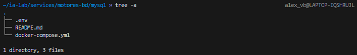
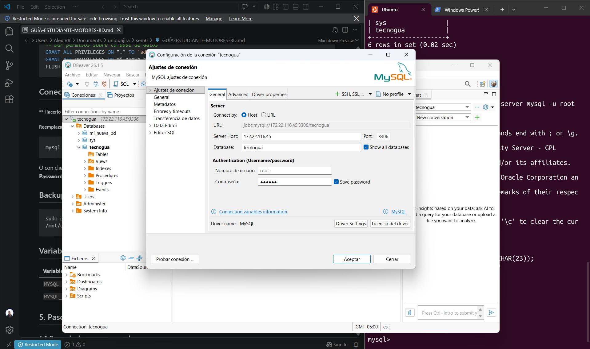

# Uso y conexion de modelos de base de datos Ubuntu wsl


<table style="width:100%; text-align:center; border-radius:5px; align-content:center">
    <thead>
        
## Herramientas
</thead>
        <tr>
            <td><b>DOCKER</td>
            <td><b>WSL</td>
            <td><b>DBEAVER</td>
        </tr>
    <tr>
        <td>
            
        </td>
        <td>
            
        </td>
        <td>        
            
        </td>
    </tr>
</table>

### Verificacion de docker instalado
Lo primero que se hizo na vez abierta la la maquina de Ubuntu en WSL fue la instalacion y revision de docker
```zsh
sudo docker --version
```
**Evidencia:**


### Creacion de la carpeta del proyecto
Lo siguiente fue la creacion de la carpeta para el proyecto ```~/ia-lab/``` con su estructura ya predispuesta
```bash
mkdir -p ~/ia-lab/services/motores-bd/{mysql,postgres,mssql,oracle}
mkdir -p ~/ia-lab/data/{mysql,postgres,mssql,oracle}
```
**evidencia:**


## 1. MySql

### 1.1 Ficheros iniciales
Ya dispuesta la estructura de la carpeta, se inicio con la creacion de los ficheros necesarios para la creacion de los contenedores de docker.
Los archivos creados fueron:
- **.env:** Archivo que contiene las variables de entorno que manejara el contenedor, principalmente usuario y contraseña.
- **README.md:** Archivo con la informacion del contenedor en lenguaje natural para su revision.
- **docker-compose.yml:** Archivo de configuracion que establece las especificaciones del repositorio, incluyendo su motor de bases de datos.

**evidencias**:



### 1.2 Levantamiento

Ya con docker instalado y el docker-compose.yml en el fichero de mysql, se uso el comando ```sudo docker compose up -d``` para realizar el levantamiento del contenedor y el comando ```sudo docker ps``` para revisar que estuviera iniciado el contenedor.

**evidencias:**


### 1.3 Acceso
Acto seguido se realizo la conexion local con la base de datos de mysql accediendo desde el terminal de Ubuntu con las credenciales guardadas en el .env.

```bash
sudo docker exec -it mysql-server mysql -u root -p

```

**evidencias:**


### 1.4 Creacion de usuario

Dentro de la conexion local al contenedor a la base de datos se creo un nuevo usuario para la conexion remota

**evidencias:**


### 1.5 Conexion DBeaver

Finalmente se utilizaron las credenciales creadas y los datos de direccion de la maquina virtual y el contenedor para realizar la conexion con el gestor de bases de datos dbeaver

**evidencias**




## 2. Postgre

### 2.1 Ficheros iniciales
Ya dispuesta la estructura de la carpeta, se inicio con la creacion de los ficheros necesarios para la creacion de los contenedores de docker.
Los archivos creados fueron:
- **.env:** Archivo que contiene las variables de entorno que manejara el contenedor, principalmente usuario y contraseña.
- **README.md:** Archivo con la informacion del contenedor en lenguaje natural para su revision.
- **docker-compose.yml:** Archivo de configuracion que establece las especificaciones del repositorio, incluyendo su motor de bases de datos.

**comandos usados**:
```bash

```


### 2.3 Acceso
### 2.4 Creacion de usuario
### 2.5 Conexion DBeaver

## 3. Oracle

### 3.1 Ficheros iniciales
Ya dispuesta la estructura de la carpeta, se inicio con la creacion de los ficheros necesarios para la creacion de los contenedores de docker.
Los archivos creados fueron:
- **.env:** Archivo que contiene las variables de entorno que manejara el contenedor, principalmente usuario y contraseña.
- **README.md:** Archivo con la informacion del contenedor en lenguaje natural para su revision.
- **docker-compose.yml:** Archivo de configuracion que establece las especificaciones del repositorio, incluyendo su motor de bases de datos.

**evidencias**:


### 3.2 Levantamiento
### 3.3 Acceso
### 3.4 Creacion de usuario
### 3.5 Conexion DBeaver

## 4. MSSQL

### 4.1 Ficheros iniciales
Ya dispuesta la estructura de la carpeta, se inicio con la creacion de los ficheros necesarios para la creacion de los contenedores de docker.
Los archivos creados fueron:
- **.env:** Archivo que contiene las variables de entorno que manejara el contenedor, principalmente usuario y contraseña.
- **README.md:** Archivo con la informacion del contenedor en lenguaje natural para su revision.
- **docker-compose.yml:** Archivo de configuracion que establece las especificaciones del repositorio, incluyendo su motor de bases de datos.

**evidencias**:


### 4.2 Levantamiento
### 4.3 Acceso
### 4.4 Creacion de usuario
### 4.5 Conexion DBeaver
