# Unidad ISS-00: Creacion del entorno virtual
## 1. Entorno
Se creo el entorno virtual con python en el cual se guardan las librerias necesarias para el funcionamiento del proyecto .venv.
### Scripts de creacion
```bash
python3 -m venv .venv
```
### Scripts de activacion
```bash
source .venv/bin/activate
```
### Evidencia
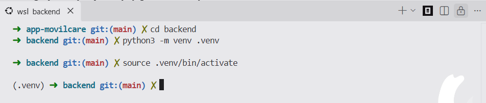

## 2. Instalacion del framework
El feame work de python que se utilizara para la creacion ndel baskend en este proyecto es Django, que permite la creacion de plantillas para frontend que conectan con controladores y permiten la comunicacion con las base de datos, para ello utilizamos el sistema de gestion de paquetes de python `pip`.

### Scripts
```bash
python -m pip install "Django==5.2.17"
python -m pip freeze > requirements.txt
```

### Evidencias
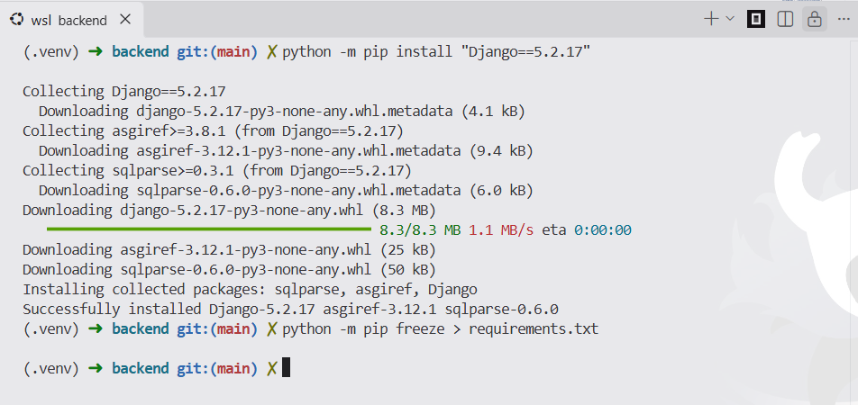
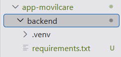

## 3. Creacion del proyecto
por medio de django nos es posible la creacion de una plantilla inicial de proyecto a partir del framework con uns estructura de archivos concreta para trabajar con la libreria

### Script
```bash
(.venv) django-admin startproject config .
```

### Evidencias
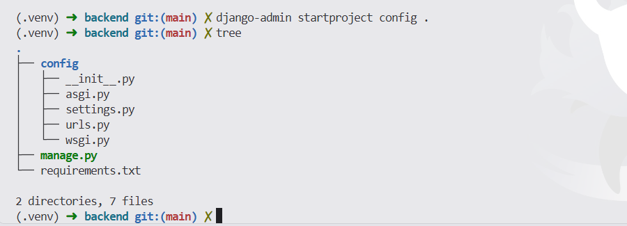
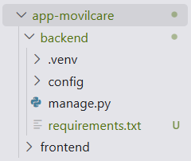

## 4. Proteccion del repositorio
Ya que se trabajara con repositorios de github, es importante conocer que ficheros como `.env`, `.venv` o `db.sqlite3` contienen informacion sensible o redundante que no debe ser subida al repositorio, para prevenir esto se agrega un archivo `.gitignore` a la raiz del proyecto donde se indique que ficheros no deben ser subidos.

### Contenido del .gitignore
```gitignore
.venv/
__pycache__/
*.py[cod]
.env
db.sqlite3
*.log
.idea/
.vscode/
staticfiles/
media/
.pytest_cache/
htmlcov/
.coverage
```
### Evidencia
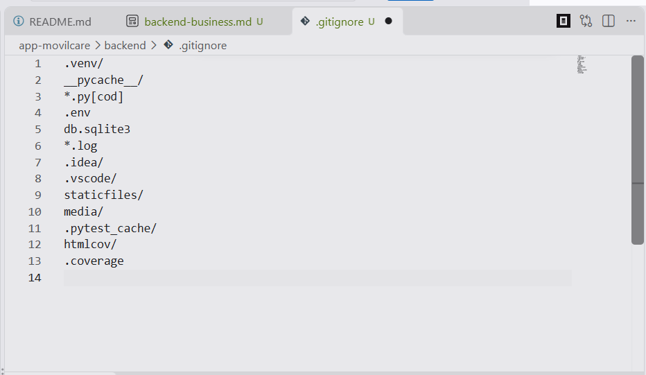

## 5. verificacion
Scripts
```bash
python -m django --version
```
```bash
python manage.py check
```
```bash
tree
```
### Evidencia
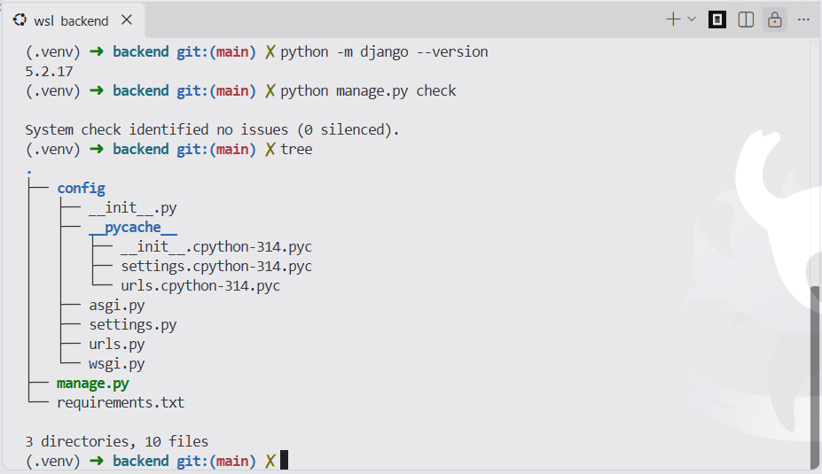

# Unidad ISS-01 Settings y seleccion de motor

## instalacion de paquetes
Los paquetes contienen las herramientas necesarias para realizar las conexiones entre Django y las bases de datos, justo despues de instalarlas se listan dentro del archivo `requirements.txt`.

### Scripts
```bash
source .venv/bin/activate
which python
python -m pip install "python-dotenv==1.2.3"
python -m pip install "psycopg[binary]==3.3.6"
python -m pip install "mysqlclient==2.3.0"
python -m pip install "mssql-django==2.0.0"
python -m pip install "oracledb==26.0.1"
python -m pip freeze > requirements.txt
```
### Evidencia
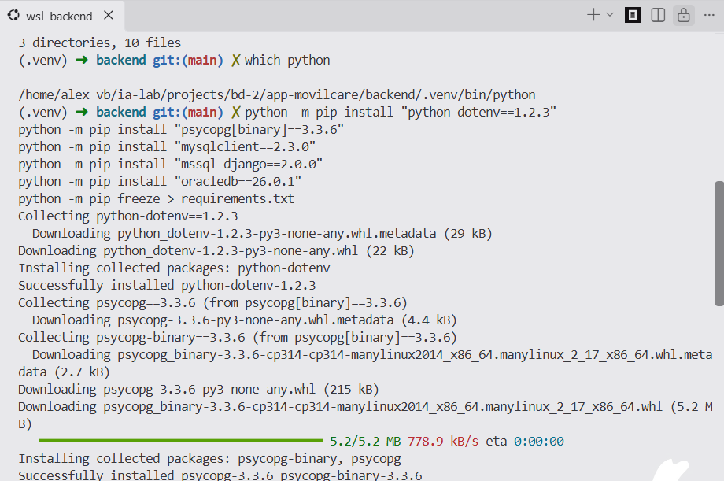
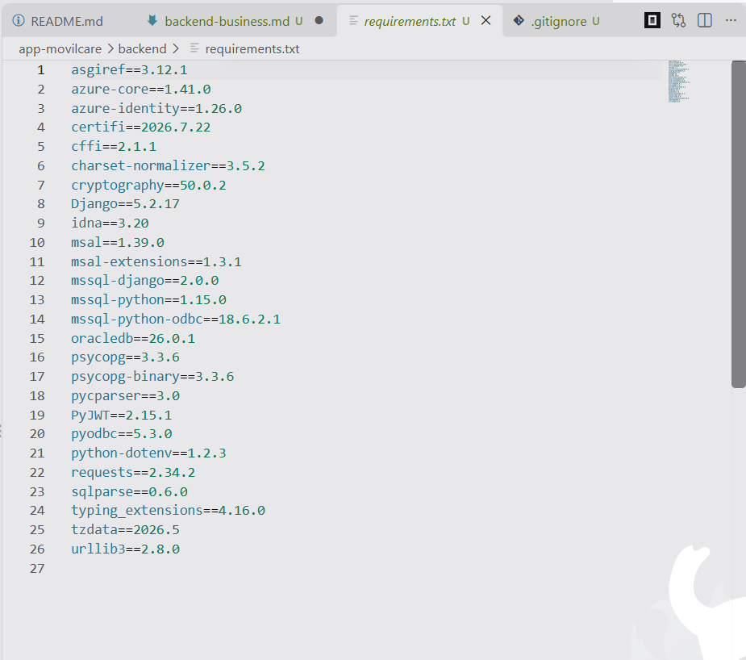

## Transformación de la Estructura de Archivos
Se elimina el archivo generado automaticamente `settings.py` y se agrega la carpeta `settings/` con el archivo `__init__.py`

Adicionalmente se crea el `.env.example` con la plantilla de las variables de entorno, `.env` que guardara los valores reales de las variables, `database.py` que permitira la conexion dinamica de motores de bases de datos y `project_python.py`

### Evidencia
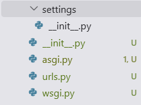


## definicion de las variables de entorno
En `.env.example` se guardaron los nombres de las variables de entorno del proyecto, en `.env` se guardaron con sus valores reales.

### Contenido del .env.example
```env
# Laboratorio académico. En producción liste orígenes explícitos.
CORS_ALLOW_ALL_ORIGINS=True
```
### Evidencia
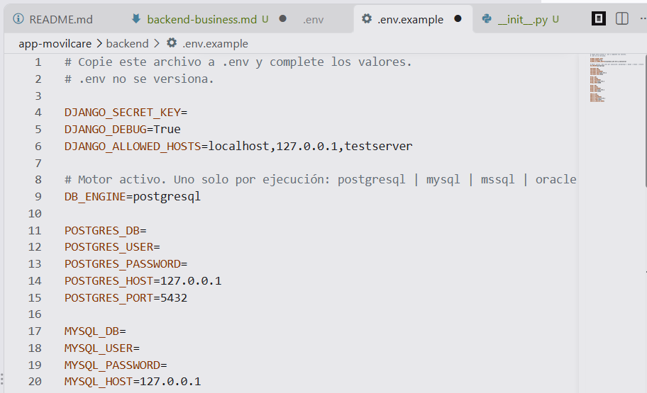

## modulo de seleccion de base de datos
Dentro de `config/database.py` se elabora el script de seleccion de base de datos.

### Codigo
```python
"""Selección del motor de base de datos a partir del entorno.

Un solo alias, default, queda activo en cada ejecución.
"""

from django.core.exceptions import ImproperlyConfigured

ALLOWED_ENGINES = ("postgresql", "mysql", "mssql", "oracle")


def database_from_environ(env):
    engine = str(env.get("DB_ENGINE", "postgresql")).strip().lower()
    if engine not in ALLOWED_ENGINES:
        allowed = ", ".join(ALLOWED_ENGINES)
        raise ImproperlyConfigured(
            f"DB_ENGINE='{engine}' no es válido. Valores permitidos: {allowed}."
        )
    builders = {
        "postgresql": _postgresql,
        "mysql": _mysql,
        "mssql": _mssql,
        "oracle": _oracle,
    }
    return {"default": builders[engine](env)}


def _required(env, key):
    value = env.get(key)
    if value is None or str(value).strip() == "":
        raise ImproperlyConfigured(
            f"Falta la variable de entorno {key} para DB_ENGINE={env.get('DB_ENGINE')}."
        )
    return str(value).strip()


def _postgresql(env):
    return {
        "ENGINE": "django.db.backends.postgresql",
        "NAME": _required(env, "POSTGRES_DB"),
        "USER": _required(env, "POSTGRES_USER"),
        "PASSWORD": _required(env, "POSTGRES_PASSWORD"),
        "HOST": _required(env, "POSTGRES_HOST"),
        "PORT": _required(env, "POSTGRES_PORT"),
    }


def _mysql(env):
    return {
        "ENGINE": "django.db.backends.mysql",
        "NAME": _required(env, "MYSQL_DB"),
        "USER": _required(env, "MYSQL_USER"),
        "PASSWORD": _required(env, "MYSQL_PASSWORD"),
        "HOST": _required(env, "MYSQL_HOST"),
        "PORT": _required(env, "MYSQL_PORT"),
        "OPTIONS": {"charset": "utf8mb4"},
    }


def _mssql(env):
    return {
        "ENGINE": "mssql",
        "NAME": _required(env, "MSSQL_DB"),
        "USER": _required(env, "MSSQL_USER"),
        "PASSWORD": _required(env, "MSSQL_PASSWORD"),
        "HOST": _required(env, "MSSQL_HOST"),
        "PORT": _required(env, "MSSQL_PORT"),
        "OPTIONS": {
            "driver": "ODBC Driver 18 for SQL Server",
            "extra_params": "TrustServerCertificate=yes",
        },
    }


def _oracle(env):
    host = _required(env, "ORACLE_HOST")
    port = _required(env, "ORACLE_PORT")
    service = _required(env, "ORACLE_SERVICE_NAME")
    dsn = (
        f"(DESCRIPTION=(ADDRESS=(PROTOCOL=TCP)(HOST={host})(PORT={port}))"
        f"(CONNECT_DATA=(SERVICE_NAME={service})))"
    )
    return {
        "ENGINE": "django.db.backends.oracle",
        "NAME": dsn,
        "USER": _required(env, "ORACLE_USER"),
        "PASSWORD": _required(env, "ORACLE_PASSWORD"),
        "HOST": host,
        "PORT": "",
    }
```

### Evidencias
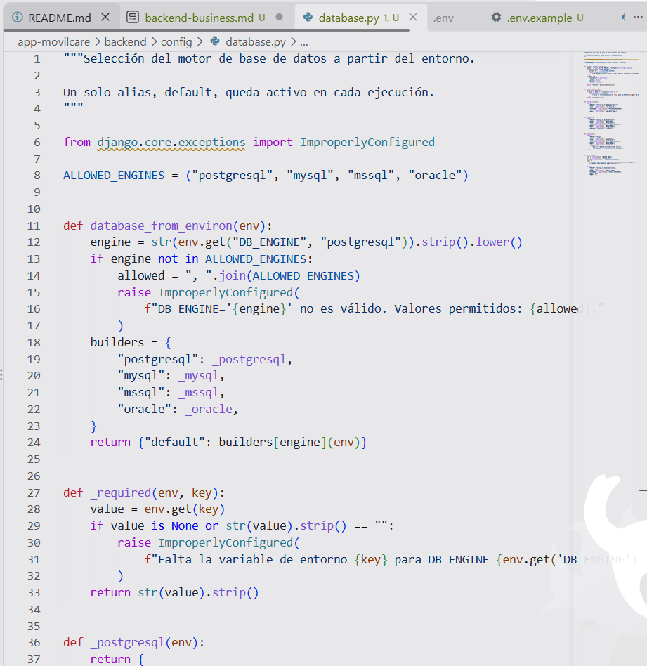

## Paquete de configuracion
Dentro del fichero `config/settings/__init__.py`
### Contenido del fichero
```python
import os
from pathlib import Path

# python-dotenv, instalado en este ISS. Lee .env antes de SECRET_KEY y DATABASES.
from dotenv import load_dotenv

from config.database import database_from_environ

BASE_DIR = Path(__file__).resolve().parent.parent.parent
load_dotenv(BASE_DIR / ".env")

SECRET_KEY = os.environ.get("DJANGO_SECRET_KEY", "").strip()
if not SECRET_KEY:
    from django.core.exceptions import ImproperlyConfigured

    raise ImproperlyConfigured("Defina DJANGO_SECRET_KEY en el archivo .env.")

DEBUG = os.environ.get("DJANGO_DEBUG", "False").strip().lower() in {"1", "true", "yes", "on"}

ALLOWED_HOSTS = [
    host.strip()
    for host in os.environ.get("DJANGO_ALLOWED_HOSTS", "localhost,127.0.0.1").split(",")
    if host.strip()
]

INSTALLED_APPS = [
    "django.contrib.admin",
    "django.contrib.auth",
    "django.contrib.contenttypes",
    "django.contrib.sessions",
    "django.contrib.messages",
    "django.contrib.staticfiles",
]

MIDDLEWARE = [
    "django.middleware.security.SecurityMiddleware",
    "django.contrib.sessions.middleware.SessionMiddleware",
    "django.middleware.common.CommonMiddleware",
    "django.middleware.csrf.CsrfViewMiddleware",
    "django.contrib.auth.middleware.AuthenticationMiddleware",
    "django.contrib.messages.middleware.MessageMiddleware",
    "django.middleware.clickjacking.XFrameOptionsMiddleware",
]

ROOT_URLCONF = "config.urls"

TEMPLATES = [
    {
        "BACKEND": "django.template.backends.django.DjangoTemplates",
        "DIRS": [],
        "APP_DIRS": True,
        "OPTIONS": {
            "context_processors": [
                "django.template.context_processors.request",
                "django.contrib.auth.context_processors.auth",
                "django.contrib.messages.context_processors.messages",
            ],
        },
    },
]

WSGI_APPLICATION = "config.wsgi.application"
ASGI_APPLICATION = "config.asgi.application"

DATABASES = database_from_environ(os.environ)

AUTH_PASSWORD_VALIDATORS = [
    {"NAME": "django.contrib.auth.password_validation.UserAttributeSimilarityValidator"},
    {"NAME": "django.contrib.auth.password_validation.MinimumLengthValidator"},
    {"NAME": "django.contrib.auth.password_validation.CommonPasswordValidator"},
    {"NAME": "django.contrib.auth.password_validation.NumericPasswordValidator"},
]

LANGUAGE_CODE = "es"
TIME_ZONE = "America/Bogota"
USE_I18N = True
USE_TZ = True

STATIC_URL = "static/"
DEFAULT_AUTO_FIELD = "django.db.models.BigAutoField"
```
### Evidencia
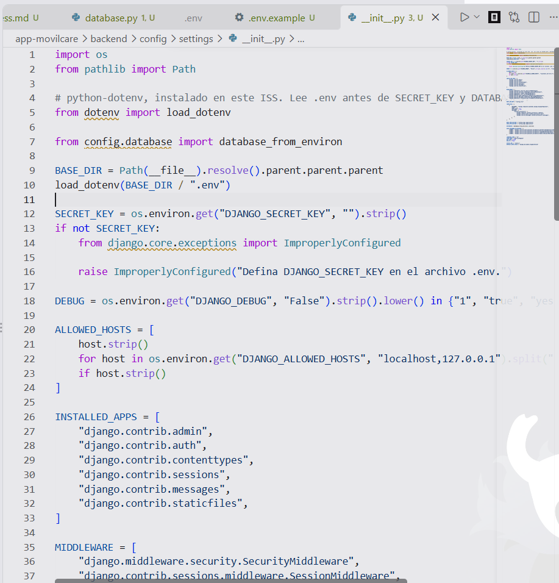

## Re-Ejecucion del interprete

En el fichero `config/project_python.py` se almacena un script de prevencion que evita que la ejecucion de `manage.py` fuera del entorno virtual `.venv` resulte en errores.

### contenido del fichero
```python
"""Intérprete del proyecto.

Los paquetes se instalan dentro de .venv. El comando python3 manage.py
usa el Python del sistema y no ve esos paquetes.
use_project_python() vuelve a lanzar el mismo comando con .venv/bin/python.
"""
import os
import sys
from pathlib import Path

PROJECT_ROOT = Path(__file__).resolve().parent.parent


def use_project_python():
    """Reejecuta el proceso con el Python de .venv si aún no es ese intérprete."""
    venv_root = PROJECT_ROOT / ".venv"
    venv_python = venv_root / "bin" / "python"
    if not venv_python.is_file():
        return
    try:
        if Path(sys.prefix).resolve() == venv_root.resolve():
            return
    except OSError:
        return
    os.execv(venv_python, [str(venv_python), *sys.argv])
```

### Evidencia
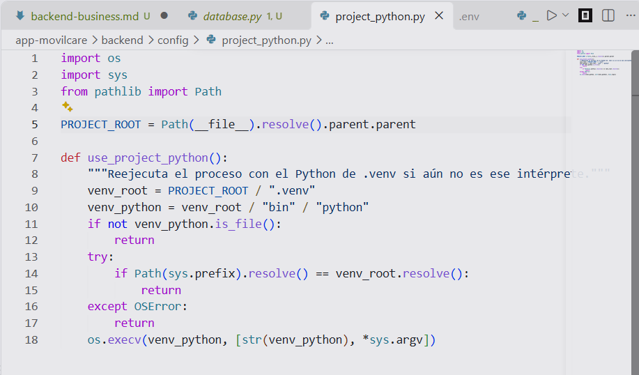

## Parches en puntos de entrada en el sistema

### Evidencias
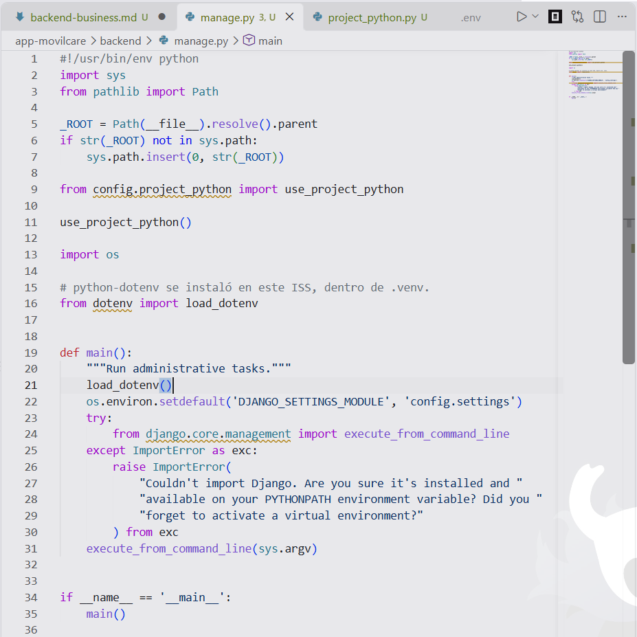
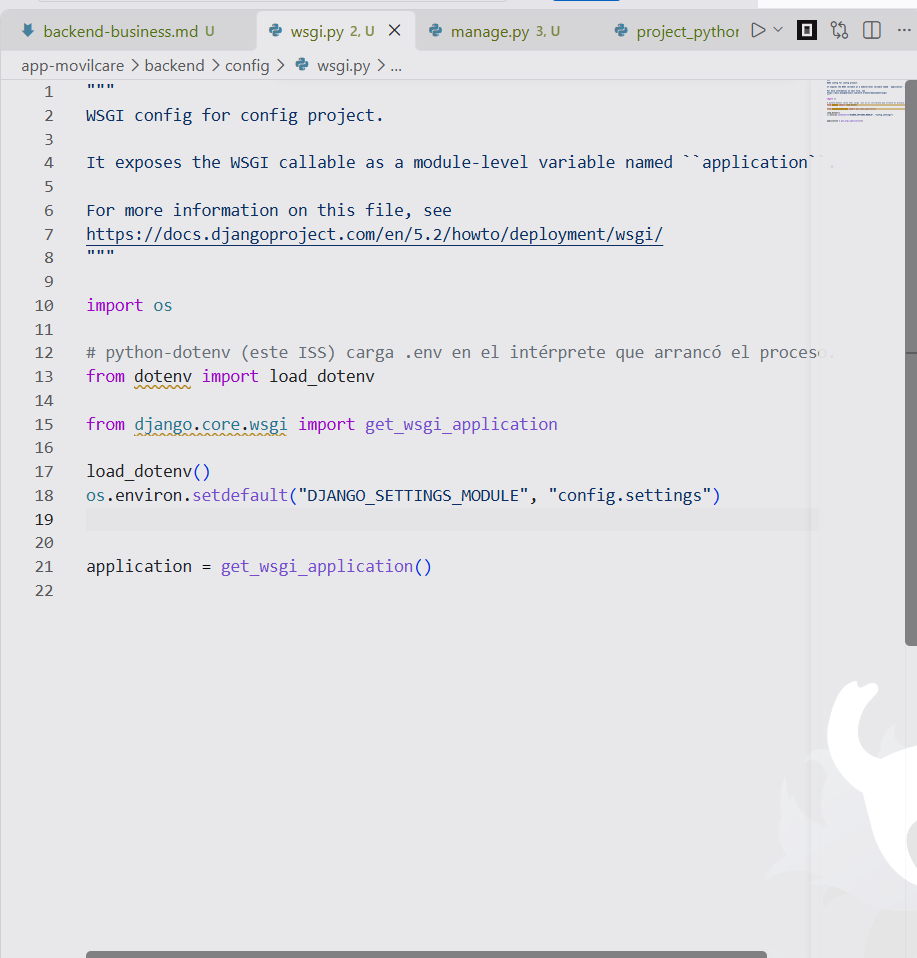
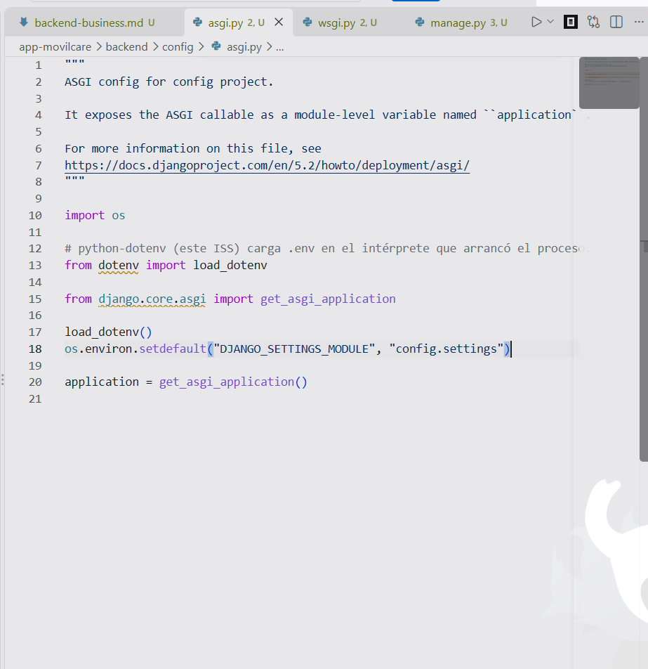