# Uso y conexion de modelos de base de datos Ubuntu wsl


<table style="width:100%; text-align:center; border-radius:5px; align-content:center">
    <thead>
        
## Herramientas
</thead>
        <tr>
            <td><b>DOCKER</td>
            <td><b>WSL</td>
            <td><b>DBEAVER</td>
        </tr>
    <tr>
        <td>
            
        </td>
        <td>
            
        </td>
        <td>        
            
        </td>
    </tr>
</table>

### Verificacion de docker instalado
Lo primero que se hizo na vez abierta la la maquina de Ubuntu en WSL fue la instalacion y revision de docker
```zsh
sudo docker --version
```
**Evidencia:**

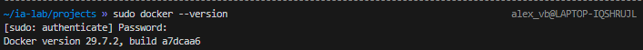

### Creacion de la carpeta del proyecto
Lo siguiente fue la creacion de la carpeta para el proyecto ```~/ia-lab/``` con su estructura ya predispuesta
```bash
mkdir -p ~/ia-lab/services/motores-bd/{mysql,postgres,mssql,oracle}
mkdir -p ~/ia-lab/data/{mysql,postgres,mssql,oracle}
```
**evidencia:**
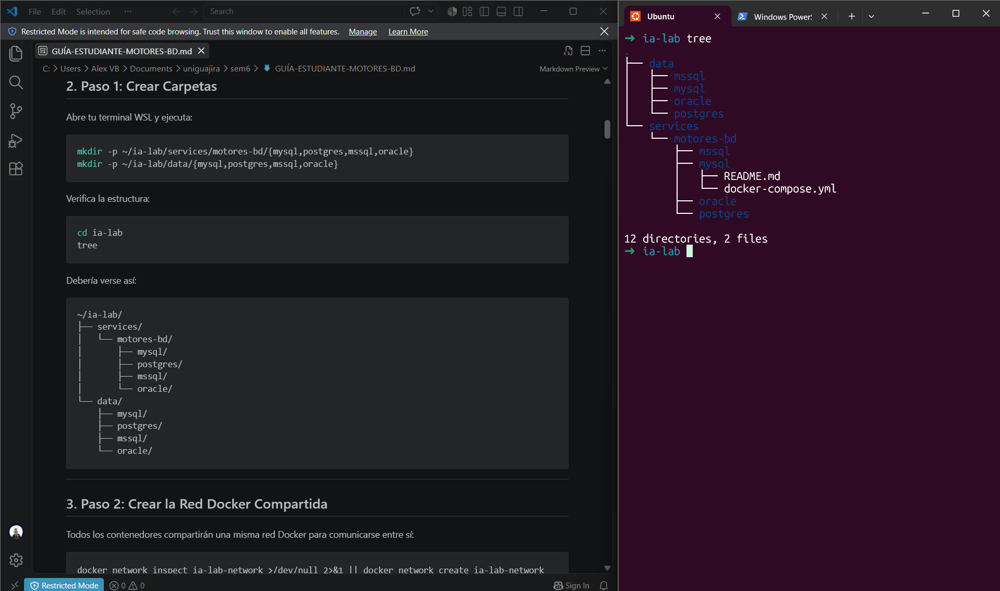


## 1. Mysql  

### 1.1 Ficheros iniciales
Ya dispuesta la estructura de la carpeta, se inicio con la creacion de los ficheros necesarios para la creacion de los contenedores de docker.
Los archivos creados fueron:
- **.env:** Archivo que contiene las variables de entorno que manejara el contenedor, principalmente usuario y contraseña.
- **README.md:** Archivo con la informacion del contenedor en lenguaje natural para su revision.
- **docker-compose.yml:** Archivo de configuracion que establece las especificaciones del repositorio, incluyendo su motor de bases de datos.

```bash
cat > ~/ia-lab/services/motores-bd/mysql/docker-compose.yml << 'EOF'
services:
  mysql:
    image: mysql:8.0
    container_name: mysql-server
    restart: unless-stopped
    env_file:
      - .env
    ports:
      - "3306:3306"
    volumes:
      - ../../../data/mysql:/var/lib/mysql
      - /mnt/d/academia/bd:/backups
    command: >
      --character-set-server=utf8mb4
      --collation-server=utf8mb4_unicode_ci
      --bind-address=0.0.0.0
    networks:
      - ia-lab-network
    healthcheck:
      test: ["CMD", "mysqladmin", "ping", "-h", "localhost"]
      interval: 10s
      timeout: 5s
      retries: 5
      start_period: 30s

networks:
  ia-lab-network:
    external: true
EOF
```
```bash
cat > ~/ia-lab/services/motores-bd/mysql/.env << 'EOF'
TZ=America/Bogota
MYSQL_ROOT_PASSWORD=MiNiCo57**
MYSQL_DATABASE=tecnogua
EOF
```
```bash
cat > ~/ia-lab/services/motores-bd/mysql/README.md << 'EOF'
# MySQL 8.0 - Motor de Base de Datos

> **Acceso remoto habilitado.** Puerto expuesto en `0.0.0.0:3306`.
> **Usuario por defecto:** `root` (acceso remoto: `%`)

---

## Conectar desde WSL (local)

```bash
sudo docker exec -it mysql-server mysql -u root -p
# Password: MiNiCo57**
```

**evidencias**:


### 1.2 Levantamiento

Ya con docker instalado y el docker-compose.yml en el fichero de mysql, se uso el comando ```sudo docker compose up -d``` para realizar el levantamiento del contenedor y el comando ```sudo docker ps``` para revisar que estuviera iniciado el contenedor.

**evidencias:**
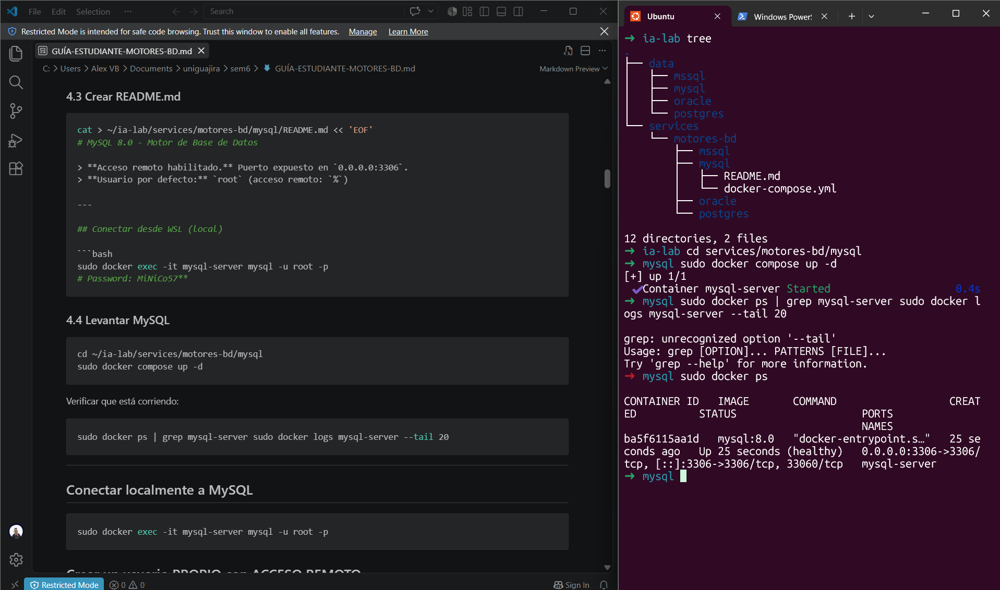

### 1.3 Acceso
Acto seguido se realizo la conexion local con la base de datos de mysql accediendo desde el terminal de Ubuntu con las credenciales guardadas en el .env.

```bash
sudo docker exec -it mysql-server mysql -u root -p

```

**evidencias:**

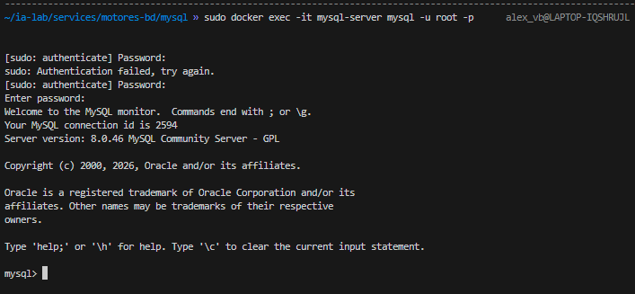

### 1.4 Creacion de usuario

Dentro de la conexion local al contenedor a la base de datos se creo un nuevo usuario para la conexion remota

**evidencias:**

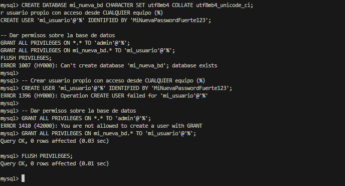

### 1.5 Conexion DBeaver

Finalmente se utilizaron las credenciales creadas y los datos de direccion de la maquina virtual y el contenedor para realizar la conexion con el gestor de bases de datos dbeaver

**evidencias**


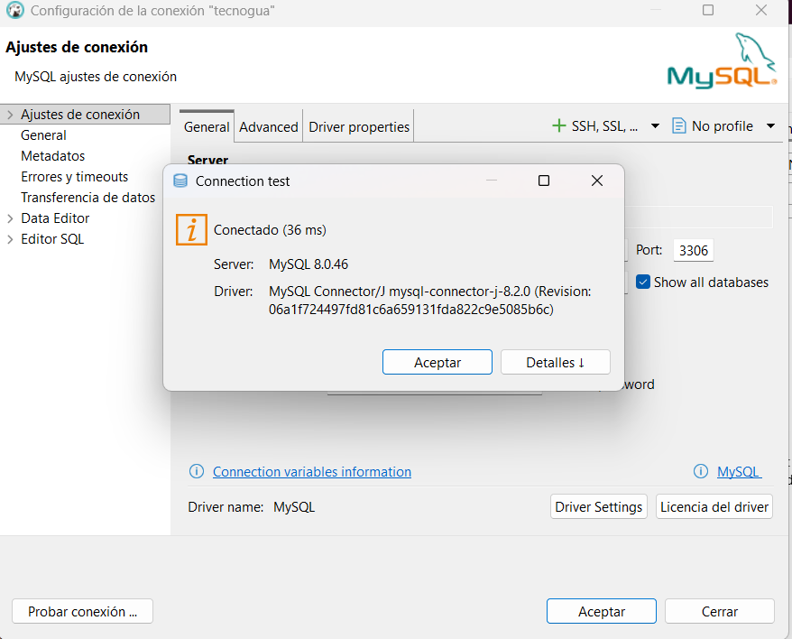


## 2. Postgre

### 2.1 Ficheros iniciales
Ya dispuesta la estructura de la carpeta, se inicio con la creacion de los ficheros necesarios para la creacion de los contenedores de docker.
Los archivos creados fueron:
- **.env:** Archivo que contiene las variables de entorno que manejara el contenedor, principalmente usuario y contraseña.
- **README.md:** Archivo con la informacion del contenedor en lenguaje natural para su revision.
- **docker-compose.yml:** Archivo de configuracion que establece las especificaciones del repositorio, incluyendo su motor de bases de datos.

**comandos usados**:
```bash
cat > ~/ia-lab/services/motores-bd/postgres/docker-compose.yml << 'EOF'
services:
  postgres:
    image: postgres:17
    container_name: ia-postgres
    restart: unless-stopped
    env_file:
      - .env
    ports:
      - "5433:5432"
    volumes:
      - ../../../data/postgres:/var/lib/postgresql/data
    networks:
      - ia-lab-network
    healthcheck:
      test: ["CMD-SHELL", "pg_isready -U $$POSTGRES_USER -d $$POSTGRES_DB"]
      interval: 10s
      timeout: 5s
      retries: 5
      start_period: 20s

networks:
  ia-lab-network:
    external: true
EOF
```
```bash
cat > ~/ia-lab/services/motores-bd/postgres/.env << 'EOF'
TZ=America/Bogota
POSTGRES_DB=ialab
POSTGRES_USER=ialab
POSTGRES_PASSWORD=MiNiCo57**
PGDATA=/var/lib/postgresql/data
EOF
```
```bash
cat > ~/ia-lab/services/motores-bd/postgres/README.md << 'EOF'
# PostgreSQL 17 - Motor de Base de Datos

> **Acceso remoto habilitado.** Puerto expuesto en `0.0.0.0:5433`.
> **Usuario por defecto:** `ialab` (acceso remoto: sin restriccion de host)

---

## Conectar desde WSL (local)

```bash
docker exec -it ia-postgres psql -U ialab -d ialab
# Password: MiNiCo57**
```

**evidencias:**
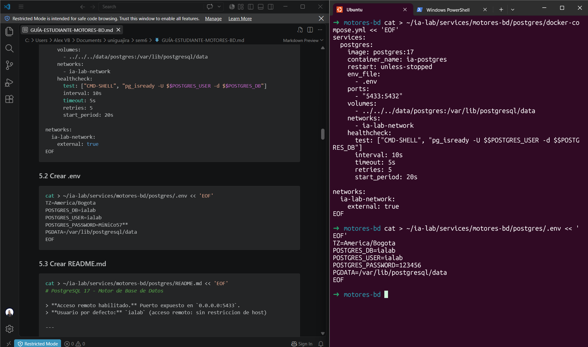
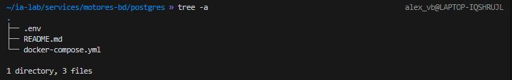

### 2.2 Levantamiento

### 1.2 Levantamiento

Ya con docker instalado y el docker-compose.yml en el fichero de mysql, se uso el comando ```sudo docker compose up -d``` para realizar el levantamiento del contenedor y el comando ```sudo docker ps``` para revisar que estuviera iniciado el contenedor.

**evidencias:**
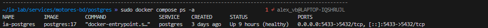

### 2.3 Acceso

Acto seguido se realizo la conexion local con la base de datos de mysql accediendo desde el terminal de Ubuntu con las credenciales guardadas en el .env.

```bash
sudo docker exec -it ia-postgres psql -U ialab -d ialab

```

**evidencias:**

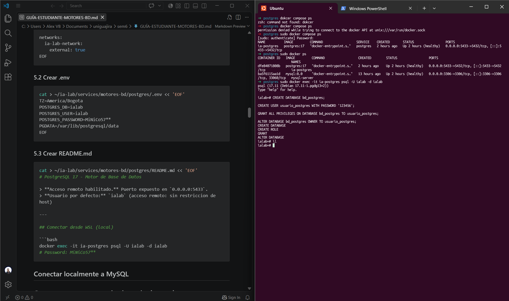

### 2.4 Creacion de usuario

Dentro de la conexion local al contenedor a la base de datos se creo un nuevo usuario para la conexion remota

**evidencias:**

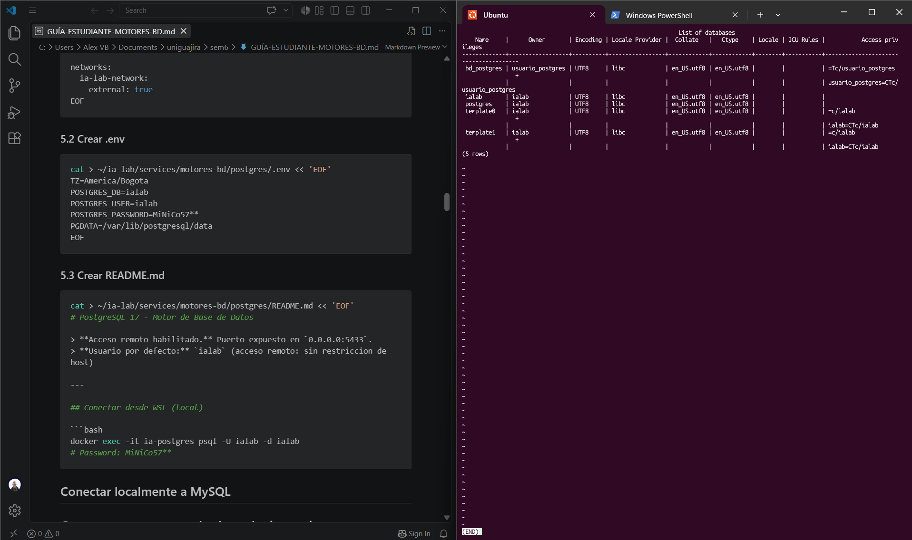

### 2.5 Conexion DBeaver

Finalmente se utilizaron las credenciales creadas y los datos de direccion de la maquina virtual y el contenedor para realizar la conexion con el gestor de bases de datos dbeaver

**evidencias**

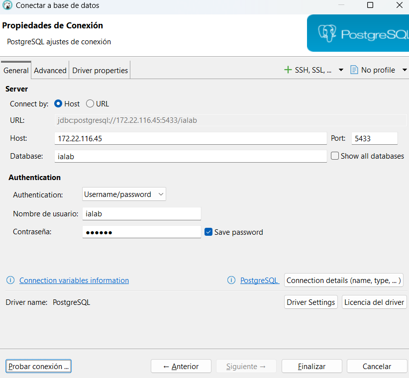
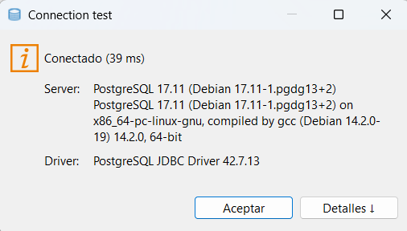

## 3. Oracle

### 3.1 Ficheros iniciales
Ya dispuesta la estructura de la carpeta, se inicio con la creacion de los ficheros necesarios para la creacion de los contenedores de docker.
Los archivos creados fueron:
- **.env:** Archivo que contiene las variables de entorno que manejara el contenedor, principalmente usuario y contraseña.
- **README.md:** Archivo con la informacion del contenedor en lenguaje natural para su revision.
- **docker-compose.yml:** Archivo de configuracion que establece las especificaciones del repositorio, incluyendo su motor de bases de datos.

**comandos usados:**

```bash
cat > ~/ia-lab/services/motores-bd/oracle/docker-compose.yml << 'EOF'
services:
  oracle:
    image: gvenzl/oracle-xe
    container_name: oracle-xe
    restart: unless-stopped
    user: root
    env_file:
      - .env
    ports:
      - "1521:1521"
      - "8080:8080"
    volumes:
      - ../../../data/oracle:/opt/oracle/oradata
    networks:
      - ia-lab-network


networks:
  ia-lab-network:
    external: true
EOF
```
```bash
cat > ~/ia-lab/services/motores-bd/oracle/.env << 'EOF'
ORACLE_PASSWORD=MiNiCo57**Fuerte
ORACLE_DATABASE=XE
EOF
```
```bash

cat > ~/ia-lab/services/motores-bd/oracle/README.md << 'EOF'
# Oracle XE - Motor de Base de Datos

> **Acceso remoto habilitado.** Puerto expuesto en `0.0.0.0:1521`.
> **Usuario por defecto:** `SYSTEM` (acceso remoto: habilitado via listener)
>
> **⚠️ Estado actual:** Este contenedor puede tener problemas de inicializacion en WSL.
> La imagen `gvenzl/oracle-xe` requiere configuracion adicional.

---

## Conectar desde WSL (local)

```bash
docker exec -it oracle-xe sqlplus system/MiNiCo57**Fuerte@XE

```

**evidencias**:

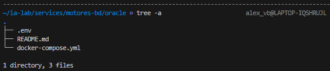

### 3.2 Levantamiento


Ya con docker instalado y el docker-compose.yml en el fichero de mysql, se uso el comando ```sudo docker compose up -d``` para realizar el levantamiento del contenedor y el comando ```sudo docker ps``` para revisar que estuviera iniciado el contenedor.

**evidencias:**

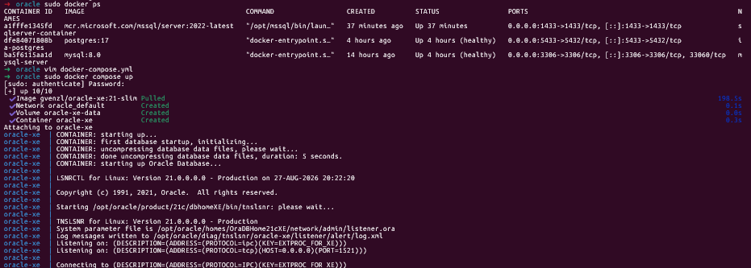
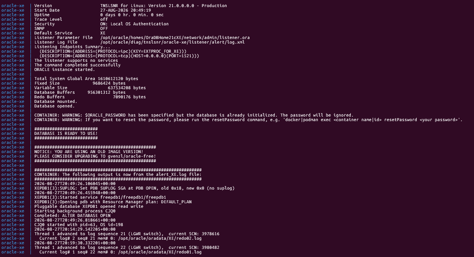

### 3.3 Creacion de usuario

Dentro de la conexion local al contenedor a la base de datos se creo un nuevo usuario para la conexion remota

**evidencias:**

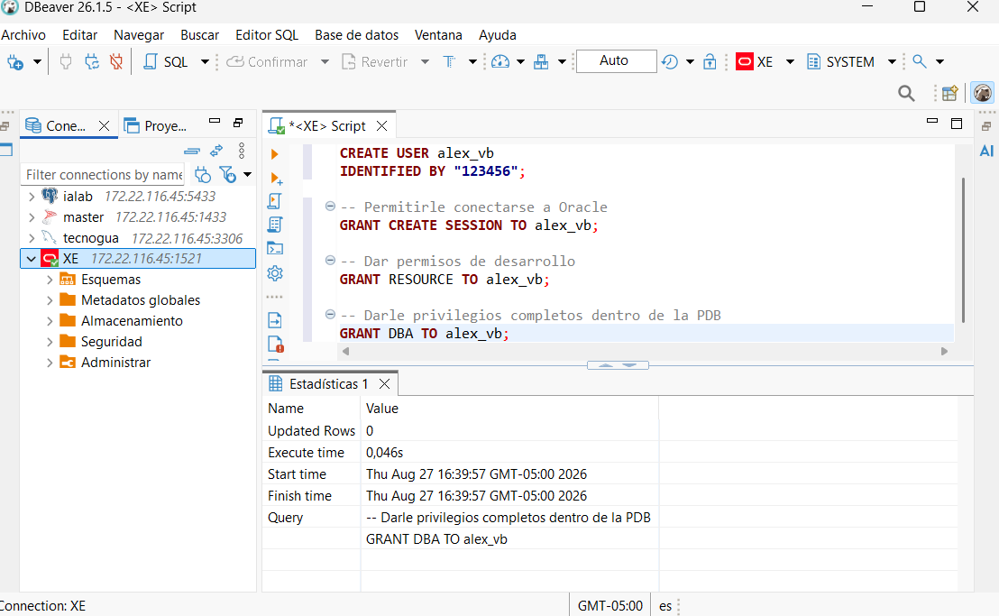

### 3.4 Conexion DBeaver

Finalmente se utilizaron las credenciales creadas y los datos de direccion de la maquina virtual y el contenedor para realizar la conexion con el gestor de bases de datos dbeaver

**evidencias**

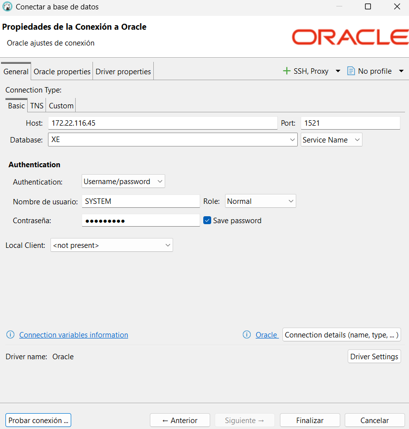
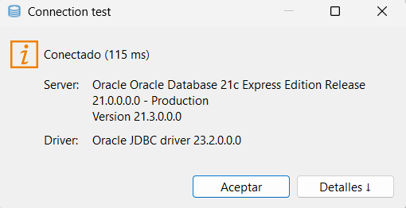

## 4. MSSQL SERVER

### 4.1 Ficheros iniciales
Ya dispuesta la estructura de la carpeta, se inicio con la creacion de los ficheros necesarios para la creacion de los contenedores de docker.
Los archivos creados fueron:
- **.env:** Archivo que contiene las variables de entorno que manejara el contenedor, principalmente usuario y contraseña.
- **README.md:** Archivo con la informacion del contenedor en lenguaje natural para su revision.
- **docker-compose.yml:** Archivo de configuracion que establece las especificaciones del repositorio, incluyendo su motor de bases de datos.

**comandos usados:**

```bash
cat > ~/ia-lab/services/motores-bd/mssql/docker-compose.yml << 'EOF'
services:
  mssql:
    image: mcr.microsoft.com/mssql/server:2022-latest
    container_name: sqlserver-container
    restart: unless-stopped
    user: root
    env_file:
      - .env
    ports:
      - "1433:1433"
    volumes:
      - ../../../data/mssql:/var/opt/mssql
    networks:
      - ia-lab-network

networks:
  ia-lab-network:
    external: true
EOF
```
```bash
cat > ~/ia-lab/services/motores-bd/mssql/.env << 'EOF'
ACCEPT_EULA=Y
MSSQL_SA_PASSWORD=MiNiCo57**Fuerte
MSSQL_PID=Developer
EOF
```
```bash
cat > ~/ia-lab/services/motores-bd/mssql/README.md << 'EOF'
# SQL Server 2022 - Motor de Base de Datos

> **Acceso remoto habilitado.** Puerto expuesto en `0.0.0.0:1433`.
> **Usuario por defecto:** `SA` (acceso remoto: habilitado por defecto)

---

## Conectar desde WSL (local)

```bash
docker exec -it sqlserver-container /opt/mssql-tools/bin/sqlcmd -S localhost -U SA -P 'MiNiCo57**Fuerte'
EOF
```

**evidencias**:

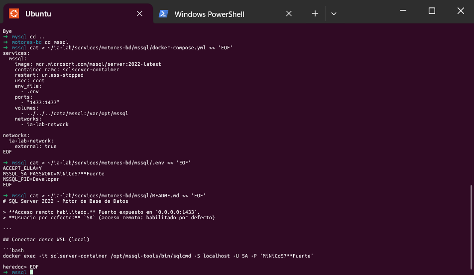
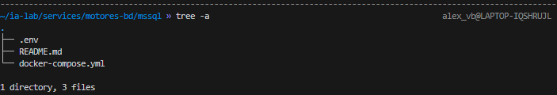

### 4.2 Levantamiento

Ya con docker instalado y el docker-compose.yml en el fichero de mysql, se uso el comando ```sudo docker compose up -d``` para realizar el levantamiento del contenedor y el comando ```sudo docker ps``` para revisar que estuviera iniciado el contenedor.

**evidencias:**

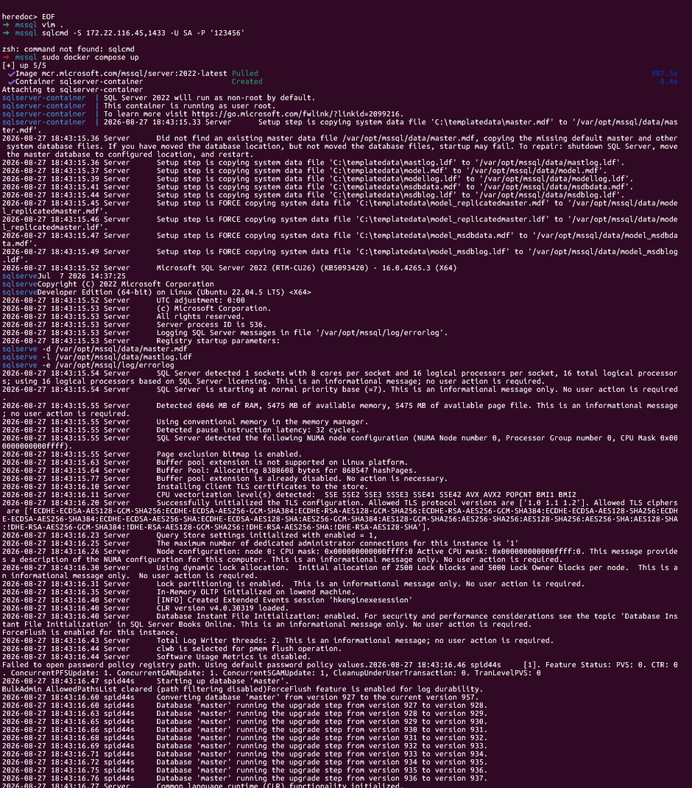

### 4.3 Acceso

Acto seguido se realizo la conexion local con la base de datos de mysql accediendo desde el terminal de Ubuntu con las credenciales guardadas en el .env.

```bash
 sudo docker exec -it sqlserver-container /opt/mssql-tools18/bin/sqlcmd \
  -S localhost -U SA -P 'Sa@123456' -C
```

**evidencias:**

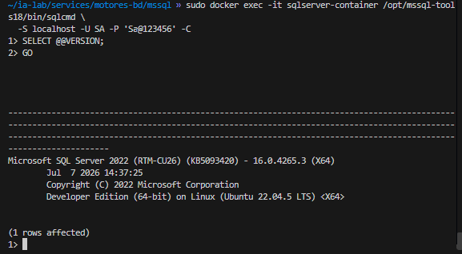

### 4.4 Creacion de usuario

Dentro de la conexion local al contenedor a la base de datos se creo un nuevo usuario para la conexion remota

**evidencias:**

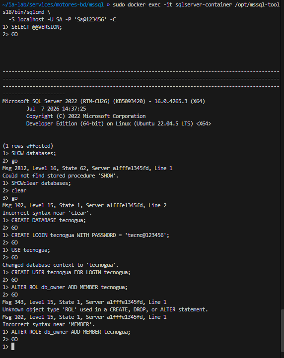

### 4.5 Conexion DBeaver

Finalmente se utilizaron las credenciales creadas y los datos de direccion de la maquina virtual y el contenedor para realizar la conexion con el gestor de bases de datos dbeaver

**evidencias**

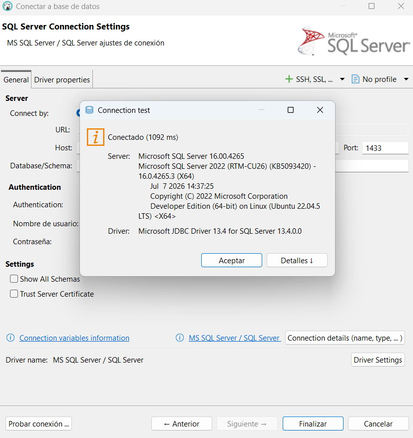

## Resultado final

Se consiguio la ejecucion simultanea de 4 contendores cada uno con un modelo de base de datos distinto usando docker dentro de una maquina virtual de Ubuntu en WSL.

```bash
docker ps
```
**evidencia:**

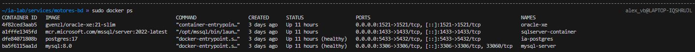

Y se consiguio la conexion remota de las bases de datos con DBeaver.

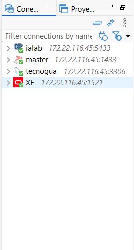

## Firma

**Alex Valdelamar Bustamante**  
Estudiante de Ingeniería de Sistemas  
Facultad de Ingeniería  
Universidad de La Guajira  
Rol: estudiante 
Fecha del informe de trazabilidad: 30 de agosto de 2026