# Creación de Base de Datos

## Apertura de las bases de datos en terminal

Para la apertura de las bases de datos en cada motor, se accedió a los motores de bases de datos por medio de la terminal de Ubuntu con las credenciales definidas previamente y se ejecutaron los siguientes comandos:

### MySQL

```sql
CREATE DATABASE MovilCare;
```

### PostgreSQL

```postgres
CREATE DATABASE movilcare;
```

### MSSQL Server

```sql
CREATE DATABASE movilcare;

GO
```

### Ejecución


### Evidencia


## Anotaciones

Para la creación de las bases de datos se establecieron las siguientes convenciones:

- Las entidades se representan como objetos utilizando **mayúscula inicial y singular**, por ejemplo: `Product`, `Customer` y `Sale`.
- Las tablas se representan utilizando **minúsculas y plural**, por ejemplo: `products`, `customers` y `sales`.
- Los nombres de las tablas y sus atributos se encuentran en **inglés**.
- Los atributos utilizan la nomenclatura **snake_case**, por ejemplo: `created_at` y `document_number`.
- La llave primaria de todas las tablas se denomina `id`.
- Los identificadores que pueden almacenar una gran cantidad de registros utilizan el tipo `BIGINT`.
- Las claves foráneas utilizan el nombre de la tabla relacionada en singular seguido de `_id`, por ejemplo: `customer_id`.
- Los campos `created_at` y `updated_at` se utilizan para registrar la fecha de creación y última actualización de los registros.
- Los campos que deben ser únicos se identifican mediante la restricción `UNIQUE`.
- Al finalizar la creación de las tablas se debe generar y visualizar el diagrama de la base de datos.

---

# Tablas

MovilCare es un sistema de gestión para empresas dedicadas a la comercialización, garantía y servicio técnico de productos. La plataforma permite administrar productos, clientes, ventas, unidades serializadas, órdenes de servicio, diagnósticos, repuestos, consumos y pagos, centralizando la información necesaria para gestionar el ciclo de atención al cliente.

Sus entidades y tablas son:

| Entidad | Tabla | Atributos / claves sugeridos |
|---|---|---|
| Product | `products` | `id`, `sku (UQ)`, `name`, `description`, `price`, `is_active`, `created_at`, `updated_at` |
| SerializedUnit | `serialized_units` | `id`, `name`, `description`, `is_active`, `created_at`, `updated_at` |
| Customer | `customers` | `id`, `document_type`, `document_number (UQ)`, `name`, `phone`, `email`, `is_active`, `created_at`, `updated_at` |
| Sale | `sales` | `id`, `customer_id (FK)`, `date`, `subtotal`, `taxes`, `total`, `status`, `created_at`, `updated_at` |
| SaleDetail | `sale_details` | `id`, `sale_id (FK)`, `product_id (FK)`, `quantity`, `unit_price`, `total`, `observations`, `created_at`, `updated_at` |
| Warranty | `warranties` | `id`, `name`, `description`, `is_active`, `created_at`, `updated_at` |
| ServiceOrder | `service_orders` | `id`, `customer_id (FK)`, `resource_id (FK)`, `number (UQ)`, `opened_at`, `closed_at`, `total`, `status`, `created_at`, `updated_at` |
| Diagnostic | `diagnostics` | `id`, `name`, `description`, `is_active`, `created_at`, `updated_at` |
| SparePart | `spare_parts` | `id`, `name`, `description`, `is_active`, `created_at`, `updated_at` |
| SparePartConsumption | `spare_part_consumption` | `id`, `name`, `description`, `is_active`, `created_at`, `updated_at` |
| Payment | `payments` | `id`, `reference_type`, `reference_id`, `method`, `amount`, `date`, `status`, `created_at`, `updated_at` |

> **Nota:** `resource_id` aparece como clave foránea en el modelo original, pero la entidad `Resource` no se encuentra definida dentro de las entidades proporcionadas. Por esta razón, la columna se incluye como atributo, pero la restricción `FOREIGN KEY` deberá establecerse cuando exista la tabla `resources`.

---

# Base de datos en MySQL - Scripts DBeaver

## 1. Creación de la tabla Products

La tabla `products` almacena la información general de los productos comercializados por MovilCare.

### Código

```sql
CREATE TABLE products (

    id BIGINT AUTO_INCREMENT PRIMARY KEY,

    sku VARCHAR(100) NOT NULL UNIQUE,

    name VARCHAR(150) NOT NULL,

    description TEXT,

    price DECIMAL(15,2) NOT NULL,

    status ENUM('active','inactive') DEFAULT 'active',

    created_at DATETIME NOT NULL DEFAULT CURRENT_TIMESTAMP,

    updated_at DATETIME NOT NULL DEFAULT CURRENT_TIMESTAMP
        ON UPDATE CURRENT_TIMESTAMP

);
```

### Evidencia


---

## 2. Creación de la tabla SerializedUnits

La tabla `serialized_units` almacena las unidades individuales que requieren identificación y seguimiento dentro del sistema.

### Código

```sql
CREATE TABLE serialized_units (

    id BIGINT AUTO_INCREMENT PRIMARY KEY,

    name VARCHAR(150) NOT NULL,

    description TEXT,

    status ENUM('active','inactive') DEFAULT 'active',

    created_at DATETIME NOT NULL DEFAULT CURRENT_TIMESTAMP,

    updated_at DATETIME NOT NULL DEFAULT CURRENT_TIMESTAMP
        ON UPDATE CURRENT_TIMESTAMP

);
```

### Evidencia


---

## 3. Creación de la tabla Customers

La tabla `customers` almacena la información de los clientes registrados en el sistema.

### Código

```sql
CREATE TABLE customers (

    id BIGINT AUTO_INCREMENT PRIMARY KEY,

    document_type VARCHAR(30) NOT NULL,

    document_number VARCHAR(11) NOT NULL UNIQUE,

    name VARCHAR(150) NOT NULL,

    phone VARCHAR(30),

    email VARCHAR(150),

    status ENUM('active','inactive') DEFAULT 'active',

    created_at DATETIME NOT NULL DEFAULT CURRENT_TIMESTAMP,

    updated_at DATETIME NOT NULL DEFAULT CURRENT_TIMESTAMP
        ON UPDATE CURRENT_TIMESTAMP

);
```

### Evidencia


---

## 4. Creación de la tabla Sales

La tabla `sales` registra las ventas realizadas y las relaciona con el cliente correspondiente.

### Código

```sql
CREATE TABLE sales (

    id BIGINT AUTO_INCREMENT PRIMARY KEY,

    customer_id BIGINT NOT NULL,

    date DATETIME NOT NULL DEFAULT CURRENT_TIMESTAMP,

    subtotal DECIMAL(15,2) NOT NULL,

    taxes DECIMAL(15,2) NOT NULL DEFAULT 0,

    total DECIMAL(15,2) NOT NULL,

    status ENUM('active','inactive') DEFAULT 'active',

    created_at DATETIME NOT NULL DEFAULT CURRENT_TIMESTAMP,

    updated_at DATETIME NOT NULL DEFAULT CURRENT_TIMESTAMP
        ON UPDATE CURRENT_TIMESTAMP,

    CONSTRAINT fk_sales_customer
        FOREIGN KEY (customer_id)
        REFERENCES customers(id)

);
```

### Evidencia


---

## 5. Creación de la tabla SaleDetails

La tabla `sale_details` contiene los productos incluidos en cada venta, su cantidad, precio unitario y valor total.

### Código

```sql
CREATE TABLE sale_details (

    id BIGINT AUTO_INCREMENT PRIMARY KEY,

    sale_id BIGINT NOT NULL,

    product_id BIGINT NOT NULL,

    quantity DECIMAL(15,3) NOT NULL,

    unit_price DECIMAL(15,2) NOT NULL,

    total DECIMAL(15,2) NOT NULL,

    observations TEXT,

    created_at DATETIME NOT NULL DEFAULT CURRENT_TIMESTAMP,

    updated_at DATETIME NOT NULL DEFAULT CURRENT_TIMESTAMP
        ON UPDATE CURRENT_TIMESTAMP,

    CONSTRAINT fk_sale_details_sale
        FOREIGN KEY (sale_id)
        REFERENCES sales(id),

    CONSTRAINT fk_sale_details_product
        FOREIGN KEY (product_id)
        REFERENCES products(id)

);
```

### Evidencia


---

## 6. Creación de la tabla Warranties

La tabla `warranties` almacena la información relacionada con las garantías ofrecidas por MovilCare.

### Código

```sql
CREATE TABLE warranties (

    id BIGINT AUTO_INCREMENT PRIMARY KEY,

    name VARCHAR(150) NOT NULL,

    description TEXT,

    status ENUM('active','inactive') DEFAULT 'active',

    created_at DATETIME NOT NULL DEFAULT CURRENT_TIMESTAMP,

    updated_at DATETIME NOT NULL DEFAULT CURRENT_TIMESTAMP
        ON UPDATE CURRENT_TIMESTAMP

);
```

### Evidencia


---

## 7. Creación de la tabla ServiceOrders

La tabla `service_orders` almacena las órdenes de servicio generadas para la atención de los clientes.

### Código

```sql
CREATE TABLE service_orders (

    id BIGINT AUTO_INCREMENT PRIMARY KEY,

    customer_id BIGINT NOT NULL,

    resource_id BIGINT,

    number VARCHAR(50) NOT NULL UNIQUE,

    opened_at DATETIME NOT NULL DEFAULT CURRENT_TIMESTAMP,

    closed_at DATETIME,

    total DECIMAL(15,2) NOT NULL DEFAULT 0,

    status ENUM('active','inactive') DEFAULT 'active',

    created_at DATETIME NOT NULL DEFAULT CURRENT_TIMESTAMP,

    updated_at DATETIME NOT NULL DEFAULT CURRENT_TIMESTAMP
        ON UPDATE CURRENT_TIMESTAMP,

    CONSTRAINT fk_service_orders_customer
        FOREIGN KEY (customer_id)
        REFERENCES customers(id)

);
```

### Evidencia


---

## 8. Creación de la tabla Diagnostics

La tabla `diagnostics` almacena los diagnósticos utilizados durante los procesos de servicio técnico.

### Código

```sql
CREATE TABLE diagnostics (

    id BIGINT AUTO_INCREMENT PRIMARY KEY,

    name VARCHAR(150) NOT NULL,

    description TEXT,

    status ENUM('active','inactive') DEFAULT 'active',

    created_at DATETIME NOT NULL DEFAULT CURRENT_TIMESTAMP,

    updated_at DATETIME NOT NULL DEFAULT CURRENT_TIMESTAMP
        ON UPDATE CURRENT_TIMESTAMP

);
```

### Evidencia


---

## 9. Creación de la tabla SpareParts

La tabla `spare_parts` almacena la información de los repuestos utilizados en los procesos de servicio técnico.

### Código

```sql
CREATE TABLE spare_parts (

    id BIGINT AUTO_INCREMENT PRIMARY KEY,

    name VARCHAR(150) NOT NULL,

    description TEXT,

    status ENUM('active','inactive') DEFAULT 'active',

    created_at DATETIME NOT NULL DEFAULT CURRENT_TIMESTAMP,

    updated_at DATETIME NOT NULL DEFAULT CURRENT_TIMESTAMP
        ON UPDATE CURRENT_TIMESTAMP

);
```

### Evidencia


---

## 10. Creación de la tabla SparePartConsumptions

La tabla `spare_part_consumptions` registra la información relacionada con el consumo de repuestos.

### Código

```sql
CREATE TABLE spare_part_consumptions (

    id BIGINT AUTO_INCREMENT PRIMARY KEY,

    name VARCHAR(150) NOT NULL,

    description TEXT,

    status ENUM('active','inactive') DEFAULT 'active',

    created_at DATETIME NOT NULL DEFAULT CURRENT_TIMESTAMP,

    updated_at DATETIME NOT NULL DEFAULT CURRENT_TIMESTAMP
        ON UPDATE CURRENT_TIMESTAMP

);
```

### Evidencia


---

## 11. Creación de la tabla Payments

La tabla `payments` almacena los pagos realizados y la referencia al registro al que corresponde cada pago.

### Código

```sql
CREATE TABLE payments (

    id BIGINT AUTO_INCREMENT PRIMARY KEY,

    reference_type VARCHAR(50) NOT NULL,

    reference_id BIGINT NOT NULL,

    method VARCHAR(50) NOT NULL,

    amount DECIMAL(15,2) NOT NULL,

    date DATETIME NOT NULL DEFAULT CURRENT_TIMESTAMP,

    status ENUM('active','inactive') DEFAULT 'active',

    created_at DATETIME NOT NULL DEFAULT CURRENT_TIMESTAMP,

    updated_at DATETIME NOT NULL DEFAULT CURRENT_TIMESTAMP
        ON UPDATE CURRENT_TIMESTAMP

);
```

### Evidencia


---

## Diagrama de la base de datos

Una vez creadas todas las tablas y establecidas las relaciones correspondientes, se procede a visualizar el diagrama de la base de datos en DBeaver.

### Evidencia


# Base de datos en MySQL - Gestor Workbench

Para esta etapa se realizó nuevamente la creación de la base de datos MovilCare, utilizando el gestor gráfico **MySQL Workbench**. 

A diferencia de la implementación anterior, en esta ocasión las tablas fueron construidas mediante la interfaz de creación de tablas proporcionada por MySQL Workbench, configurando manualmente los campos, tipos de datos, restricciones, claves primarias, valores predeterminados y relaciones correspondientes.

La estructura utilizada corresponde al modelo previamente definido para MovilCare.

## Conexion con el motor alojado en la maquina virtual
Lo primero que se hizo fue usar las credenciales que establecimos anteriormente y los datos de la mquina virtual de Ubunti para establacer conexion con el motor de mysql en ejcucion desde el gestor de workbench.
**Evidencias**


Lo Siguiente fue la creacion del schema o asignacion de nombre a la nueva base de datos usando la interfaz de usuario de workbench.

**Evidencia**


---

## 1. Creación de la tabla `products`

Se inicia la creación de la tabla `products` mediante la opción **Create Table** de MySQL Workbench.

La tabla contiene los siguientes campos:

| Campo | Tipo de dato | Restricciones |
|---|---|---|
| `id` | BIGINT | PK, NN, AI |
| `sku` | VARCHAR(100) | NN, UNIQUE |
| `name` | VARCHAR(150) | NN |
| `description` | TEXT | |
| `price` | DECIMAL(15,2) | NN |
| `status` | ENUM('active', 'inactive') | NN, Default: active |
| `created_at` | DATETIME | NN, Default: CURRENT_TIMESTAMP |
| `updated_at` | DATETIME | NN, Default: CURRENT_TIMESTAMP |

El campo `id` se establece como clave primaria y se habilita la opción **Auto Increment (AI)**. El campo `sku` se configura como único para evitar registros con identificadores de producto repetidos.

El campo `status` permite controlar el estado del producto mediante los valores `active` e `inactive`.

### Evidencia

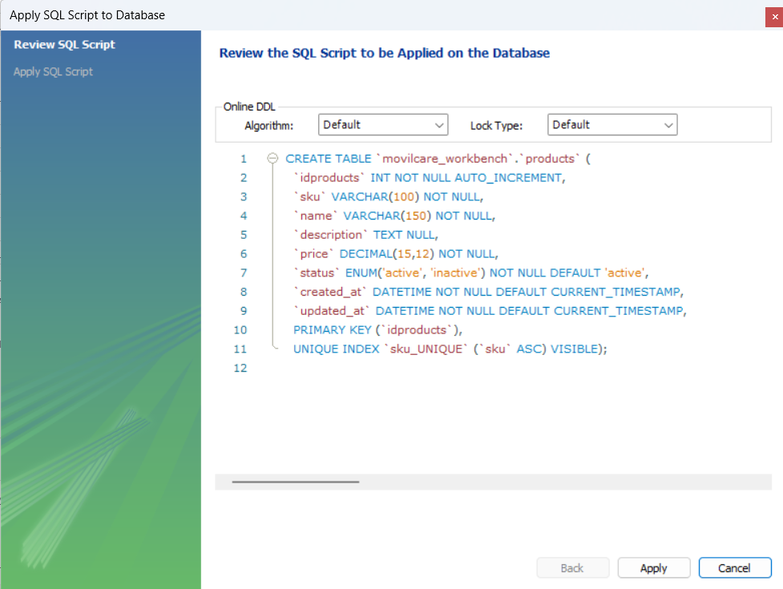

---

## 2. Creación de la tabla `serialized_units`

Se crea la tabla `serialized_units` mediante la interfaz gráfica de MySQL Workbench.

La tabla contiene los siguientes campos:

| Campo | Tipo de dato | Restricciones |
|---|---|---|
| `id` | BIGINT | PK, NN, AI |
| `name` | VARCHAR(150) | NN |
| `description` | TEXT | |
| `status` | ENUM('active', 'inactive') | NN, Default: active |
| `created_at` | DATETIME | NN, Default: CURRENT_TIMESTAMP |
| `updated_at` | DATETIME | NN, Default: CURRENT_TIMESTAMP |

El campo `id` se configura como clave primaria y con incremento automático. El campo `status` se establece mediante un tipo `ENUM`, restringiendo sus valores a `active` e `inactive`.

### Evidencia

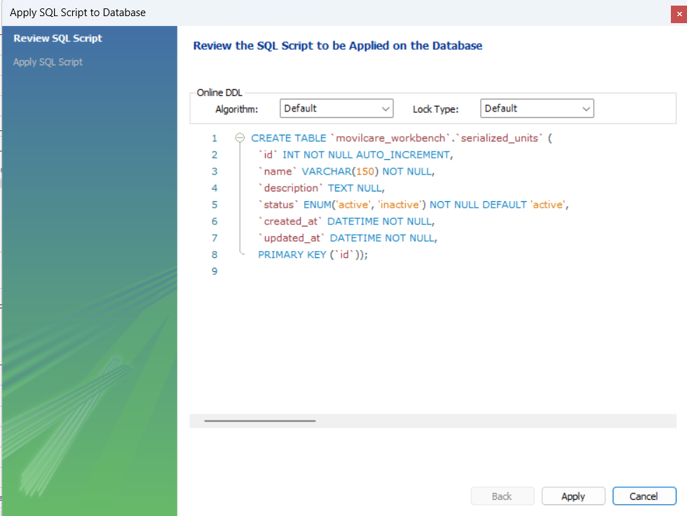

---

## 3. Creación de la tabla `customers`

Se crea la tabla `customers` utilizando la interfaz gráfica de MySQL Workbench.

La tabla contiene los siguientes campos:

| Campo | Tipo de dato | Restricciones |
|---|---|---|
| `id` | BIGINT | PK, NN, AI |
| `document_type` | VARCHAR(30) | NN |
| `document_number` | VARCHAR(50) | NN, UNIQUE |
| `name` | VARCHAR(150) | NN |
| `phone` | VARCHAR(30) | |
| `email` | VARCHAR(150) | |
| `status` | ENUM('active', 'inactive') | NN, Default: active |
| `created_at` | DATETIME | NN, Default: CURRENT_TIMESTAMP |
| `updated_at` | DATETIME | NN, Default: CURRENT_TIMESTAMP |

El campo `id` se establece como clave primaria con incremento automático. El campo `document_number` se configura como único para evitar la duplicación de documentos de identificación.

### Evidencia

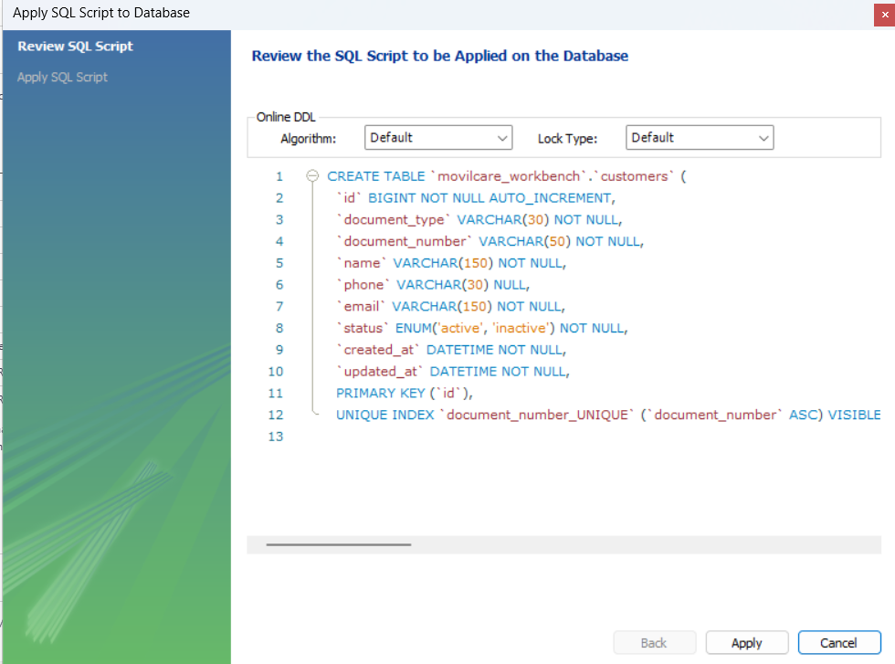

---

## 4. Creación de la tabla `sales`

Se crea la tabla `sales` mediante la interfaz de creación de tablas de MySQL Workbench.

La tabla contiene los siguientes campos:

| Campo | Tipo de dato | Restricciones |
|---|---|---|
| `id` | BIGINT | PK, NN, AI |
| `customer_id` | BIGINT | NN, FK |
| `date` | DATETIME | NN, Default: CURRENT_TIMESTAMP |
| `subtotal` | DECIMAL(15,2) | NN |
| `taxes` | DECIMAL(15,2) | NN, Default: 0 |
| `total` | DECIMAL(15,2) | NN |
| `status` | ENUM('active', 'inactive') | NN, Default: active |
| `created_at` | DATETIME | NN, Default: CURRENT_TIMESTAMP |
| `updated_at` | DATETIME | NN, Default: CURRENT_TIMESTAMP |

El campo `customer_id` se configura como clave foránea relacionada con el campo `id` de la tabla `customers`.

### Relación

```text
sales.customer_id → customers.id
````

### Evidencia

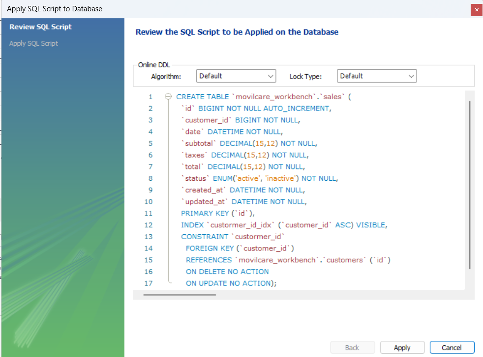

---

## 5. Creación de la tabla `sale_details`

Se crea la tabla `sale_details` utilizando la interfaz gráfica de MySQL Workbench.

La tabla contiene los siguientes campos:

| Campo          | Tipo de dato               | Restricciones                  |
| -------------- | -------------------------- | ------------------------------ |
| `id`           | BIGINT                     | PK, NN, AI                     |
| `sale_id`      | BIGINT                     | NN, FK                         |
| `product_id`   | BIGINT                     | NN, FK                         |
| `quantity`     | DECIMAL(15,3)              | NN                             |
| `unit_price`   | DECIMAL(15,2)              | NN                             |
| `total`        | DECIMAL(15,2)              | NN                             |
| `observations` | TEXT                       |                                |
| `status`       | ENUM('active', 'inactive') | NN, Default: active            |
| `created_at`   | DATETIME                   | NN, Default: CURRENT_TIMESTAMP |
| `updated_at`   | DATETIME                   | NN, Default: CURRENT_TIMESTAMP |

Se establecen dos relaciones mediante claves foráneas:

```text
sale_details.sale_id → sales.id
sale_details.product_id → products.id
```

Estas relaciones permiten asociar cada detalle con la venta y el producto correspondiente.

### Evidencia

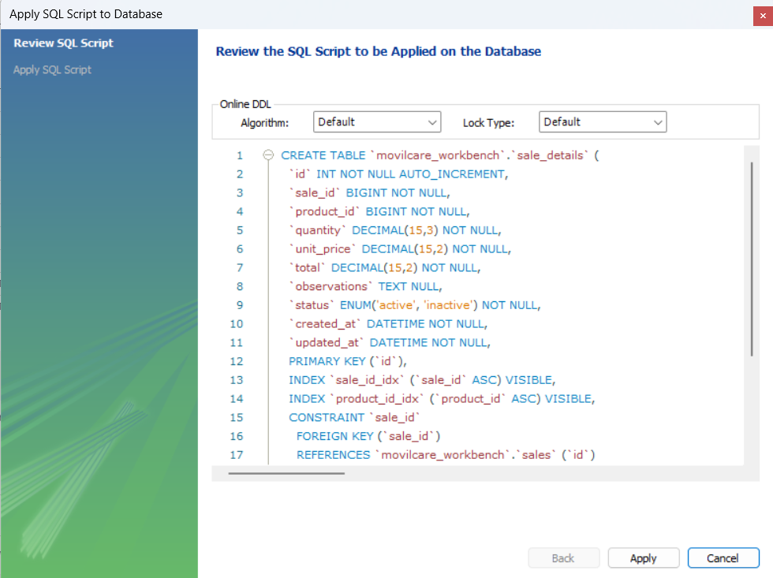

---

## 6. Creación de la tabla `warranties`

Se crea la tabla `warranties` mediante la interfaz gráfica de MySQL Workbench.

La tabla contiene los siguientes campos:

| Campo         | Tipo de dato               | Restricciones                  |
| ------------- | -------------------------- | ------------------------------ |
| `id`          | BIGINT                     | PK, NN, AI                     |
| `name`        | VARCHAR(150)               | NN                             |
| `description` | TEXT                       |                                |
| `status`      | ENUM('active', 'inactive') | NN, Default: active            |
| `created_at`  | DATETIME                   | NN, Default: CURRENT_TIMESTAMP |
| `updated_at`  | DATETIME                   | NN, Default: CURRENT_TIMESTAMP |

El campo `id` se establece como clave primaria y con incremento automático.

### Evidencia

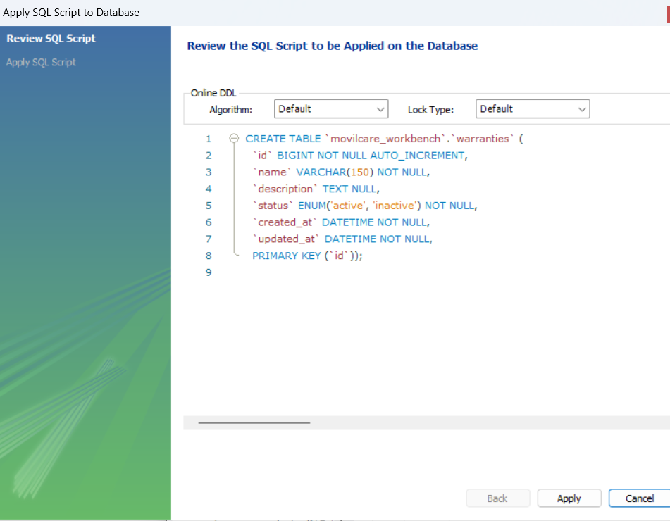

---

## 7. Creación de la tabla `service_orders`

Se crea la tabla `service_orders` mediante la interfaz de creación de tablas de MySQL Workbench.

La tabla contiene los siguientes campos:

| Campo         | Tipo de dato               | Restricciones                  |
| ------------- | -------------------------- | ------------------------------ |
| `id`          | BIGINT                     | PK, NN, AI                     |
| `customer_id` | BIGINT                     | NN, FK                         |
| `resource_id` | BIGINT                     |                                |
| `number`      | VARCHAR(50)                | NN, UNIQUE                     |
| `opened_at`   | DATETIME                   | NN, Default: CURRENT_TIMESTAMP |
| `closed_at`   | DATETIME                   |                                |
| `total`       | DECIMAL(15,2)              | NN, Default: 0                 |
| `status`      | ENUM('active', 'inactive') | NN, Default: active            |
| `created_at`  | DATETIME                   | NN, Default: CURRENT_TIMESTAMP |
| `updated_at`  | DATETIME                   | NN, Default: CURRENT_TIMESTAMP |

El campo `customer_id` se establece como clave foránea relacionada con `customers.id`.

El campo `resource_id` se mantiene como identificador sin clave foránea debido a que el modelo actual no contempla una tabla `resources`.

### Relación

```text
service_orders.customer_id → customers.id
```

### Evidencia


---

## 8. Creación de la tabla `diagnostics`

Se crea la tabla `diagnostics` utilizando la interfaz gráfica de MySQL Workbench.

La tabla contiene los siguientes campos:

| Campo         | Tipo de dato               | Restricciones                  |
| ------------- | -------------------------- | ------------------------------ |
| `id`          | BIGINT                     | PK, NN, AI                     |
| `name`        | VARCHAR(150)               | NN                             |
| `description` | TEXT                       |                                |
| `status`      | ENUM('active', 'inactive') | NN, Default: active            |
| `created_at`  | DATETIME                   | NN, Default: CURRENT_TIMESTAMP |
| `updated_at`  | DATETIME                   | NN, Default: CURRENT_TIMESTAMP |

El campo `id` se establece como clave primaria con incremento automático.

### Evidencia

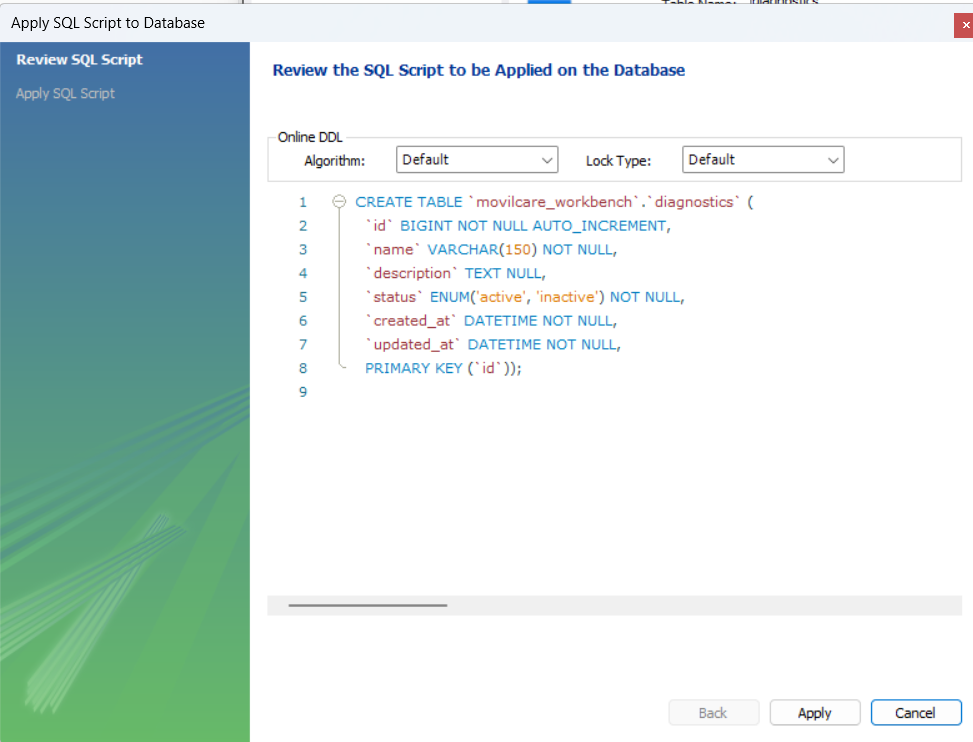
---

## 9. Creación de la tabla `spare_parts`

Se crea la tabla `spare_parts` mediante la interfaz gráfica de MySQL Workbench.

La tabla contiene los siguientes campos:

| Campo         | Tipo de dato               | Restricciones                  |
| ------------- | -------------------------- | ------------------------------ |
| `id`          | BIGINT                     | PK, NN, AI                     |
| `name`        | VARCHAR(150)               | NN                             |
| `description` | TEXT                       |                                |
| `status`      | ENUM('active', 'inactive') | NN, Default: active            |
| `created_at`  | DATETIME                   | NN, Default: CURRENT_TIMESTAMP |
| `updated_at`  | DATETIME                   | NN, Default: CURRENT_TIMESTAMP |

El campo `id` se establece como clave primaria y con incremento automático.

### Evidencia


---

## 10. Creación de la tabla `spare_part_consumptions`

Se crea la tabla `spare_part_consumptions` mediante la interfaz gráfica de MySQL Workbench.

La tabla contiene los siguientes campos:

| Campo         | Tipo de dato               | Restricciones                  |
| ------------- | -------------------------- | ------------------------------ |
| `id`          | BIGINT                     | PK, NN, AI                     |
| `name`        | VARCHAR(150)               | NN                             |
| `description` | TEXT                       |                                |
| `status`      | ENUM('active', 'inactive') | NN, Default: active            |
| `created_at`  | DATETIME                   | NN, Default: CURRENT_TIMESTAMP |
| `updated_at`  | DATETIME                   | NN, Default: CURRENT_TIMESTAMP |

El campo `id` se configura como clave primaria con incremento automático.

### Evidencia

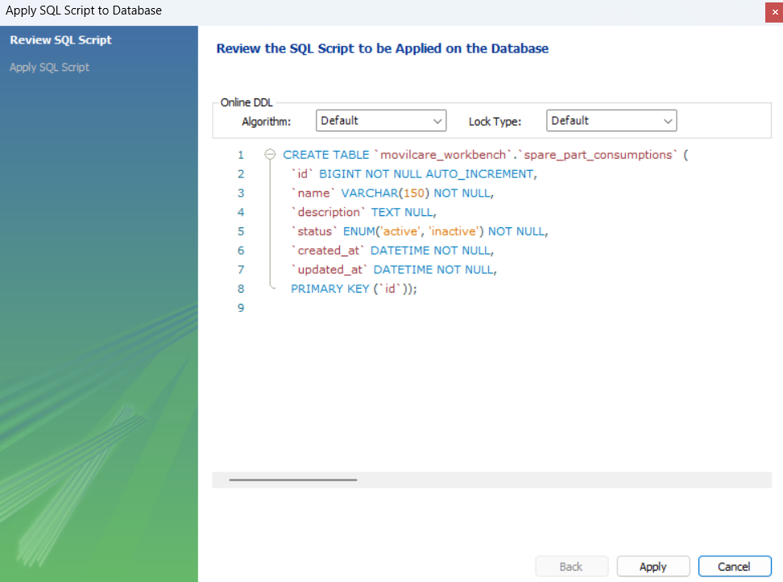

---

## 11. Creación de la tabla `payments`

Finalmente, se crea la tabla `payments` mediante la interfaz gráfica de MySQL Workbench.

La tabla contiene los siguientes campos:

| Campo            | Tipo de dato               | Restricciones                  |
| ---------------- | -------------------------- | ------------------------------ |
| `id`             | BIGINT                     | PK, NN, AI                     |
| `reference_type` | VARCHAR(50)                | NN                             |
| `reference_id`   | BIGINT                     | NN                             |
| `method`         | VARCHAR(50)                | NN                             |
| `amount`         | DECIMAL(15,2)              | NN                             |
| `date`           | DATETIME                   | NN, Default: CURRENT_TIMESTAMP |
| `status`         | ENUM('active', 'inactive') | NN, Default: active            |
| `created_at`     | DATETIME                   | NN, Default: CURRENT_TIMESTAMP |
| `updated_at`     | DATETIME                   | NN, Default: CURRENT_TIMESTAMP |

El campo `id` se configura como clave primaria con incremento automático.

El campo `reference_id` se mantiene sin una clave foránea debido a que `reference_type` permite determinar dinámicamente el tipo de registro al que hace referencia.

### Evidencia

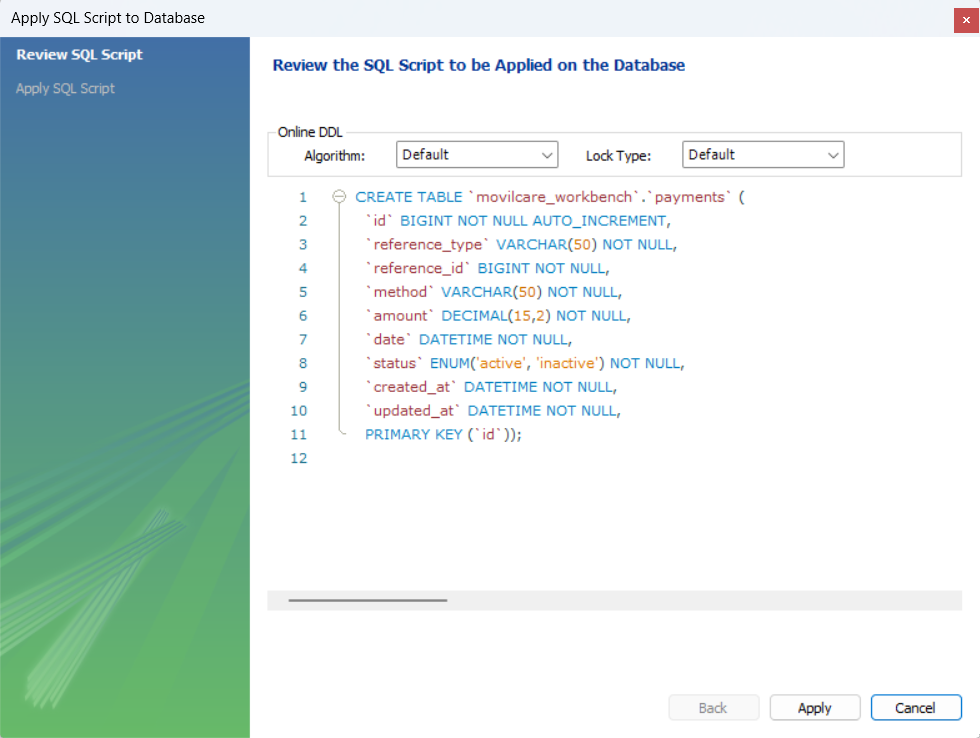

# Diagrama de la base de datos

Una vez finalizada la creación de las tablas mediante la interfaz gráfica de MySQL Workbench, se procede a generar y visualizar el diagrama entidad-relación de la base de datos.

El diagrama permite comprobar visualmente la estructura de las tablas y las relaciones establecidas entre ellas.

### Evidencia

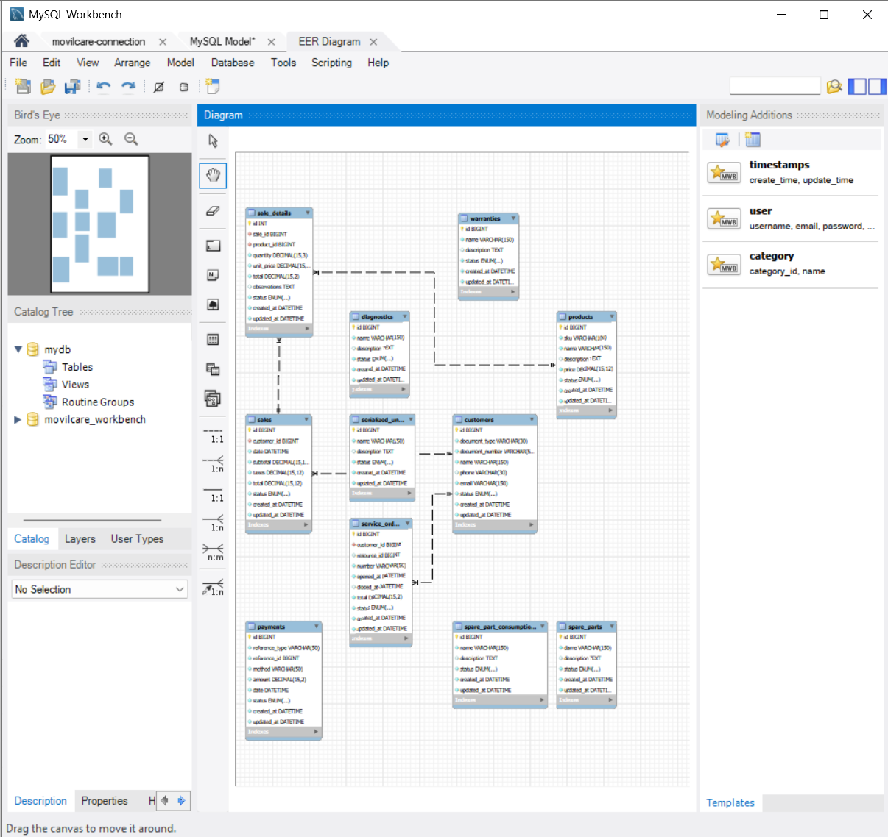

# Base de datos en PostgreSQL - Terminal DBeaver

Para la implementación de la base de datos MovilCare en PostgreSQL se utilizó DBeaver como herramienta de administración. Se mantuvo la misma estructura lógica implementada previamente en MySQL, adaptando únicamente los tipos de datos y elementos de sintaxis correspondientes al motor PostgreSQL.

## 1. Creación de la tabla Products

La tabla `products` almacena la información general de los productos comercializados por MovilCare.

### Código

```sql
CREATE TABLE products (

    id BIGINT GENERATED ALWAYS AS IDENTITY PRIMARY KEY,

    sku VARCHAR(100) NOT NULL UNIQUE,

    name VARCHAR(150) NOT NULL,

    description TEXT,

    price NUMERIC(15,2) NOT NULL,

    is_active BOOLEAN NOT NULL DEFAULT TRUE,

    created_at TIMESTAMP NOT NULL DEFAULT CURRENT_TIMESTAMP,

    updated_at TIMESTAMP NOT NULL DEFAULT CURRENT_TIMESTAMP

);
```

### Evidencia

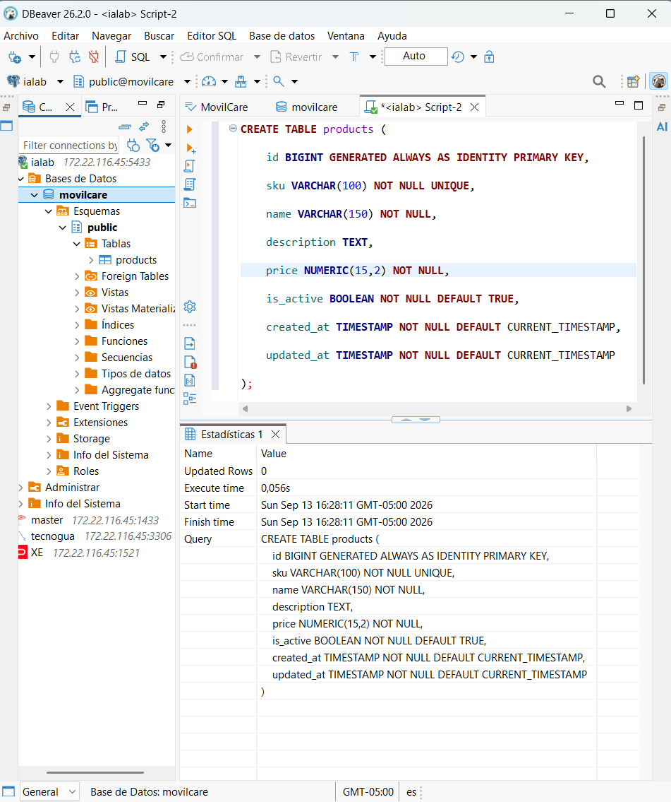

---

## 2. Creación de la tabla SerializedUnits

La tabla `serialized_units` almacena las unidades individuales que requieren identificación y seguimiento dentro del sistema.

### Código

```sql
CREATE TABLE serialized_units (

    id BIGINT GENERATED ALWAYS AS IDENTITY PRIMARY KEY,

    name VARCHAR(150) NOT NULL,

    description TEXT,

    is_active BOOLEAN NOT NULL DEFAULT TRUE,

    created_at TIMESTAMP NOT NULL DEFAULT CURRENT_TIMESTAMP,

    updated_at TIMESTAMP NOT NULL DEFAULT CURRENT_TIMESTAMP

);
```

### Evidencia

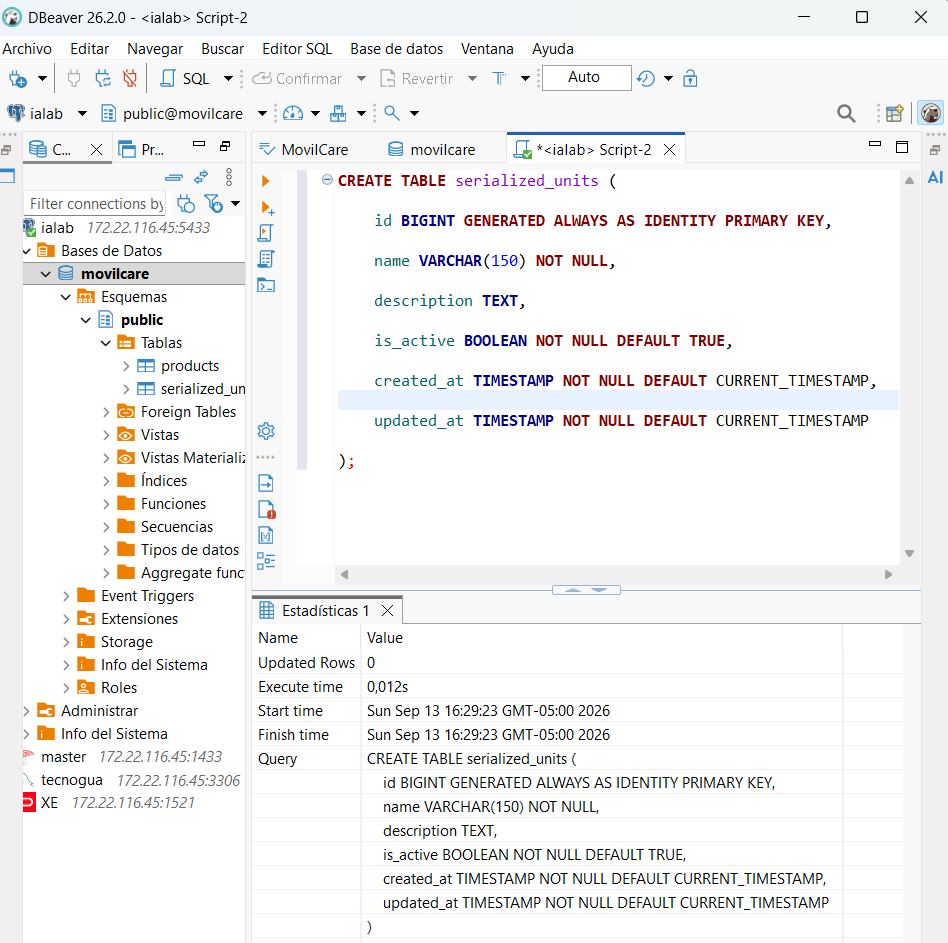

---

## 3. Creación de la tabla Customers

La tabla `customers` almacena la información de los clientes registrados en el sistema.

### Código

```sql
CREATE TABLE customers (

    id BIGINT GENERATED ALWAYS AS IDENTITY PRIMARY KEY,

    document_type VARCHAR(30) NOT NULL,

    document_number VARCHAR(50) NOT NULL UNIQUE,

    name VARCHAR(150) NOT NULL,

    phone VARCHAR(30),

    email VARCHAR(150),

    is_active BOOLEAN NOT NULL DEFAULT TRUE,

    created_at TIMESTAMP NOT NULL DEFAULT CURRENT_TIMESTAMP,

    updated_at TIMESTAMP NOT NULL DEFAULT CURRENT_TIMESTAMP

);
```

### Evidencia

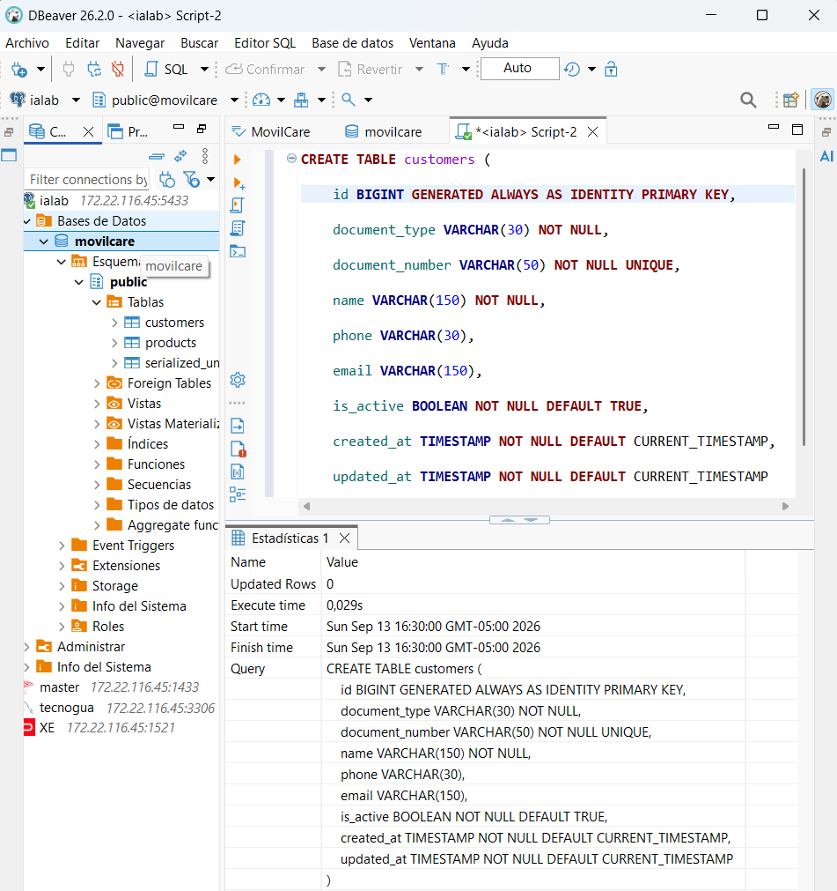

---

## 4. Creación de la tabla Sales

La tabla `sales` registra las ventas realizadas y las relaciona con el cliente correspondiente mediante la clave foránea `customer_id`.

### Código

```sql
CREATE TABLE sales (

    id BIGINT GENERATED ALWAYS AS IDENTITY PRIMARY KEY,

    customer_id BIGINT NOT NULL,

    date TIMESTAMP NOT NULL DEFAULT CURRENT_TIMESTAMP,

    subtotal NUMERIC(15,2) NOT NULL,

    taxes NUMERIC(15,2) NOT NULL DEFAULT 0,

    total NUMERIC(15,2) NOT NULL,

    status VARCHAR(30) NOT NULL,

    created_at TIMESTAMP NOT NULL DEFAULT CURRENT_TIMESTAMP,

    updated_at TIMESTAMP NOT NULL DEFAULT CURRENT_TIMESTAMP,

    CONSTRAINT fk_sales_customer
        FOREIGN KEY (customer_id)
        REFERENCES customers(id)

);
```

### Evidencia

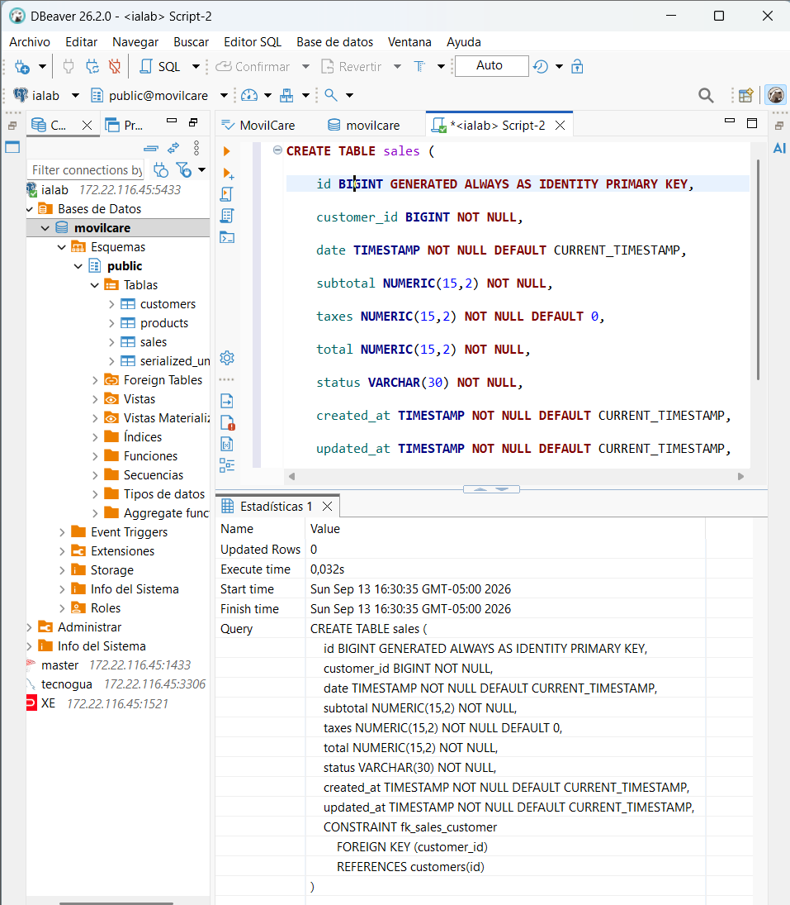

---

## 5. Creación de la tabla SaleDetails

La tabla `sale_details` contiene el detalle de los productos incluidos en cada venta, incluyendo cantidad, precio unitario, total y observaciones.

### Código

```sql
CREATE TABLE sale_details (

    id BIGINT GENERATED ALWAYS AS IDENTITY PRIMARY KEY,

    sale_id BIGINT NOT NULL,

    product_id BIGINT NOT NULL,

    quantity NUMERIC(15,3) NOT NULL,

    unit_price NUMERIC(15,2) NOT NULL,

    total NUMERIC(15,2) NOT NULL,

    observations TEXT,

    created_at TIMESTAMP NOT NULL DEFAULT CURRENT_TIMESTAMP,

    updated_at TIMESTAMP NOT NULL DEFAULT CURRENT_TIMESTAMP,

    CONSTRAINT fk_sale_details_sale
        FOREIGN KEY (sale_id)
        REFERENCES sales(id),

    CONSTRAINT fk_sale_details_product
        FOREIGN KEY (product_id)
        REFERENCES products(id)

);
```

### Evidencia

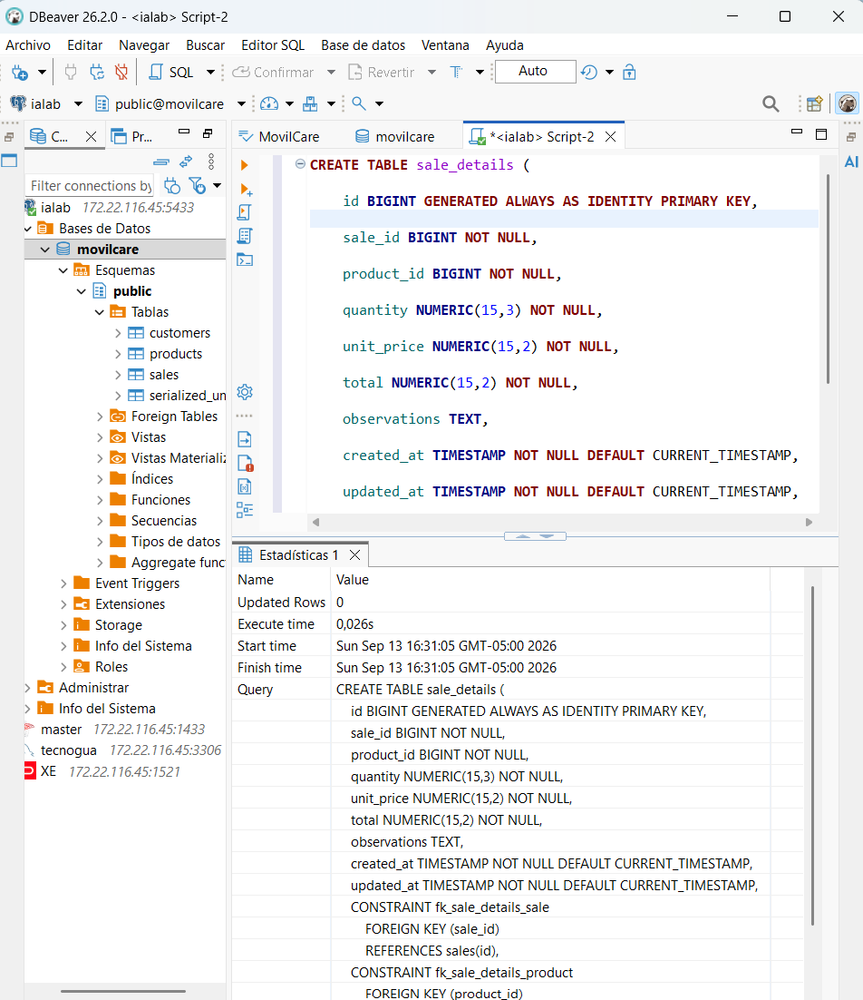

---

## 6. Creación de la tabla Warranties

La tabla `warranties` almacena la información relacionada con las garantías ofrecidas por MovilCare.

### Código

```sql
CREATE TABLE warranties (

    id BIGINT GENERATED ALWAYS AS IDENTITY PRIMARY KEY,

    name VARCHAR(150) NOT NULL,

    description TEXT,

    is_active BOOLEAN NOT NULL DEFAULT TRUE,

    created_at TIMESTAMP NOT NULL DEFAULT CURRENT_TIMESTAMP,

    updated_at TIMESTAMP NOT NULL DEFAULT CURRENT_TIMESTAMP

);
```

### Evidencia

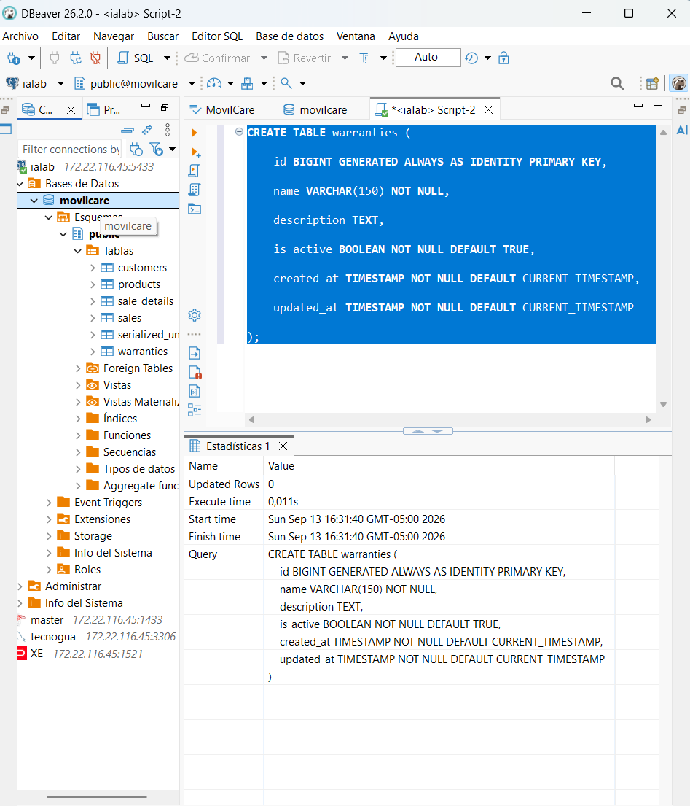
---

## 7. Creación de la tabla ServiceOrders

La tabla `service_orders` almacena las órdenes de servicio generadas para la atención de los clientes.

### Código

```sql
CREATE TABLE service_orders (

    id BIGINT GENERATED ALWAYS AS IDENTITY PRIMARY KEY,

    customer_id BIGINT NOT NULL,

    resource_id BIGINT,

    number VARCHAR(50) NOT NULL UNIQUE,

    opened_at TIMESTAMP NOT NULL DEFAULT CURRENT_TIMESTAMP,

    closed_at TIMESTAMP,

    total NUMERIC(15,2) NOT NULL DEFAULT 0,

    status VARCHAR(30) NOT NULL,

    created_at TIMESTAMP NOT NULL DEFAULT CURRENT_TIMESTAMP,

    updated_at TIMESTAMP NOT NULL DEFAULT CURRENT_TIMESTAMP,

    CONSTRAINT fk_service_orders_customer
        FOREIGN KEY (customer_id)
        REFERENCES customers(id)

);
```

### Evidencia

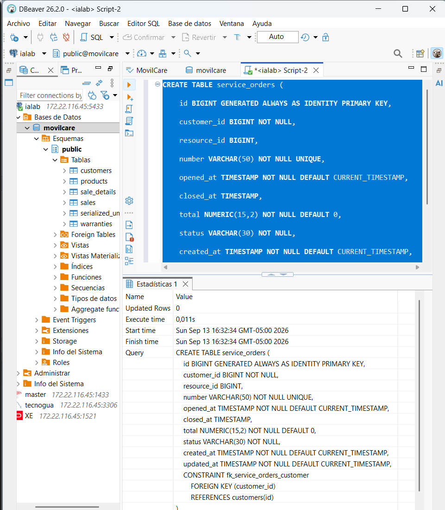

> **Nota:** `resource_id` se conserva debido a que forma parte del modelo original. Sin embargo, no se establece la restricción `FOREIGN KEY` porque la tabla `resources` no se encuentra definida actualmente en el modelo.

---

## 8. Creación de la tabla Diagnostics

La tabla `diagnostics` almacena la información relacionada con los diagnósticos realizados durante los procesos de servicio técnico.

### Código

```sql
CREATE TABLE diagnostics (

    id BIGINT GENERATED ALWAYS AS IDENTITY PRIMARY KEY,

    name VARCHAR(150) NOT NULL,

    description TEXT,

    is_active BOOLEAN NOT NULL DEFAULT TRUE,

    created_at TIMESTAMP NOT NULL DEFAULT CURRENT_TIMESTAMP,

    updated_at TIMESTAMP NOT NULL DEFAULT CURRENT_TIMESTAMP

);
```

### Evidencia

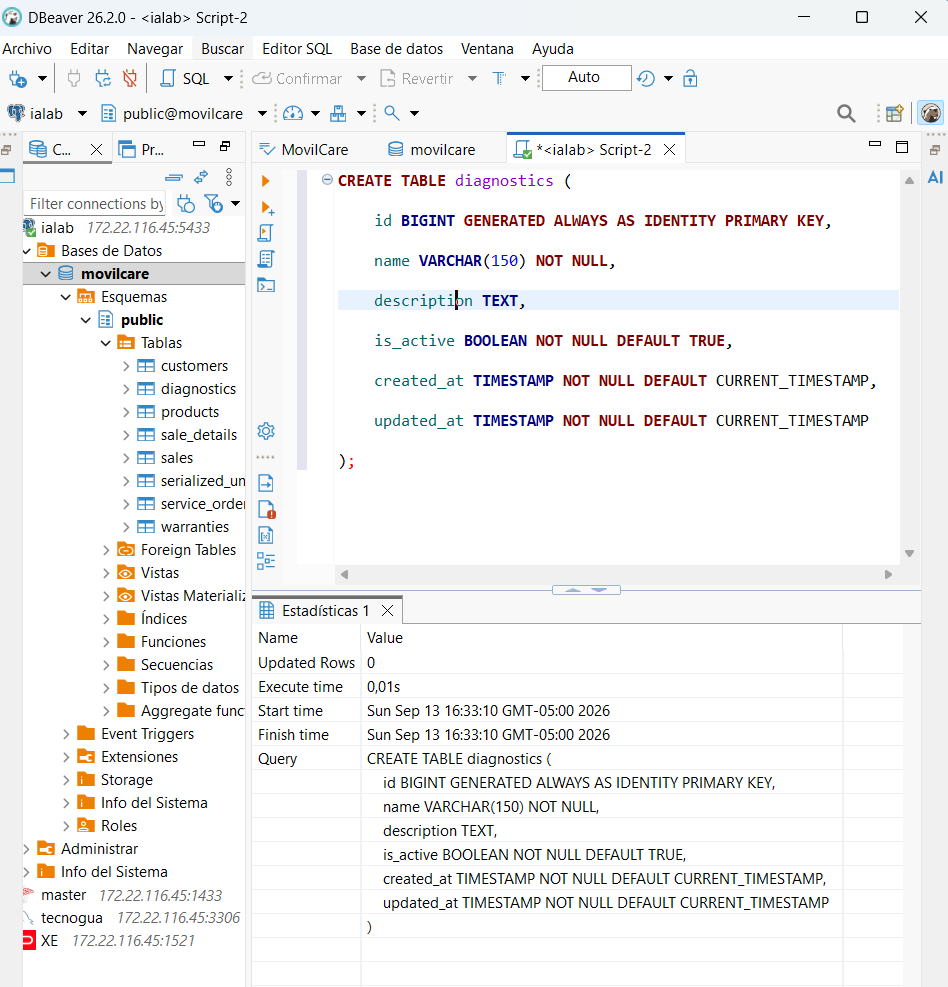

---

## 9. Creación de la tabla SpareParts

La tabla `spare_parts` almacena la información de los repuestos utilizados en los procesos de servicio técnico.

### Código

```sql
CREATE TABLE spare_parts (

    id BIGINT GENERATED ALWAYS AS IDENTITY PRIMARY KEY,

    name VARCHAR(150) NOT NULL,

    description TEXT,

    is_active BOOLEAN NOT NULL DEFAULT TRUE,

    created_at TIMESTAMP NOT NULL DEFAULT CURRENT_TIMESTAMP,

    updated_at TIMESTAMP NOT NULL DEFAULT CURRENT_TIMESTAMP

);
```

### Evidencia

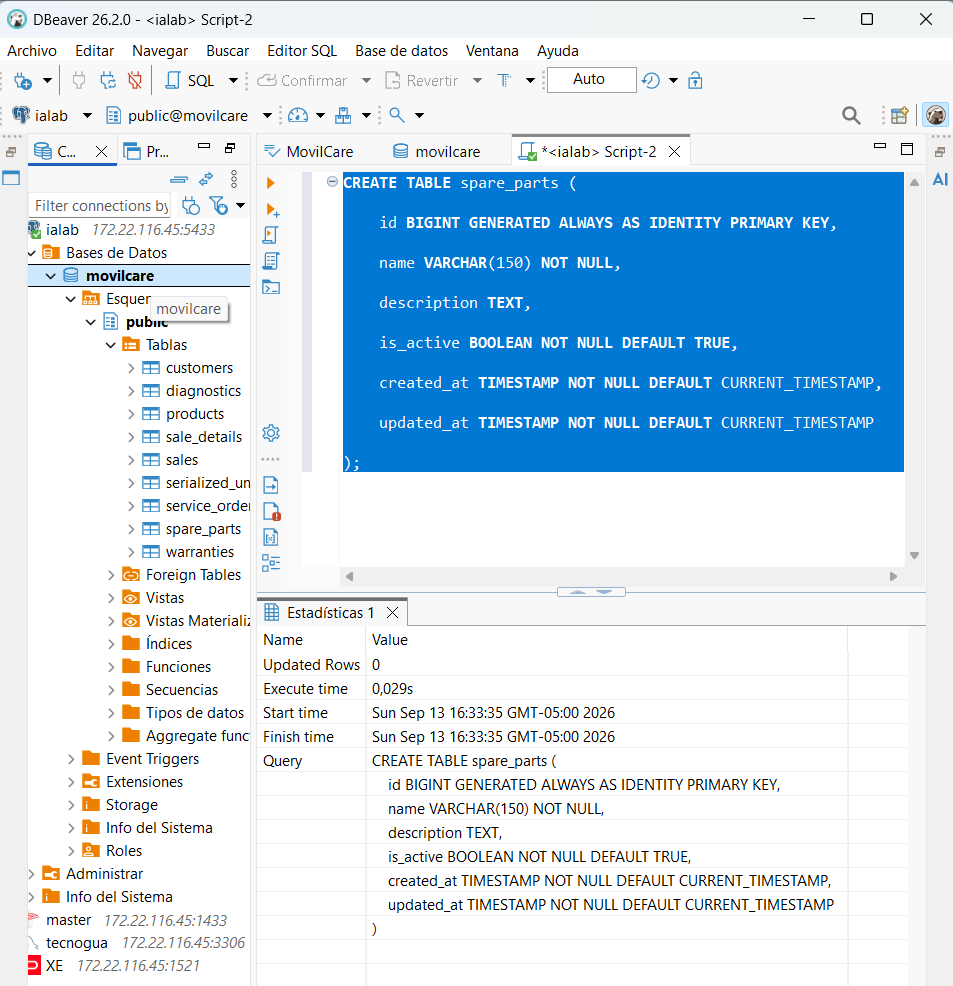

---

## 10. Creación de la tabla SparePartConsumptions

La tabla `spare_part_consumptions` almacena la información relacionada con el consumo de repuestos.

### Código

```sql
CREATE TABLE spare_part_consumptions (

    id BIGINT GENERATED ALWAYS AS IDENTITY PRIMARY KEY,

    name VARCHAR(150) NOT NULL,

    description TEXT,

    is_active BOOLEAN NOT NULL DEFAULT TRUE,

    created_at TIMESTAMP NOT NULL DEFAULT CURRENT_TIMESTAMP,

    updated_at TIMESTAMP NOT NULL DEFAULT CURRENT_TIMESTAMP

);
```

### Evidencia

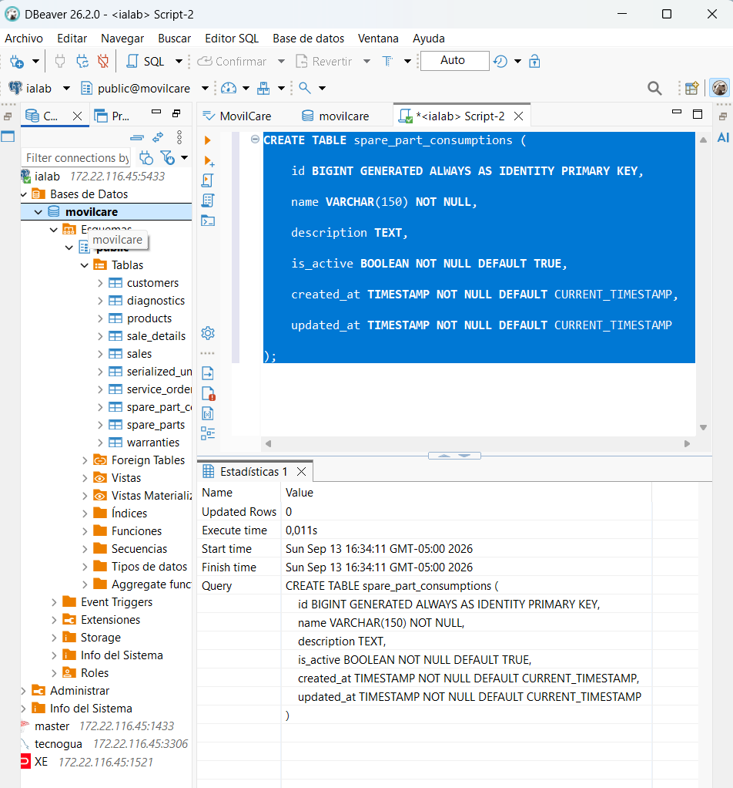

---

## 11. Creación de la tabla Payments

La tabla `payments` almacena los pagos realizados y la referencia al registro al que corresponde cada pago.

### Código

```sql
CREATE TABLE payments (

    id BIGINT GENERATED ALWAYS AS IDENTITY PRIMARY KEY,

    reference_type VARCHAR(50) NOT NULL,

    reference_id BIGINT NOT NULL,

    method VARCHAR(50) NOT NULL,

    amount NUMERIC(15,2) NOT NULL,

    date TIMESTAMP NOT NULL DEFAULT CURRENT_TIMESTAMP,

    status VARCHAR(30) NOT NULL,

    created_at TIMESTAMP NOT NULL DEFAULT CURRENT_TIMESTAMP,

    updated_at TIMESTAMP NOT NULL DEFAULT CURRENT_TIMESTAMP

);
```

### Evidencia

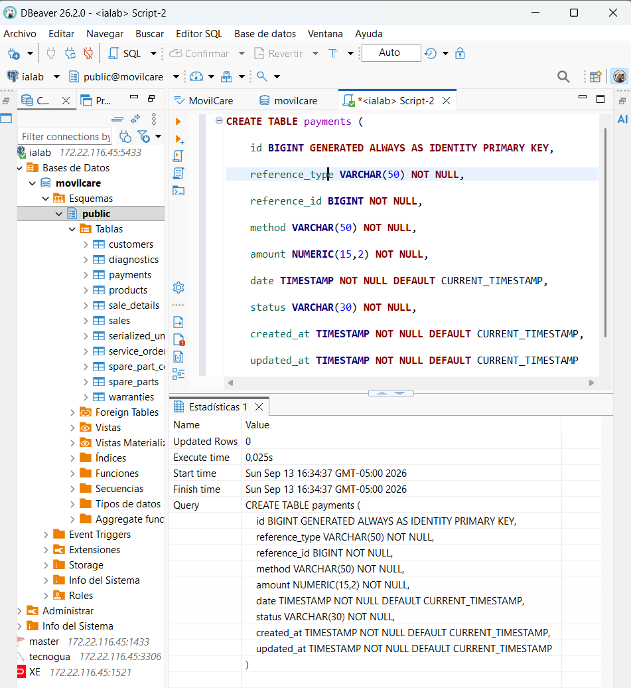

---

# Diagrama de la base de datos

Una vez creadas todas las tablas y establecidas las relaciones correspondientes, se procede a visualizar el diagrama de la base de datos en DBeaver.

### Evidencia

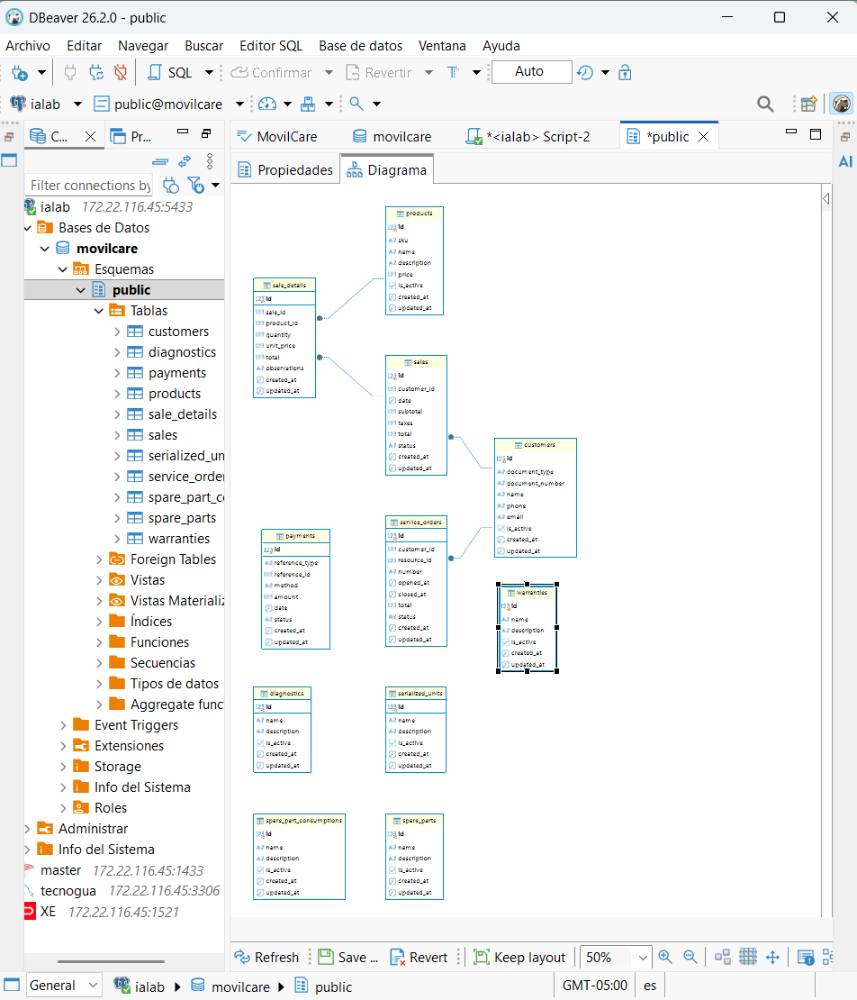


---

# Consideraciones de PostgreSQL

Durante la implementación de MovilCare en PostgreSQL se realizaron las siguientes adaptaciones respecto a la versión de MySQL:

| MySQL | PostgreSQL |
|---|---|
| `BIGINT AUTO_INCREMENT` | `BIGINT GENERATED ALWAYS AS IDENTITY` |
| `DECIMAL(15,2)` | `NUMERIC(15,2)` |
| `DATETIME` | `TIMESTAMP` |
| `BOOLEAN` | `BOOLEAN` |
| `DEFAULT CURRENT_TIMESTAMP` | `DEFAULT CURRENT_TIMESTAMP` |
| `ON UPDATE CURRENT_TIMESTAMP` | No existe de forma nativa |

> **Nota:** PostgreSQL no dispone de `ON UPDATE CURRENT_TIMESTAMP` como MySQL. Por esta razón, `updated_at` se inicializa con `CURRENT_TIMESTAMP`, pero para actualizar automáticamente este campo cuando se modifique un registro será necesario implementar posteriormente un **trigger**.


# Base de datos en Postgresql - gestor pgAmin

Para esta etapa se realizó nuevamente la creación de la base de datos MovilCare utilizando el gestor gráfico **pgAdmin**, herramienta de administración para PostgreSQL.

A diferencia de la implementación anterior realizada mediante scripts SQL en DBeaver, en esta ocasión las tablas fueron construidas utilizando las opciones disponibles en la interfaz gráfica de pgAdmin, configurando manualmente los campos, tipos de datos, valores predeterminados, claves primarias, restricciones y relaciones correspondientes.

La estructura utilizada mantiene el mismo modelo lógico definido para MovilCare.

**Evidencia**
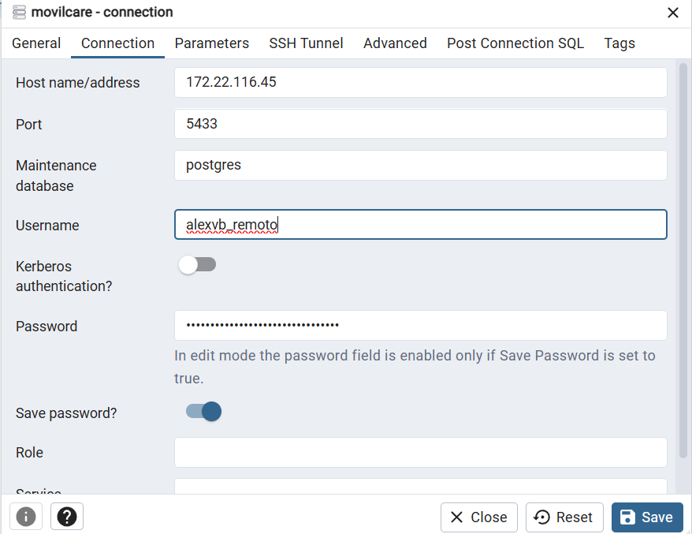

## 1. Creación de la tabla `products`

Se inicia la creación de la tabla `products` mediante la opción **Create → Table** disponible en pgAdmin.

La tabla contiene los siguientes campos:

| Campo | Tipo de dato | Restricciones |
|---|---|---|
| `id` | BIGINT | PK, NOT NULL, Identity |
| `sku` | VARCHAR(100) | NOT NULL, UNIQUE |
| `name` | VARCHAR(150) | NOT NULL |
| `description` | TEXT | |
| `price` | NUMERIC(15,2) | NOT NULL |
| `status` | VARCHAR(10) | NOT NULL, Default: active |
| `created_at` | TIMESTAMP | NOT NULL, Default: CURRENT_TIMESTAMP |
| `updated_at` | TIMESTAMP | NOT NULL, Default: CURRENT_TIMESTAMP |

El campo `id` se establece como clave primaria y se configura como columna Identity para generar automáticamente los identificadores.

El campo `sku` se configura como único para evitar la duplicación de identificadores de producto.

Para el campo `status` se establece una restricción `CHECK` que permite únicamente los valores `active` e `inactive`.

### Evidencia

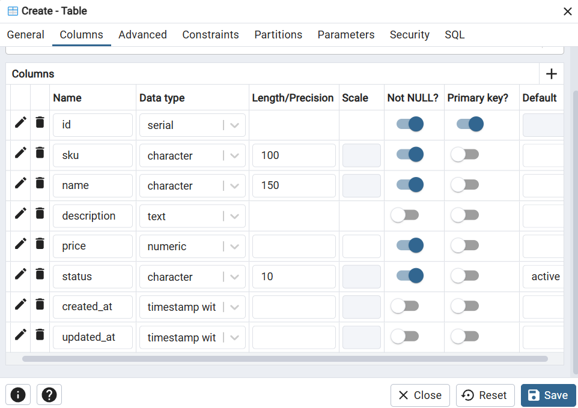

---

## 2. Creación de la tabla `serialized_units`

Se crea la tabla `serialized_units` mediante la interfaz gráfica de pgAdmin.

La tabla contiene los siguientes campos:

| Campo | Tipo de dato | Restricciones |
|---|---|---|
| `id` | BIGINT | PK, NOT NULL, Identity |
| `name` | VARCHAR(150) | NOT NULL |
| `description` | TEXT | |
| `status` | VARCHAR(10) | NOT NULL, Default: active |
| `created_at` | TIMESTAMP | NOT NULL, Default: CURRENT_TIMESTAMP |
| `updated_at` | TIMESTAMP | NOT NULL, Default: CURRENT_TIMESTAMP |

El campo `id` se configura como clave primaria con generación automática de valores.

El campo `status` se restringe a los valores `active` e `inactive`.

### Evidencia

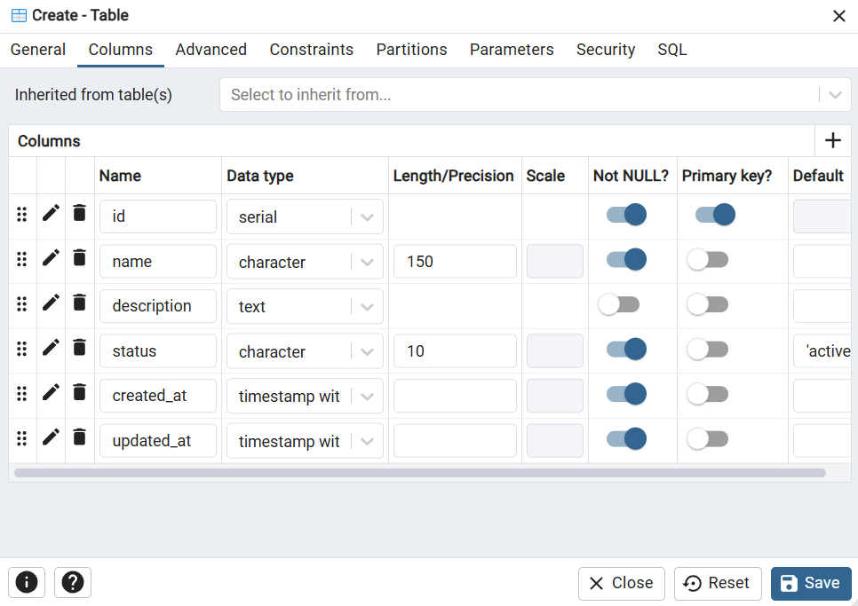

---

## 3. Creación de la tabla `customers`

Se crea la tabla `customers` mediante la interfaz gráfica de pgAdmin.

La tabla contiene los siguientes campos:

| Campo | Tipo de dato | Restricciones |
|---|---|---|
| `id` | BIGINT | PK, NOT NULL, Identity |
| `document_type` | VARCHAR(30) | NOT NULL |
| `document_number` | VARCHAR(50) | NOT NULL, UNIQUE |
| `name` | VARCHAR(150) | NOT NULL |
| `phone` | VARCHAR(30) | |
| `email` | VARCHAR(150) | |
| `status` | VARCHAR(10) | NOT NULL, Default: active |
| `created_at` | TIMESTAMP | NOT NULL, Default: CURRENT_TIMESTAMP |
| `updated_at` | TIMESTAMP | NOT NULL, Default: CURRENT_TIMESTAMP |

El campo `id` se establece como clave primaria con generación automática.

El campo `document_number` se configura como único para evitar que un mismo documento de identificación sea registrado más de una vez.

### Evidencias

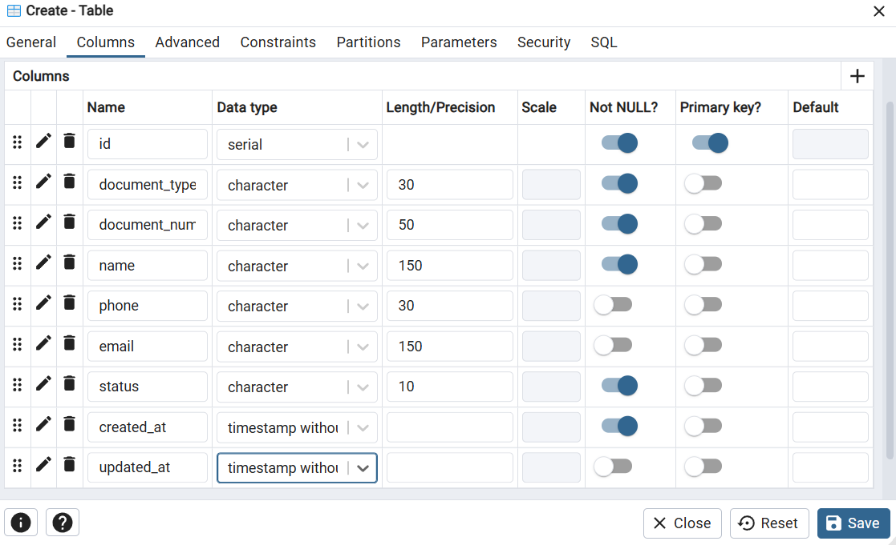


---

## 4. Creación de la tabla `sales`

Se crea la tabla `sales` mediante la interfaz gráfica de pgAdmin.

La tabla contiene los siguientes campos:

| Campo | Tipo de dato | Restricciones |
|---|---|---|
| `id` | BIGINT | PK, NOT NULL, Identity |
| `customer_id` | BIGINT | NOT NULL, FK |
| `date` | TIMESTAMP | NOT NULL, Default: CURRENT_TIMESTAMP |
| `subtotal` | NUMERIC(15,2) | NOT NULL |
| `taxes` | NUMERIC(15,2) | NOT NULL, Default: 0 |
| `total` | NUMERIC(15,2) | NOT NULL |
| `status` | VARCHAR(10) | NOT NULL, Default: active |
| `created_at` | TIMESTAMP | NOT NULL, Default: CURRENT_TIMESTAMP |
| `updated_at` | TIMESTAMP | NOT NULL, Default: CURRENT_TIMESTAMP |

Se establece una clave foránea entre `customer_id` y el campo `id` de la tabla `customers`.

### Relación

```text
sales.customer_id → customers.id
```

### Evidencia

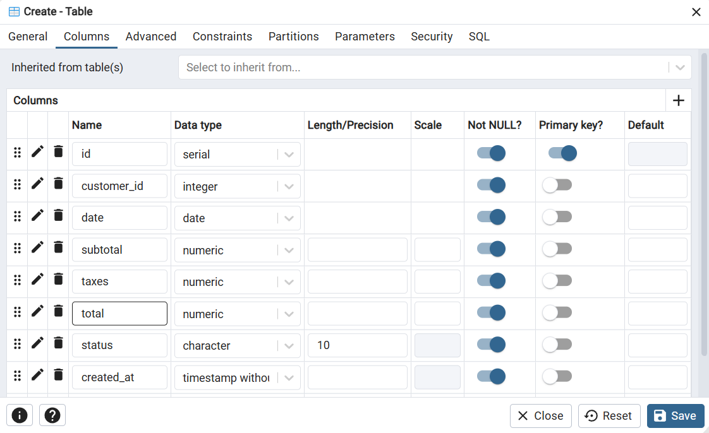


---

## 5. Creación de la tabla `sale_details`

Se crea la tabla `sale_details` utilizando la interfaz gráfica de pgAdmin.

La tabla contiene los siguientes campos:

| Campo          | Tipo de dato  | Restricciones                        |
| -------------- | ------------- | ------------------------------------ |
| `id`           | BIGINT        | PK, NOT NULL, Identity               |
| `sale_id`      | BIGINT        | NOT NULL, FK                         |
| `product_id`   | BIGINT        | NOT NULL, FK                         |
| `quantity`     | NUMERIC(15,3) | NOT NULL                             |
| `unit_price`   | NUMERIC(15,2) | NOT NULL                             |
| `total`        | NUMERIC(15,2) | NOT NULL                             |
| `observations` | TEXT          |                                      |
| `status`       | VARCHAR(10)   | NOT NULL, Default: active            |
| `created_at`   | TIMESTAMP     | NOT NULL, Default: CURRENT_TIMESTAMP |
| `updated_at`   | TIMESTAMP     | NOT NULL, Default: CURRENT_TIMESTAMP |

Se establecen dos claves foráneas:

```text
sale_details.sale_id → sales.id
sale_details.product_id → products.id
```

Estas relaciones permiten asociar cada detalle con la venta y el producto correspondiente.

### Evidencia

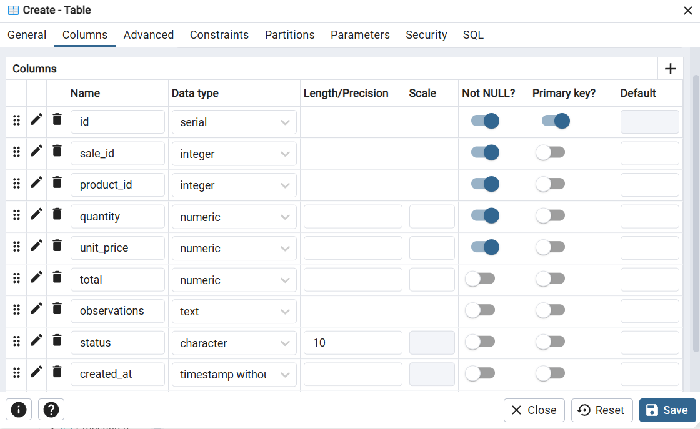


---

## 6. Creación de la tabla `warranties`

Se crea la tabla `warranties` mediante la interfaz gráfica de pgAdmin.

La tabla contiene los siguientes campos:

| Campo         | Tipo de dato | Restricciones                        |
| ------------- | ------------ | ------------------------------------ |
| `id`          | BIGINT       | PK, NOT NULL, Identity               |
| `name`        | VARCHAR(150) | NOT NULL                             |
| `description` | TEXT         |                                      |
| `status`      | VARCHAR(10)  | NOT NULL, Default: active            |
| `created_at`  | TIMESTAMP    | NOT NULL, Default: CURRENT_TIMESTAMP |
| `updated_at`  | TIMESTAMP    | NOT NULL, Default: CURRENT_TIMESTAMP |

El campo `id` se establece como clave primaria con generación automática.

### Evidencia

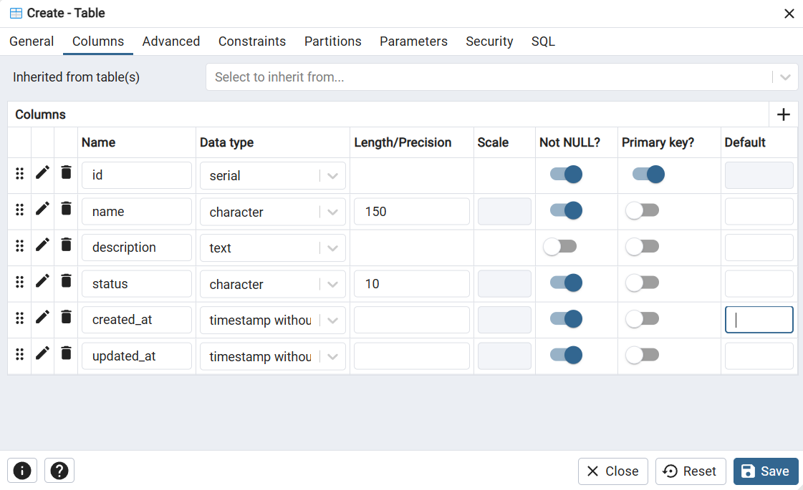

---

## 7. Creación de la tabla `service_orders`

Se crea la tabla `service_orders` mediante la interfaz gráfica de pgAdmin.

La tabla contiene los siguientes campos:

| Campo         | Tipo de dato  | Restricciones                        |
| ------------- | ------------- | ------------------------------------ |
| `id`          | BIGINT        | PK, NOT NULL, Identity               |
| `customer_id` | BIGINT        | NOT NULL, FK                         |
| `resource_id` | BIGINT        |                                      |
| `number`      | VARCHAR(50)   | NOT NULL, UNIQUE                     |
| `opened_at`   | TIMESTAMP     | NOT NULL, Default: CURRENT_TIMESTAMP |
| `closed_at`   | TIMESTAMP     |                                      |
| `total`       | NUMERIC(15,2) | NOT NULL, Default: 0                 |
| `status`      | VARCHAR(10)   | NOT NULL, Default: active            |
| `created_at`  | TIMESTAMP     | NOT NULL, Default: CURRENT_TIMESTAMP |
| `updated_at`  | TIMESTAMP     | NOT NULL, Default: CURRENT_TIMESTAMP |

El campo `customer_id` se establece como clave foránea relacionada con `customers.id`.

El campo `resource_id` se mantiene sin clave foránea debido a que el modelo actual no contempla una tabla `resources`.

### Relación

```text
service_orders.customer_id → customers.id
```

### Evidencia

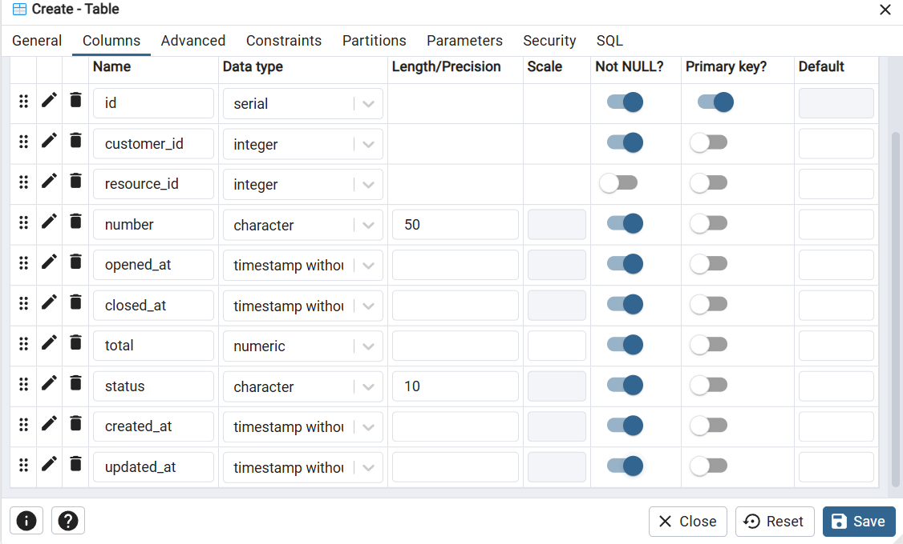


---

## 8. Creación de la tabla `diagnostics`

Se crea la tabla `diagnostics` utilizando la interfaz gráfica de pgAdmin.

La tabla contiene los siguientes campos:

| Campo         | Tipo de dato | Restricciones                        |
| ------------- | ------------ | ------------------------------------ |
| `id`          | BIGINT       | PK, NOT NULL, Identity               |
| `name`        | VARCHAR(150) | NOT NULL                             |
| `description` | TEXT         |                                      |
| `status`      | VARCHAR(10)  | NOT NULL, Default: active            |
| `created_at`  | TIMESTAMP    | NOT NULL, Default: CURRENT_TIMESTAMP |
| `updated_at`  | TIMESTAMP    | NOT NULL, Default: CURRENT_TIMESTAMP |

El campo `id` se configura como clave primaria con generación automática.

### Evidencia

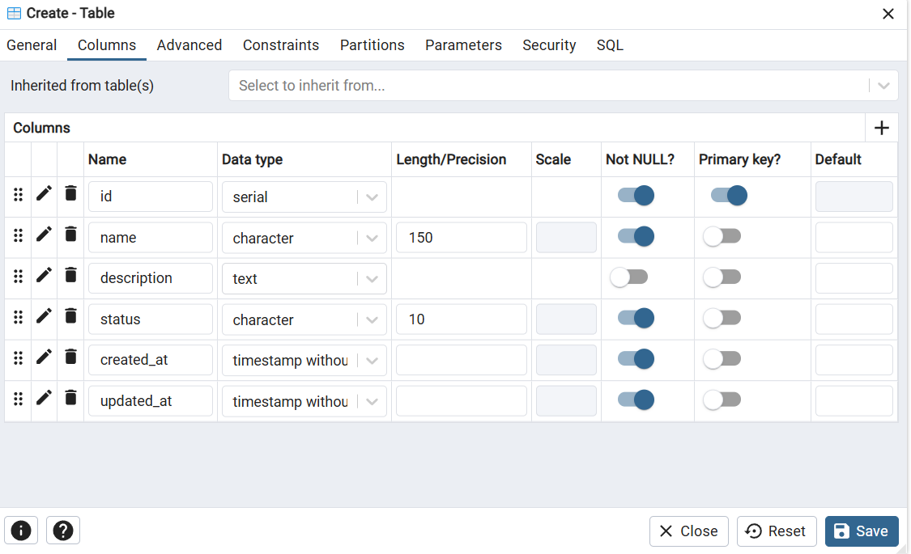

---

## 9. Creación de la tabla `spare_parts`

Se crea la tabla `spare_parts` mediante la interfaz gráfica de pgAdmin.

La tabla contiene los siguientes campos:

| Campo         | Tipo de dato | Restricciones                        |
| ------------- | ------------ | ------------------------------------ |
| `id`          | BIGINT       | PK, NOT NULL, Identity               |
| `name`        | VARCHAR(150) | NOT NULL                             |
| `description` | TEXT         |                                      |
| `status`      | VARCHAR(10)  | NOT NULL, Default: active            |
| `created_at`  | TIMESTAMP    | NOT NULL, Default: CURRENT_TIMESTAMP |
| `updated_at`  | TIMESTAMP    | NOT NULL, Default: CURRENT_TIMESTAMP |

El campo `id` se establece como clave primaria con generación automática.

### Evidencia


---

## 10. Creación de la tabla `spare_part_consumptions`

Se crea la tabla `spare_part_consumptions` mediante la interfaz gráfica de pgAdmin.

La tabla contiene los siguientes campos:

| Campo         | Tipo de dato | Restricciones                        |
| ------------- | ------------ | ------------------------------------ |
| `id`          | BIGINT       | PK, NOT NULL, Identity               |
| `name`        | VARCHAR(150) | NOT NULL                             |
| `description` | TEXT         |                                      |
| `status`      | VARCHAR(10)  | NOT NULL, Default: active            |
| `created_at`  | TIMESTAMP    | NOT NULL, Default: CURRENT_TIMESTAMP |
| `updated_at`  | TIMESTAMP    | NOT NULL, Default: CURRENT_TIMESTAMP |

El campo `id` se configura como clave primaria con generación automática.

### Evidencia

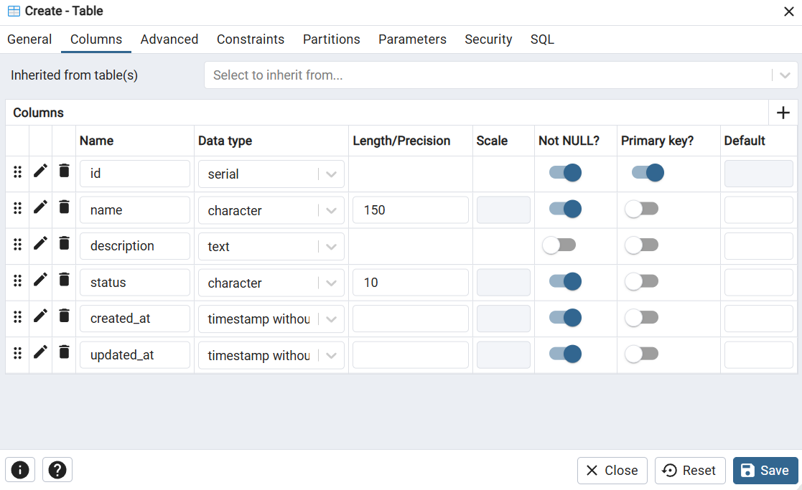

---

## 11. Creación de la tabla `payments`

Finalmente, se crea la tabla `payments` mediante la interfaz gráfica de pgAdmin.

La tabla contiene los siguientes campos:

| Campo            | Tipo de dato  | Restricciones                        |
| ---------------- | ------------- | ------------------------------------ |
| `id`             | BIGINT        | PK, NOT NULL, Identity               |
| `reference_type` | VARCHAR(50)   | NOT NULL                             |
| `reference_id`   | BIGINT        | NOT NULL                             |
| `method`         | VARCHAR(50)   | NOT NULL                             |
| `amount`         | NUMERIC(15,2) | NOT NULL                             |
| `date`           | TIMESTAMP     | NOT NULL, Default: CURRENT_TIMESTAMP |
| `status`         | VARCHAR(10)   | NOT NULL, Default: active            |
| `created_at`     | TIMESTAMP     | NOT NULL, Default: CURRENT_TIMESTAMP |
| `updated_at`     | TIMESTAMP     | NOT NULL, Default: CURRENT_TIMESTAMP |

El campo `id` se establece como clave primaria con generación automática.

El campo `reference_id` se mantiene sin clave foránea debido a que `reference_type` permite determinar el tipo de registro al que hace referencia.

### Evidencia

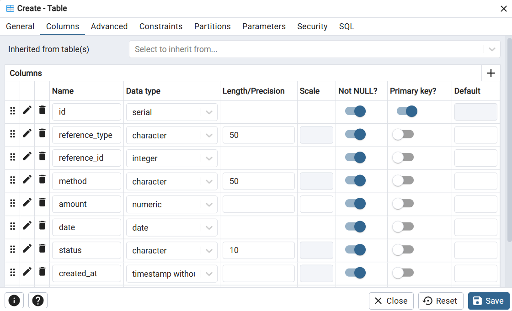

# Diagrama de la base de datos

Una vez finalizada la creación de todas las tablas mediante la interfaz gráfica de pgAdmin, se procede a verificar la estructura de la base de datos y las relaciones establecidas entre las entidades.

El diagrama permite visualizar gráficamente las tablas y sus respectivas relaciones dentro del modelo de datos de MovilCare.

### Evidencia

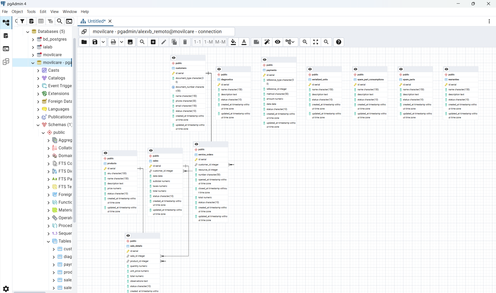

**Una precisión para la práctica:** en pgAdmin, el `CHECK` de `status` no se configura dentro del campo como tal; se agrega desde **Constraints → Check** de cada tabla. Para cada tabla debe quedar una restricción equivalente a:

```sql
CHECK (status IN ('active', 'inactive'))
```

Así la implementación gráfica conserva exactamente la regla `status = active/inactive` que ya establecimos para el modelo.

# Base de datos en MSSQL Server - Terminal DBeaver

Para la implementación de la base de datos MovilCare en MSSQL Server se utilizó DBeaver como herramienta de administración y ejecución de scripts SQL.

Se mantuvo la misma estructura lógica utilizada en los motores anteriores, realizando las adaptaciones correspondientes a los tipos de datos y características propias de SQL Server.

## 1. Creación de la tabla Products

La tabla `products` almacena la información general de los productos comercializados por el sistema.

### Script SQL

```sql
CREATE TABLE products (

    id BIGINT IDENTITY(1,1) PRIMARY KEY,

    sku VARCHAR(100) NOT NULL UNIQUE,

    name VARCHAR(150) NOT NULL,

    description VARCHAR(MAX),

    price DECIMAL(15,2) NOT NULL,

    status VARCHAR(10) NOT NULL DEFAULT 'active',

    created_at DATETIME NOT NULL DEFAULT CURRENT_TIMESTAMP,

    updated_at DATETIME NOT NULL DEFAULT CURRENT_TIMESTAMP,

    CONSTRAINT chk_products_status
        CHECK (status IN ('active', 'inactive'))

);
```

### Evidencia


## 2. Creación de la tabla Serialized Units

La tabla `serialized_units` almacena información relacionada con las unidades que requieren identificación individual dentro del sistema.

### Script SQL

```sql
CREATE TABLE serialized_units (

    id BIGINT IDENTITY(1,1) PRIMARY KEY,

    name VARCHAR(150) NOT NULL,

    description VARCHAR(MAX),

    status VARCHAR(10) NOT NULL DEFAULT 'active',

    created_at DATETIME NOT NULL DEFAULT CURRENT_TIMESTAMP,

    updated_at DATETIME NOT NULL DEFAULT CURRENT_TIMESTAMP,

    CONSTRAINT chk_serialized_units_status
        CHECK (status IN ('active', 'inactive'))

);
```

### Evidencia


## 3. Creación de la tabla Customers

La tabla `customers` almacena la información de los clientes registrados en el sistema.

### Script SQL

```sql
CREATE TABLE customers (

    id BIGINT IDENTITY(1,1) PRIMARY KEY,

    document_type VARCHAR(30) NOT NULL,

    document_number VARCHAR(50) NOT NULL UNIQUE,

    name VARCHAR(150) NOT NULL,

    phone VARCHAR(30),

    email VARCHAR(150),

    status VARCHAR(10) NOT NULL DEFAULT 'active',

    created_at DATETIME NOT NULL DEFAULT CURRENT_TIMESTAMP,

    updated_at DATETIME NOT NULL DEFAULT CURRENT_TIMESTAMP,

    CONSTRAINT chk_customers_status
        CHECK (status IN ('active', 'inactive'))

);
```

### Evidencia


## 4. Creación de la tabla Sales

La tabla `sales` registra las ventas realizadas y las relaciona con el cliente correspondiente.

### Script SQL

```sql
CREATE TABLE sales (

    id BIGINT IDENTITY(1,1) PRIMARY KEY,

    customer_id BIGINT NOT NULL,

    date DATETIME NOT NULL DEFAULT CURRENT_TIMESTAMP,

    subtotal DECIMAL(15,2) NOT NULL,

    taxes DECIMAL(15,2) NOT NULL DEFAULT 0,

    total DECIMAL(15,2) NOT NULL,

    status VARCHAR(10) NOT NULL DEFAULT 'active',

    created_at DATETIME NOT NULL DEFAULT CURRENT_TIMESTAMP,

    updated_at DATETIME NOT NULL DEFAULT CURRENT_TIMESTAMP,

    CONSTRAINT fk_sales_customer
        FOREIGN KEY (customer_id)
        REFERENCES customers(id),

    CONSTRAINT chk_sales_status
        CHECK (status IN ('active', 'inactive'))

);
```

### Evidencia


## 5. Creación de la tabla Sale Details

La tabla `sale_details` contiene el detalle de los productos incluidos en cada venta.

### Script SQL

```sql
CREATE TABLE sale_details (

    id BIGINT IDENTITY(1,1) PRIMARY KEY,

    sale_id BIGINT NOT NULL,

    product_id BIGINT NOT NULL,

    quantity DECIMAL(15,3) NOT NULL,

    unit_price DECIMAL(15,2) NOT NULL,

    total DECIMAL(15,2) NOT NULL,

    observations VARCHAR(MAX),

    status VARCHAR(10) NOT NULL DEFAULT 'active',

    created_at DATETIME NOT NULL DEFAULT CURRENT_TIMESTAMP,

    updated_at DATETIME NOT NULL DEFAULT CURRENT_TIMESTAMP,

    CONSTRAINT fk_sale_details_sale
        FOREIGN KEY (sale_id)
        REFERENCES sales(id),

    CONSTRAINT fk_sale_details_product
        FOREIGN KEY (product_id)
        REFERENCES products(id),

    CONSTRAINT chk_sale_details_status
        CHECK (status IN ('active', 'inactive'))

);
```

### Evidencia


## 6. Creación de la tabla Warranties

La tabla `warranties` almacena la información relacionada con las garantías disponibles dentro del sistema.

### Script SQL

```sql
CREATE TABLE warranties (

    id BIGINT IDENTITY(1,1) PRIMARY KEY,

    name VARCHAR(150) NOT NULL,

    description VARCHAR(MAX),

    status VARCHAR(10) NOT NULL DEFAULT 'active',

    created_at DATETIME NOT NULL DEFAULT CURRENT_TIMESTAMP,

    updated_at DATETIME NOT NULL DEFAULT CURRENT_TIMESTAMP,

    CONSTRAINT chk_warranties_status
        CHECK (status IN ('active', 'inactive'))

);
```

### Evidencia


## 7. Creación de la tabla Service Orders

La tabla `service_orders` registra las órdenes de servicio y su relación con los clientes.

### Script SQL

```sql
CREATE TABLE service_orders (

    id BIGINT IDENTITY(1,1) PRIMARY KEY,

    customer_id BIGINT NOT NULL,

    resource_id BIGINT,

    number VARCHAR(50) NOT NULL UNIQUE,

    opened_at DATETIME NOT NULL DEFAULT CURRENT_TIMESTAMP,

    closed_at DATETIME,

    total DECIMAL(15,2) NOT NULL DEFAULT 0,

    status VARCHAR(10) NOT NULL DEFAULT 'active',

    created_at DATETIME NOT NULL DEFAULT CURRENT_TIMESTAMP,

    updated_at DATETIME NOT NULL DEFAULT CURRENT_TIMESTAMP,

    CONSTRAINT fk_service_orders_customer
        FOREIGN KEY (customer_id)
        REFERENCES customers(id),

    CONSTRAINT chk_service_orders_status
        CHECK (status IN ('active', 'inactive'))

);
```

### Evidencia


## 8. Creación de la tabla Diagnostics

La tabla `diagnostics` almacena los diagnósticos utilizados dentro de los procesos de servicio técnico.

### Script SQL

```sql
CREATE TABLE diagnostics (

    id BIGINT IDENTITY(1,1) PRIMARY KEY,

    name VARCHAR(150) NOT NULL,

    description VARCHAR(MAX),

    status VARCHAR(10) NOT NULL DEFAULT 'active',

    created_at DATETIME NOT NULL DEFAULT CURRENT_TIMESTAMP,

    updated_at DATETIME NOT NULL DEFAULT CURRENT_TIMESTAMP,

    CONSTRAINT chk_diagnostics_status
        CHECK (status IN ('active', 'inactive'))

);
```

### Evidencia


## 9. Creación de la tabla Spare Parts

La tabla `spare_parts` almacena la información de los repuestos utilizados en los procesos de mantenimiento y reparación.

### Script SQL

```sql
CREATE TABLE spare_parts (

    id BIGINT IDENTITY(1,1) PRIMARY KEY,

    name VARCHAR(150) NOT NULL,

    description VARCHAR(MAX),

    status VARCHAR(10) NOT NULL DEFAULT 'active',

    created_at DATETIME NOT NULL DEFAULT CURRENT_TIMESTAMP,

    updated_at DATETIME NOT NULL DEFAULT CURRENT_TIMESTAMP,

    CONSTRAINT chk_spare_parts_status
        CHECK (status IN ('active', 'inactive'))

);
```

### Evidencia


## 10. Creación de la tabla Spare Part Consumptions

La tabla `spare_part_consumptions` almacena información relacionada con el consumo de repuestos.

### Script SQL

```sql
CREATE TABLE spare_part_consumptions (

    id BIGINT IDENTITY(1,1) PRIMARY KEY,

    name VARCHAR(150) NOT NULL,

    description VARCHAR(MAX),

    status VARCHAR(10) NOT NULL DEFAULT 'active',

    created_at DATETIME NOT NULL DEFAULT CURRENT_TIMESTAMP,

    updated_at DATETIME NOT NULL DEFAULT CURRENT_TIMESTAMP,

    CONSTRAINT chk_spare_part_consumptions_status
        CHECK (status IN ('active', 'inactive'))

);
```

### Evidencia


## 11. Creación de la tabla Payments

La tabla `payments` registra los pagos realizados y permite identificar el tipo y registro al que pertenece cada pago.

### Script SQL

```sql
CREATE TABLE payments (

    id BIGINT IDENTITY(1,1) PRIMARY KEY,

    reference_type VARCHAR(50) NOT NULL,

    reference_id BIGINT NOT NULL,

    method VARCHAR(50) NOT NULL,

    amount DECIMAL(15,2) NOT NULL,

    date DATETIME NOT NULL DEFAULT CURRENT_TIMESTAMP,

    status VARCHAR(10) NOT NULL DEFAULT 'active',

    created_at DATETIME NOT NULL DEFAULT CURRENT_TIMESTAMP,

    updated_at DATETIME NOT NULL DEFAULT CURRENT_TIMESTAMP,

    CONSTRAINT chk_payments_status
        CHECK (status IN ('active', 'inactive'))

);
```

### Evidencia


## Diagrama de la base de datos

Una vez creadas todas las tablas y establecidas las relaciones correspondientes, se procede a visualizar el diagrama de la base de datos en DBeaver.

**Evidencia**


---

## Consideraciones de MSSQL Server

Durante la implementación de MovilCare en MSSQL Server se realizaron las siguientes adaptaciones respecto a los demás motores:

| MySQL | PostgreSQL | MSSQL Server |
|---|---|---|
| `BIGINT AUTO_INCREMENT` | `BIGINT GENERATED ALWAYS AS IDENTITY` | `BIGINT IDENTITY(1,1)` |
| `DECIMAL(15,2)` | `NUMERIC(15,2)` | `DECIMAL(15,2)` |
| `DECIMAL(15,3)` | `NUMERIC(15,3)` | `DECIMAL(15,3)` |
| `DATETIME` | `TIMESTAMP` | `DATETIME` |
| `BOOLEAN` | `BOOLEAN` | `BIT` |
| `ENUM('active','inactive')` | `ENUM` | `VARCHAR(10)` + `CHECK` |
| `TEXT` | `TEXT` | `VARCHAR(MAX)` |
| `CURRENT_TIMESTAMP` | `CURRENT_TIMESTAMP` | `CURRENT_TIMESTAMP` |
| `ON UPDATE CURRENT_TIMESTAMP` | No existe de forma nativa | No existe de forma nativa |

> **Nota:** SQL Server no dispone de un tipo de dato `ENUM` nativo. Para mantener la restricción de los valores permitidos, se utilizó `VARCHAR(10)` acompañado de una restricción `CHECK`, permitiendo únicamente los valores `'active'` e `'inactive'`.

> **Nota:** SQL Server tampoco dispone de una cláusula equivalente a `ON UPDATE CURRENT_TIMESTAMP`. Por esta razón, `updated_at` se inicializa automáticamente con la fecha y hora de creación del registro. Para actualizar este campo automáticamente cuando se modifique un registro, sería necesario implementar un **trigger**.

## Resumen de la implementación

La estructura lógica de MovilCare se mantuvo equivalente a las implementaciones realizadas en los diferentes motores de bases de datos.

Las relaciones implementadas fueron:

- `sales.customer_id` → `customers.id`
- `sale_details.sale_id` → `sales.id`
- `sale_details.product_id` → `products.id`
- `service_orders.customer_id` → `customers.id`

Todas las tablas cuentan con una columna `status` que permite controlar su estado mediante los valores:

- `active`
- `inactive`

De esta manera, se mantiene una estructura consistente del modelo de datos entre los diferentes motores de bases de datos.


# Base de datos en MSSQL Server - gestor SQL Server Management Studio

Para esta etapa se realizó la creación de la base de datos MovilCare utilizando **SQL Server Management Studio (SSMS)** como gestor de administración de SQL Server.

A diferencia de la implementación realizada mediante scripts en DBeaver, en esta ocasión la base de datos y sus tablas fueron construidas mediante las herramientas gráficas proporcionadas por SQL Server Management Studio.

Para la creación de las tablas se configuraron manualmente los campos, tipos de datos, claves primarias, valores predeterminados, restricciones y relaciones correspondientes.

Se mantuvo la estructura lógica definida para MovilCare, realizando las adaptaciones de tipos de datos establecidas para esta implementación.

**Evidencias**
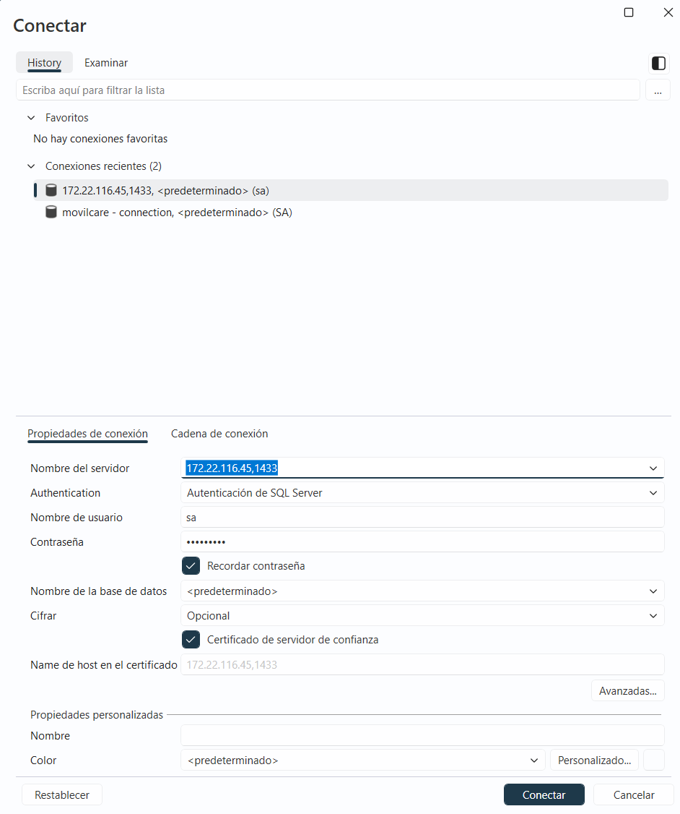

---

# Creación de la base de datos

Se inicia el proceso desde el explorador de objetos de SQL Server Management Studio, seleccionando la opción **New Database** sobre el apartado **Databases**.

Se establece el nombre de la base de datos como:

`movilcare`

Una vez configurado el nombre, se confirma la creación mediante la opción correspondiente de SQL Server Management Studio.

### Evidencia

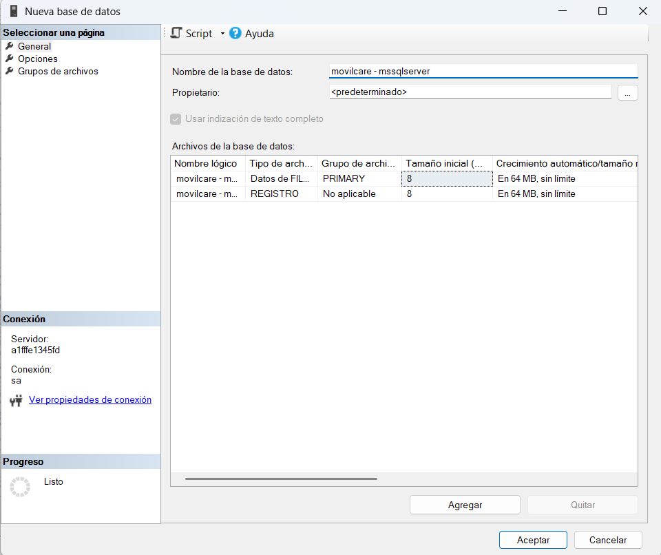


---

# Creación de tablas

Una vez creada la base de datos `movilcare`, se procede a la creación de cada una de las tablas mediante la opción **Tables → New → Table** de SQL Server Management Studio.

La configuración se realiza individualmente para cada tabla.

## 1. Creación de la tabla `products`

Se crea la tabla `products`, destinada a almacenar la información general de los productos comercializados por el sistema.

La tabla contiene los siguientes campos:

| Campo | Tipo de dato | Restricciones |
|---|---|---|
| `id` | INT | PK, NOT NULL, Identity |
| `sku` | CHAR(100) | NOT NULL, UNIQUE |
| `name` | CHAR(150) | NOT NULL |
| `description` | CHAR(500) | |
| `price` | DECIMAL(15,2) | NOT NULL |
| `status` | CHAR(8) | NOT NULL, Default: active |
| `created_at` | DATETIME | NOT NULL, Default: CURRENT_TIMESTAMP |
| `updated_at` | DATETIME | NOT NULL, Default: CURRENT_TIMESTAMP |

El campo `id` se establece como clave primaria y se configura como columna **Identity**, permitiendo la generación automática de identificadores.

El campo `sku` se establece como único para evitar la duplicación de identificadores de productos.

Para el campo `status` se configura una restricción que permite únicamente los valores `active` e `inactive`.

### Evidencia

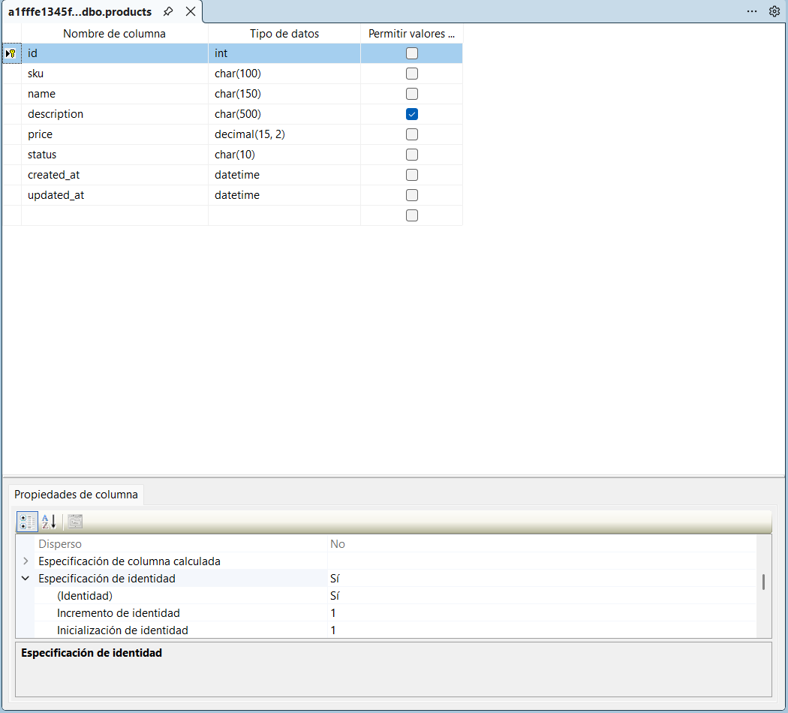

---

## 2. Creación de la tabla `serialized_units`

Se crea la tabla `serialized_units`, destinada a almacenar la información de las unidades que requieren identificación individual.

La tabla contiene los siguientes campos:

| Campo | Tipo de dato | Restricciones |
|---|---|---|
| `id` | INT | PK, NOT NULL, Identity |
| `name` | CHAR(150) | NOT NULL |
| `description` | CHAR(500) | |
| `status` | CHAR(8) | NOT NULL, Default: active |
| `created_at` | DATETIME | NOT NULL, Default: CURRENT_TIMESTAMP |
| `updated_at` | DATETIME | NOT NULL, Default: CURRENT_TIMESTAMP |

El campo `id` se establece como clave primaria y como columna Identity.

El campo `status` se configura para aceptar únicamente los valores `active` e `inactive`.

### Evidencia

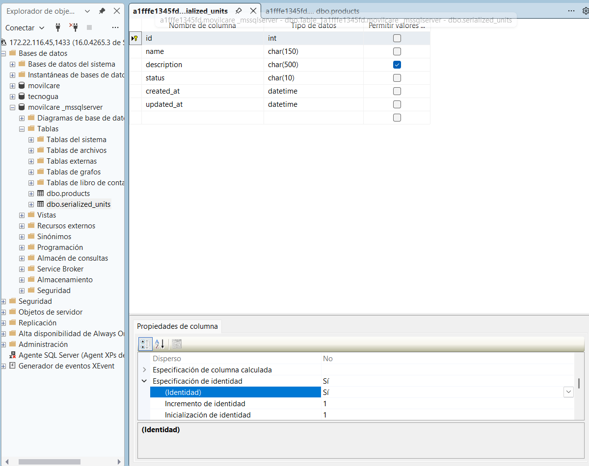

---

## 3. Creación de la tabla `customers`

Se crea la tabla `customers`, destinada a almacenar la información de los clientes registrados en el sistema.

La tabla contiene los siguientes campos:

| Campo | Tipo de dato | Restricciones |
|---|---|---|
| `id` | INT | PK, NOT NULL, Identity |
| `document_type` | CHAR(30) | NOT NULL |
| `document_number` | CHAR(50) | NOT NULL, UNIQUE |
| `name` | CHAR(150) | NOT NULL |
| `phone` | CHAR(30) | |
| `email` | CHAR(150) | |
| `status` | CHAR(8) | NOT NULL, Default: active |
| `created_at` | DATETIME | NOT NULL, Default: CURRENT_TIMESTAMP |
| `updated_at` | DATETIME | NOT NULL, Default: CURRENT_TIMESTAMP |

El campo `id` se establece como clave primaria y como columna Identity.

El campo `document_number` se configura como único para evitar que un mismo documento de identificación sea registrado más de una vez.

### Evidencia

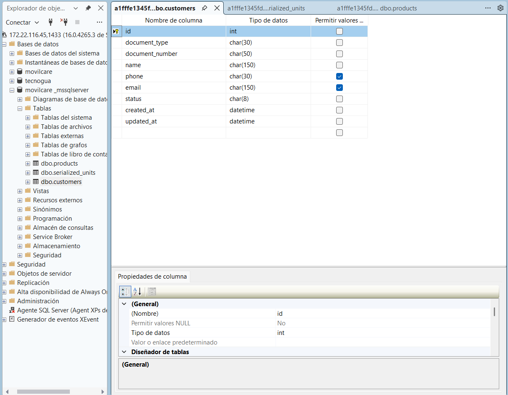

---

## 4. Creación de la tabla `sales`

Se crea la tabla `sales`, destinada a registrar las ventas realizadas y su relación con los clientes.

La tabla contiene los siguientes campos:

| Campo | Tipo de dato | Restricciones |
|---|---|---|
| `id` | INT | PK, NOT NULL, Identity |
| `customer_id` | INT | NOT NULL, FK |
| `date` | DATE | NOT NULL |
| `subtotal` | DECIMAL(15,2) | NOT NULL |
| `taxes` | DECIMAL(15,2) | NOT NULL, Default: 0 |
| `total` | DECIMAL(15,2) | NOT NULL |
| `status` | CHAR(8) | NOT NULL, Default: active |
| `created_at` | DATETIME | NOT NULL, Default: CURRENT_TIMESTAMP |
| `updated_at` | DATETIME | NOT NULL, Default: CURRENT_TIMESTAMP |

El campo `customer_id` se establece como clave foránea y se relaciona con el campo `id` de la tabla `customers`.

### Relación

```text
sales.customer_id → customers.id
```

### Evidencia

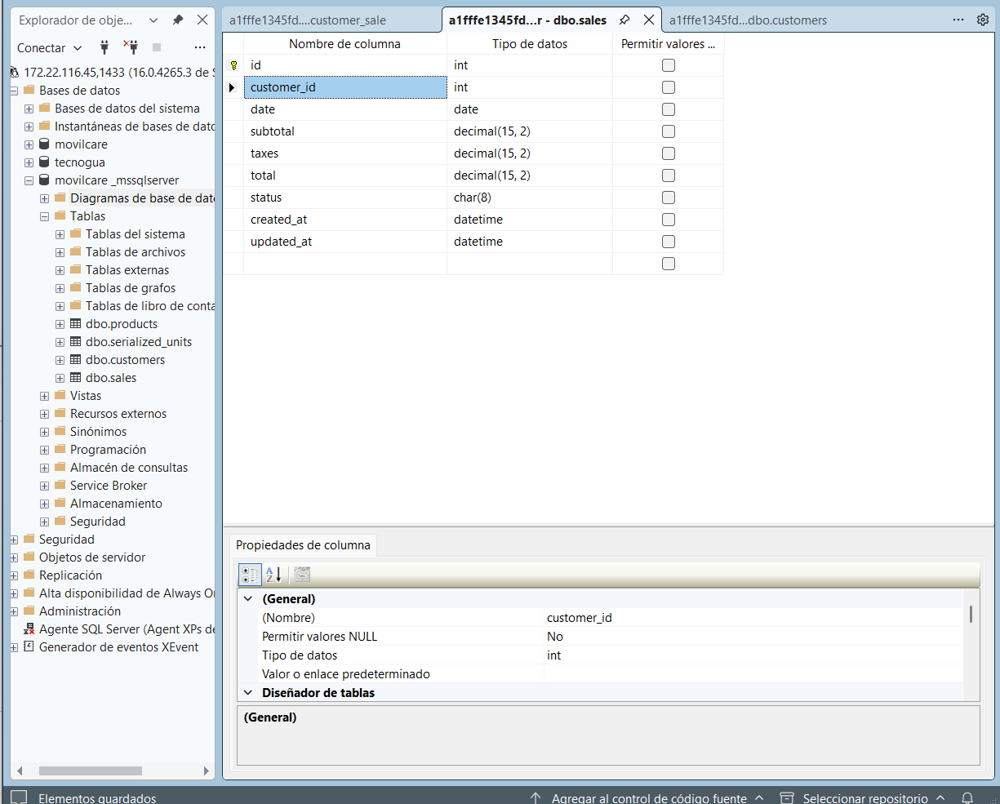
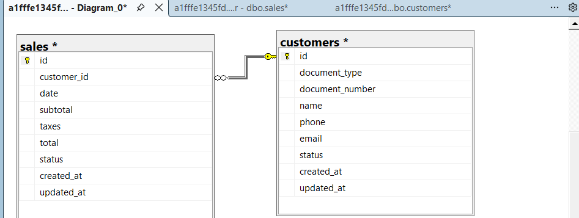

---

## 5. Creación de la tabla `sale_details`

Se crea la tabla `sale_details`, destinada a almacenar el detalle de los productos incluidos en cada venta.

La tabla contiene los siguientes campos:

| Campo | Tipo de dato | Restricciones |
|---|---|---|
| `id` | INT | PK, NOT NULL, Identity |
| `sale_id` | INT | NOT NULL, FK |
| `product_id` | INT | NOT NULL, FK |
| `quantity` | DECIMAL(15,3) | NOT NULL |
| `unit_price` | DECIMAL(15,2) | NOT NULL |
| `total` | DECIMAL(15,2) | NOT NULL |
| `observations` | CHAR(500) | |
| `status` | CHAR(8) | NOT NULL, Default: active |
| `created_at` | DATETIME | NOT NULL, Default: CURRENT_TIMESTAMP |
| `updated_at` | DATETIME | NOT NULL, Default: CURRENT_TIMESTAMP |

Se establecen dos claves foráneas para relacionar cada detalle con la venta y con el producto correspondiente.

### Relaciones

```text
sale_details.sale_id → sales.id
sale_details.product_id → products.id
```

### Evidencia
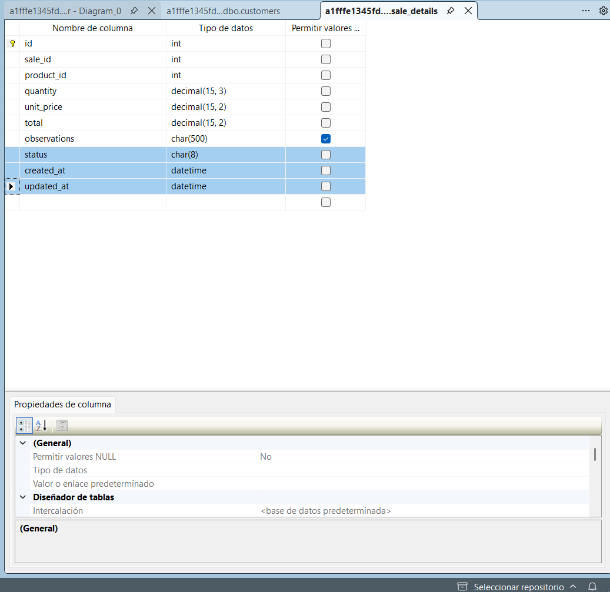
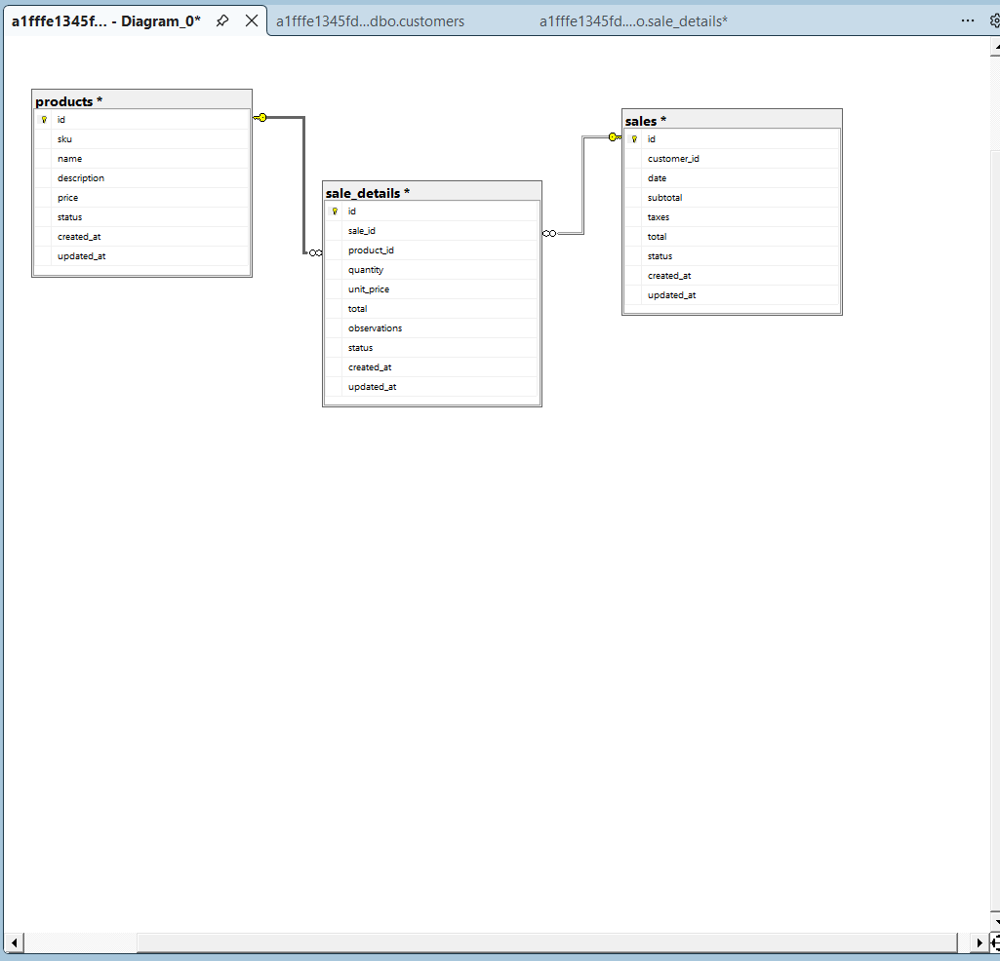

---

## 6. Creación de la tabla `warranties`

Se crea la tabla `warranties`, destinada a almacenar la información relacionada con las garantías disponibles en el sistema.

La tabla contiene los siguientes campos:

| Campo | Tipo de dato | Restricciones |
|---|---|---|
| `id` | INT | PK, NOT NULL, Identity |
| `name` | CHAR(150) | NOT NULL |
| `description` | CHAR(500) | |
| `status` | CHAR(8) | NOT NULL, Default: active |
| `created_at` | DATETIME | NOT NULL, Default: CURRENT_TIMESTAMP |
| `updated_at` | DATETIME | NOT NULL, Default: CURRENT_TIMESTAMP |

El campo `id` se establece como clave primaria y como columna Identity.

### Evidencia

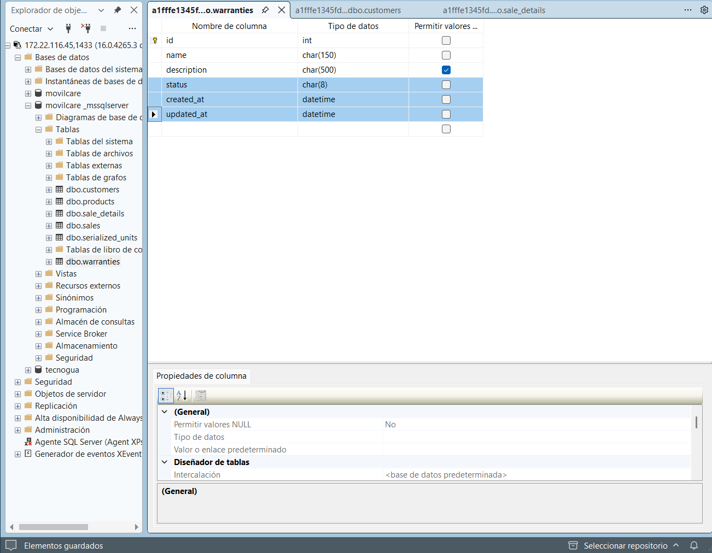

---

## 7. Creación de la tabla `service_orders`

Se crea la tabla `service_orders`, destinada a registrar las órdenes de servicio y su relación con los clientes.

La tabla contiene los siguientes campos:

| Campo | Tipo de dato | Restricciones |
|---|---|---|
| `id` | INT | PK, NOT NULL, Identity |
| `customer_id` | INT | NOT NULL, FK |
| `resource_id` | INT | |
| `number` | CHAR(50) | NOT NULL, UNIQUE |
| `opened_at` | DATE | NOT NULL |
| `closed_at` | DATE | |
| `total` | DECIMAL(15,2) | NOT NULL, Default: 0 |
| `status` | CHAR(8) | NOT NULL, Default: active |
| `created_at` | DATETIME | NOT NULL, Default: CURRENT_TIMESTAMP |
| `updated_at` | DATETIME | NOT NULL, Default: CURRENT_TIMESTAMP |

El campo `customer_id` se establece como clave foránea relacionada con el campo `id` de la tabla `customers`.

El campo `resource_id` se mantiene sin clave foránea debido a que el modelo actual no contempla una tabla `resources`.

### Relación

```text
service_orders.customer_id → customers.id
```

### Evidencia

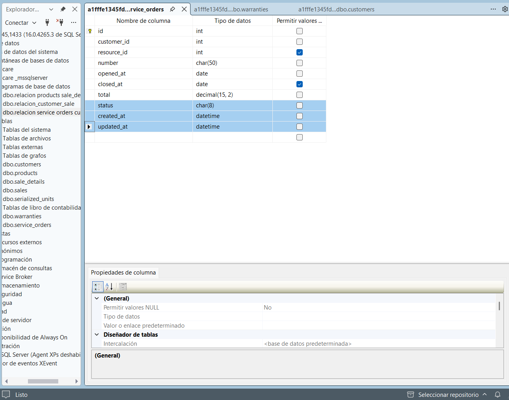
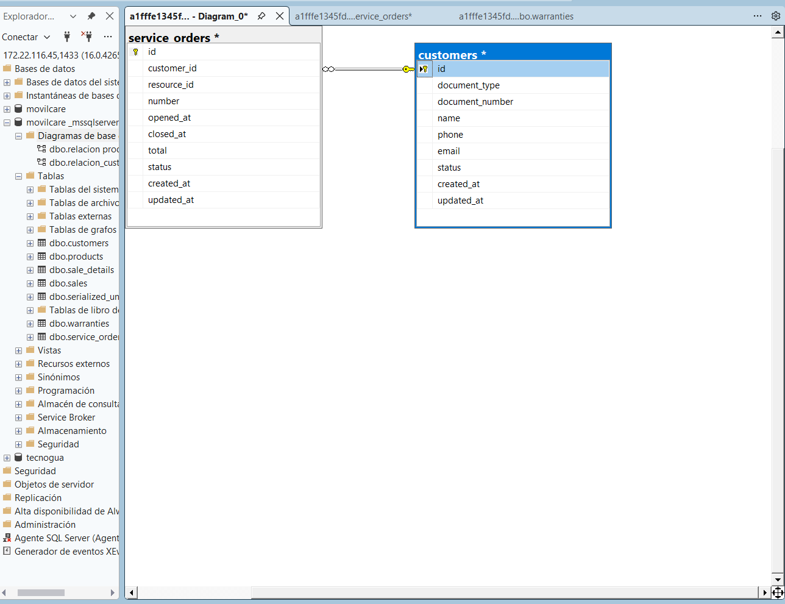

---

## 8. Creación de la tabla `diagnostics`

Se crea la tabla `diagnostics`, destinada a almacenar la información relacionada con los diagnósticos utilizados en los procesos de servicio técnico.

La tabla contiene los siguientes campos:

| Campo | Tipo de dato | Restricciones |
|---|---|---|
| `id` | INT | PK, NOT NULL, Identity |
| `name` | CHAR(150) | NOT NULL |
| `description` | CHAR(500) | |
| `status` | CHAR(8) | NOT NULL, Default: active |
| `created_at` | DATETIME | NOT NULL, Default: CURRENT_TIMESTAMP |
| `updated_at` | DATETIME | NOT NULL, Default: CURRENT_TIMESTAMP |

El campo `id` se configura como clave primaria con generación automática.

### Evidencia

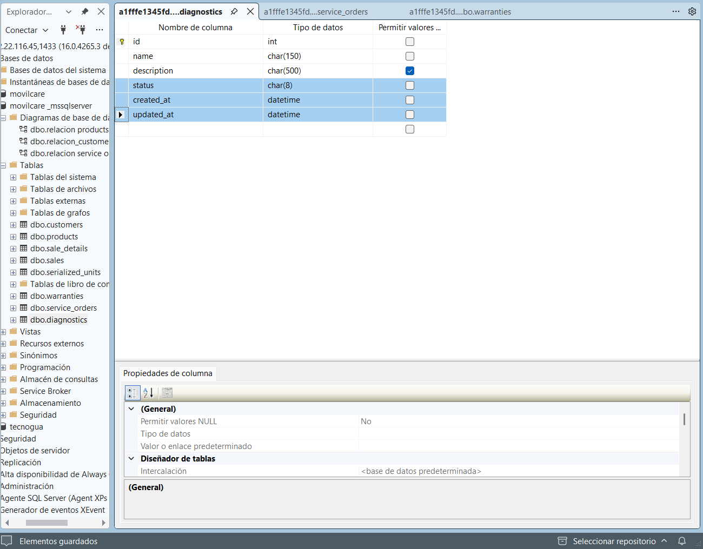

---

## 9. Creación de la tabla `spare_parts`

Se crea la tabla `spare_parts`, destinada a almacenar la información de los repuestos utilizados en los procesos de mantenimiento y reparación.

La tabla contiene los siguientes campos:

| Campo | Tipo de dato | Restricciones |
|---|---|---|
| `id` | INT | PK, NOT NULL, Identity |
| `name` | CHAR(150) | NOT NULL |
| `description` | CHAR(500) | |
| `status` | CHAR(8) | NOT NULL, Default: active |
| `created_at` | DATETIME | NOT NULL, Default: CURRENT_TIMESTAMP |
| `updated_at` | DATETIME | NOT NULL, Default: CURRENT_TIMESTAMP |

El campo `id` se establece como clave primaria con generación automática.

### Evidencia

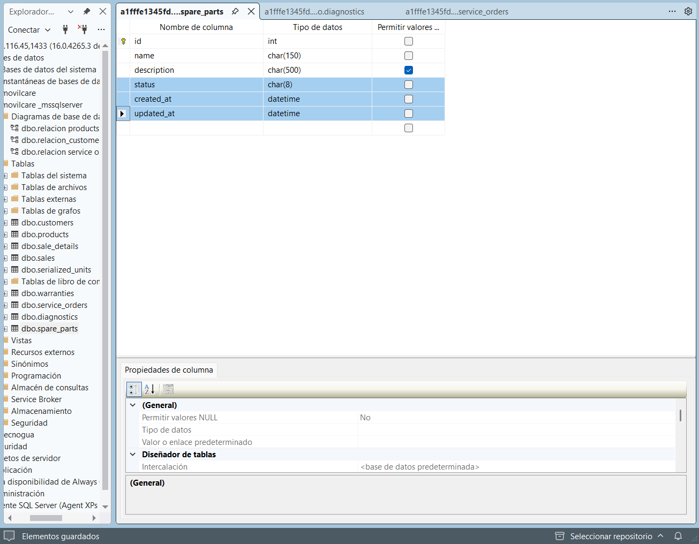

---

## 10. Creación de la tabla `spare_part_consumptions`

Se crea la tabla `spare_part_consumptions`, destinada a almacenar información relacionada con el consumo de repuestos.

La tabla contiene los siguientes campos:

| Campo | Tipo de dato | Restricciones |
|---|---|---|
| `id` | INT | PK, NOT NULL, Identity |
| `name` | CHAR(150) | NOT NULL |
| `description` | CHAR(500) | |
| `status` | CHAR(8) | NOT NULL, Default: active |
| `created_at` | DATETIME | NOT NULL, Default: CURRENT_TIMESTAMP |
| `updated_at` | DATETIME | NOT NULL, Default: CURRENT_TIMESTAMP |

El campo `id` se establece como clave primaria con generación automática.

### Evidencia

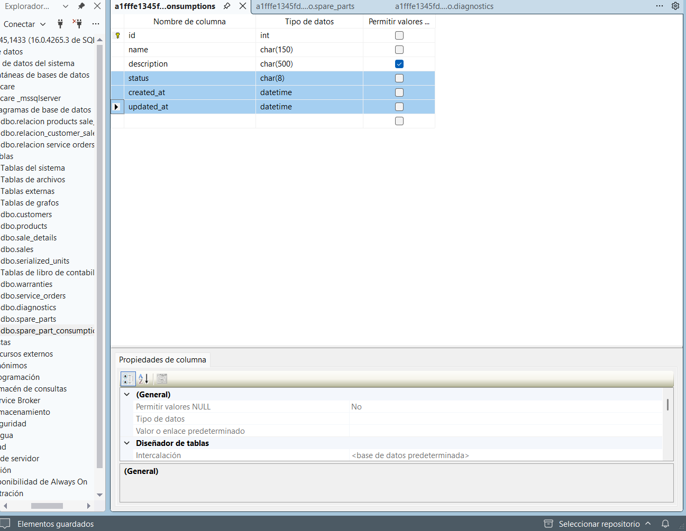

---

## 11. Creación de la tabla `payments`

Finalmente, se crea la tabla `payments`, destinada a registrar los pagos realizados dentro del sistema.

La tabla contiene los siguientes campos:

| Campo | Tipo de dato | Restricciones |
|---|---|---|
| `id` | INT | PK, NOT NULL, Identity |
| `reference_type` | CHAR(50) | NOT NULL |
| `reference_id` | INT | NOT NULL |
| `method` | CHAR(50) | NOT NULL |
| `amount` | DECIMAL(15,2) | NOT NULL |
| `date` | DATE | NOT NULL |
| `status` | CHAR(8) | NOT NULL, Default: active |
| `created_at` | DATETIME | NOT NULL, Default: CURRENT_TIMESTAMP |
| `updated_at` | DATETIME | NOT NULL, Default: CURRENT_TIMESTAMP |

El campo `id` se establece como clave primaria con generación automática.

El campo `reference_id` se mantiene sin clave foránea debido a que `reference_type` permite determinar el tipo de registro al que hace referencia.

### Evidencia

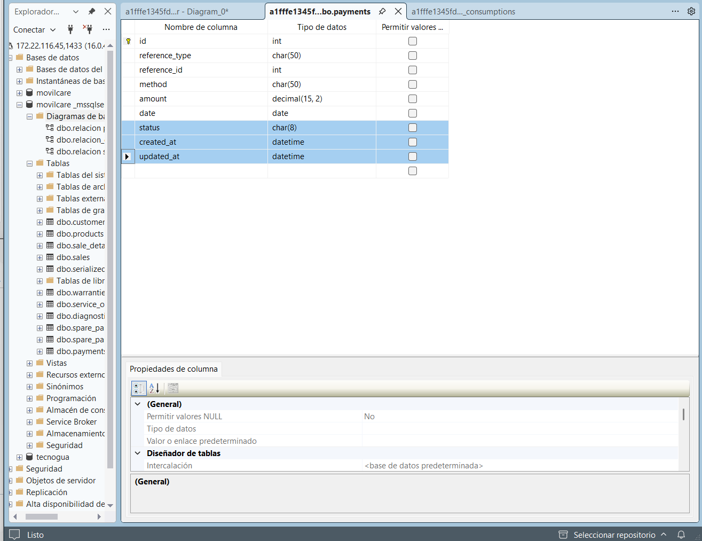
---

# Diagrama de la base de datos

Una vez finalizada la creación de las tablas mediante la interfaz gráfica de SQL Server Management Studio, se procede a verificar la estructura de la base de datos y las relaciones establecidas.

El diagrama permite visualizar gráficamente las tablas que conforman MovilCare y las relaciones establecidas mediante claves foráneas.

### Evidencia

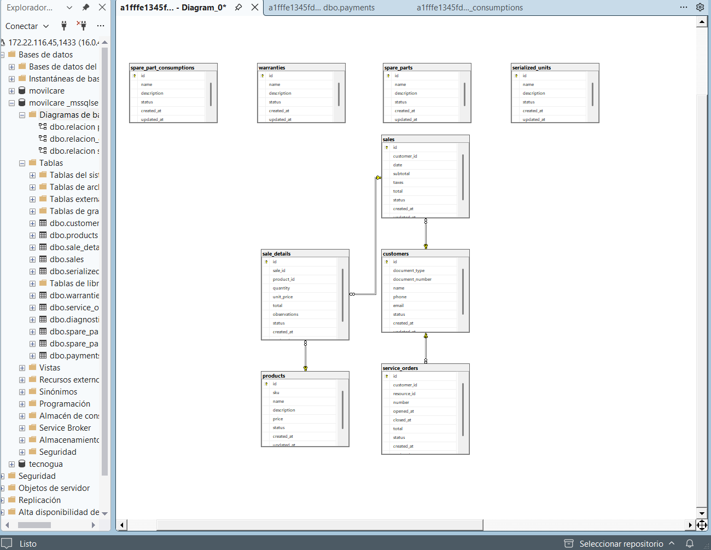

---

# Consideraciones de la implementación en SQL Server Management Studio

Para esta implementación se utilizaron tipos de datos definidos específicamente para el ejercicio:

| Elemento | Tipo utilizado |
|---|---|
| Identificadores | `INT` |
| Textos | `CHAR(n)` |
| Fechas | `DATE` |
| Fecha de creación y actualización | `DATETIME` |
| Números reales y valores monetarios | `DECIMAL` |
| Estado | `CHAR(8)` + `CHECK` |
| Identificadores automáticos | `IDENTITY` |

El campo `status` se implementó mediante `CHAR(8)` debido a que SQL Server no cuenta con un tipo `ENUM` nativo. La restricción `CHECK` limita los valores permitidos a:

```text
active
inactive
```

Todas las tablas cuentan con los campos `created_at` y `updated_at`, permitiendo registrar la fecha y hora asociadas a la creación y actualización de los registros.

Las relaciones implementadas mediante claves foráneas son:

- `sales.customer_id` → `customers.id`
- `sale_details.sale_id` → `sales.id`
- `sale_details.product_id` → `products.id`
- `service_orders.customer_id` → `customers.id`

# Base de datos en Oracle - Terminal DBeaver

Para la implementación de la base de datos MovilCare en Oracle se utilizó DBeaver como herramienta de administración y ejecución de scripts SQL.

Se mantuvo la misma estructura lógica utilizada en MySQL, PostgreSQL y MSSQL Server, realizando las adaptaciones correspondientes a los tipos de datos, generación de identificadores y restricciones propias del motor Oracle.

## Apertura de la base de datos en Oracle

A diferencia de MySQL, PostgreSQL y MSSQL Server, en Oracle la organización de los datos se realiza principalmente mediante **usuarios y esquemas**. Por esta razón, para la implementación de MovilCare se utilizó el esquema correspondiente al usuario previamente configurado para el proyecto.

Una vez establecida la conexión desde DBeaver, se seleccionó el esquema de trabajo y se procedió con la creación de las tablas.

### Evidencia


---

## 1. Creación de la tabla Products

La tabla `products` almacena la información general de los productos comercializados por MovilCare.

### Código

```sql
CREATE TABLE products (
    id NUMBER(19) GENERATED ALWAYS AS IDENTITY PRIMARY KEY,
    sku VARCHAR2(100) NOT NULL UNIQUE,
    name VARCHAR2(150) NOT NULL,
    description CLOB,
    price NUMBER(15,2) NOT NULL,
    status VARCHAR2(10) DEFAULT 'active' NOT NULL,
    created_at TIMESTAMP DEFAULT CURRENT_TIMESTAMP NOT NULL,
    updated_at TIMESTAMP DEFAULT CURRENT_TIMESTAMP NOT NULL,
    CONSTRAINT chk_products_status
        CHECK (status IN ('active', 'inactive'))
);
```

### Evidencia

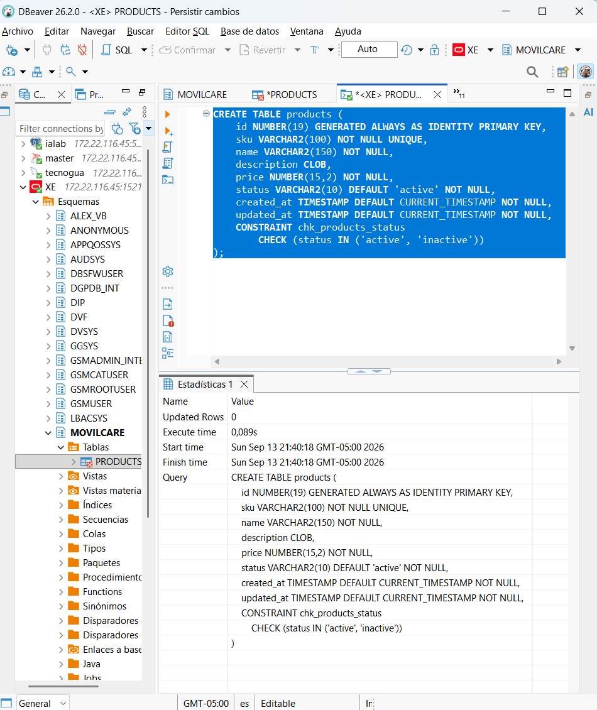

## 2. Creación de la tabla Serialized Units

La tabla `serialized_units` almacena información relacionada con las unidades que requieren identificación individual dentro del sistema.

### Script SQL

```sql
CREATE TABLE serialized_units (
    id NUMBER(19) GENERATED ALWAYS AS IDENTITY PRIMARY KEY,
    name VARCHAR2(150) NOT NULL,
    description CLOB,
    status VARCHAR2(10) DEFAULT 'active' NOT NULL,
    created_at TIMESTAMP DEFAULT CURRENT_TIMESTAMP NOT NULL,
    updated_at TIMESTAMP DEFAULT CURRENT_TIMESTAMP NOT NULL,
    CONSTRAINT chk_serialized_units_status
        CHECK (status IN ('active', 'inactive'))
);
```

### Evidencia

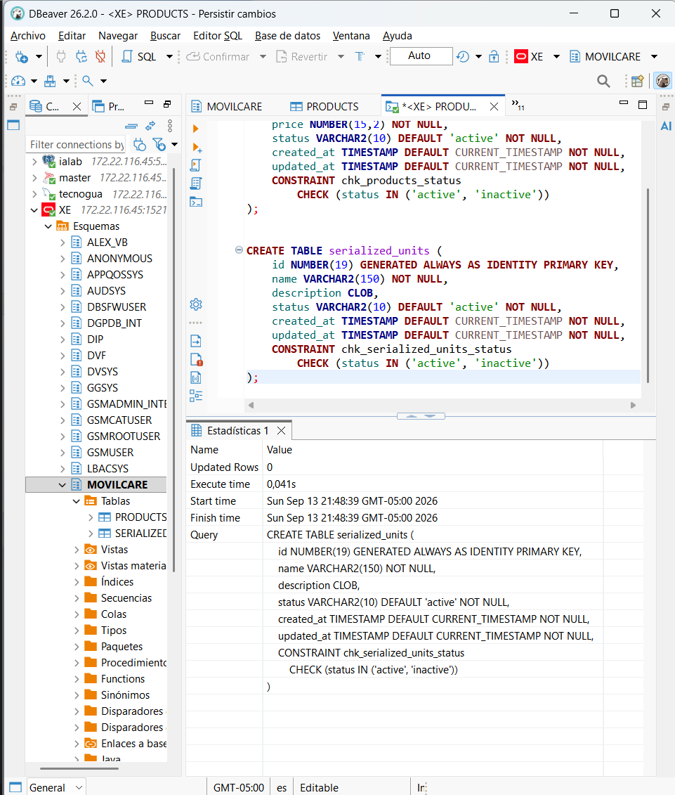


## 3. Creación de la tabla Customers

La tabla `customers` almacena la información de los clientes registrados en el sistema.

### Script SQL

```sql
CREATE TABLE customers (
    id NUMBER(19) GENERATED ALWAYS AS IDENTITY PRIMARY KEY,
    document_type VARCHAR2(30) NOT NULL,
    document_number VARCHAR2(50) NOT NULL UNIQUE,
    name VARCHAR2(150) NOT NULL,
    phone VARCHAR2(30),
    email VARCHAR2(150),
    status VARCHAR2(10) DEFAULT 'active' NOT NULL,
    created_at TIMESTAMP DEFAULT CURRENT_TIMESTAMP NOT NULL,
    updated_at TIMESTAMP DEFAULT CURRENT_TIMESTAMP NOT NULL,
    CONSTRAINT chk_customers_status
        CHECK (status IN ('active', 'inactive'))
);
```

### Evidencia

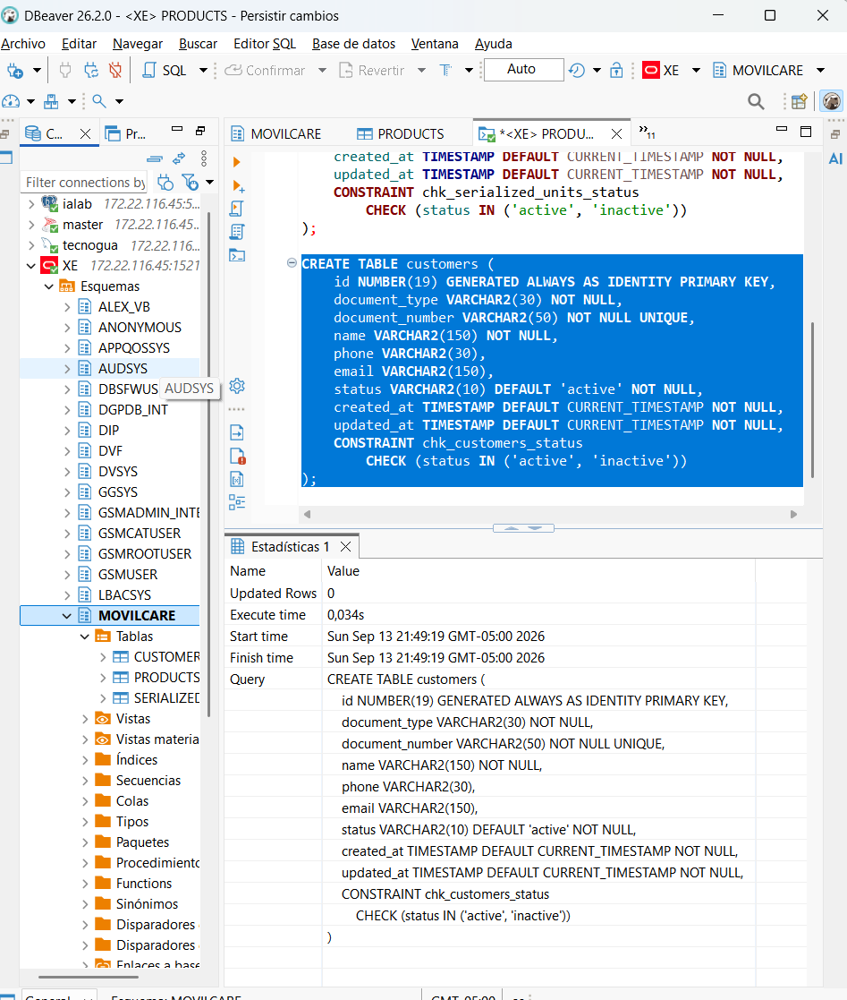


## 4. Creación de la tabla Sales

La tabla `sales` registra las ventas realizadas y las relaciona con el cliente correspondiente.

### Script SQL

```sql
CREATE TABLE sales (
    id NUMBER(19) GENERATED ALWAYS AS IDENTITY PRIMARY KEY,
    customer_id NUMBER(19) NOT NULL,
    sale_date TIMESTAMP DEFAULT CURRENT_TIMESTAMP NOT NULL,
    subtotal NUMBER(15,2) NOT NULL,
    taxes NUMBER(15,2) DEFAULT 0 NOT NULL,
    total NUMBER(15,2) NOT NULL,
    status VARCHAR2(10) DEFAULT 'active' NOT NULL,
    created_at TIMESTAMP DEFAULT CURRENT_TIMESTAMP NOT NULL,
    updated_at TIMESTAMP DEFAULT CURRENT_TIMESTAMP NOT NULL,
    CONSTRAINT fk_sales_customer
        FOREIGN KEY (customer_id)
        REFERENCES customers(id),
    CONSTRAINT chk_sales_status
        CHECK (status IN ('active', 'inactive'))
);
```

### Evidencia

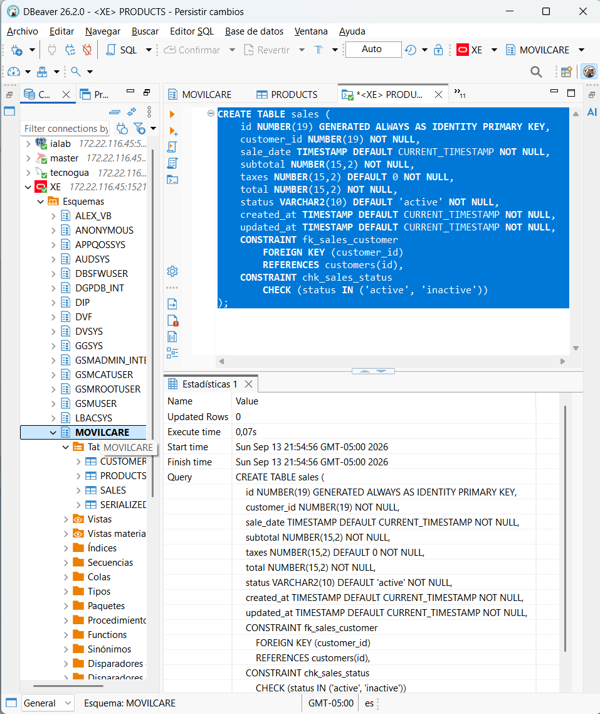


## 5. Creación de la tabla Sale Details

La tabla `sale_details` contiene el detalle de los productos incluidos en cada venta.

### Script SQL

```sql
CREATE TABLE sale_details (
    id NUMBER(19) GENERATED ALWAYS AS IDENTITY PRIMARY KEY,
    sale_id NUMBER(19) NOT NULL,
    product_id NUMBER(19) NOT NULL,
    quantity NUMBER(15,3) NOT NULL,
    unit_price NUMBER(15,2) NOT NULL,
    total NUMBER(15,2) NOT NULL,
    observations CLOB,
    status VARCHAR2(10) DEFAULT 'active' NOT NULL,
    created_at TIMESTAMP DEFAULT CURRENT_TIMESTAMP NOT NULL,
    updated_at TIMESTAMP DEFAULT CURRENT_TIMESTAMP NOT NULL,

    CONSTRAINT fk_sale_details_sale
        FOREIGN KEY (sale_id)
        REFERENCES sales(id),

    CONSTRAINT fk_sale_details_product
        FOREIGN KEY (product_id)
        REFERENCES products(id),

    CONSTRAINT chk_sale_details_status
        CHECK (status IN ('active', 'inactive'))
);
```

### Evidencia

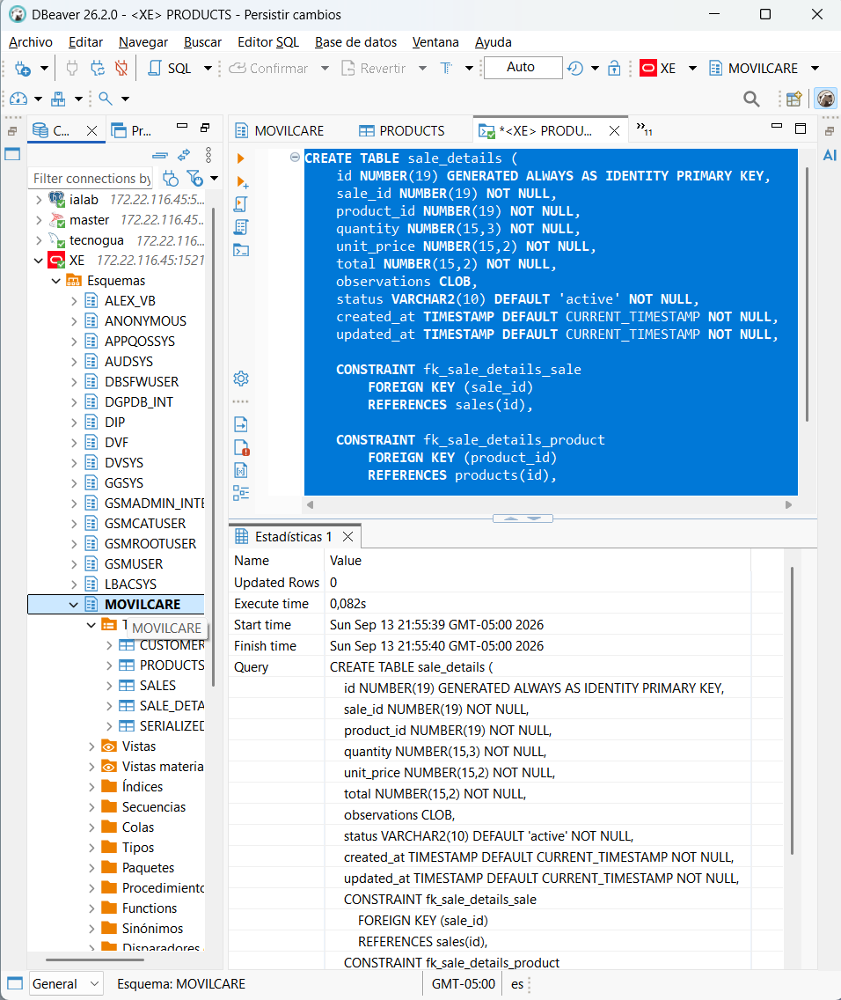

## 6. Creación de la tabla Warranties

La tabla `warranties` almacena la información relacionada con las garantías disponibles dentro del sistema.

### Script SQL

```sql
CREATE TABLE warranties (
    id NUMBER(19) GENERATED ALWAYS AS IDENTITY PRIMARY KEY,
    name VARCHAR2(150) NOT NULL,
    description CLOB,
    status VARCHAR2(10) DEFAULT 'active' NOT NULL,
    created_at TIMESTAMP DEFAULT CURRENT_TIMESTAMP NOT NULL,
    updated_at TIMESTAMP DEFAULT CURRENT_TIMESTAMP NOT NULL,
    CONSTRAINT chk_warranties_status
        CHECK (status IN ('active', 'inactive'))
);
```

### Evidencia

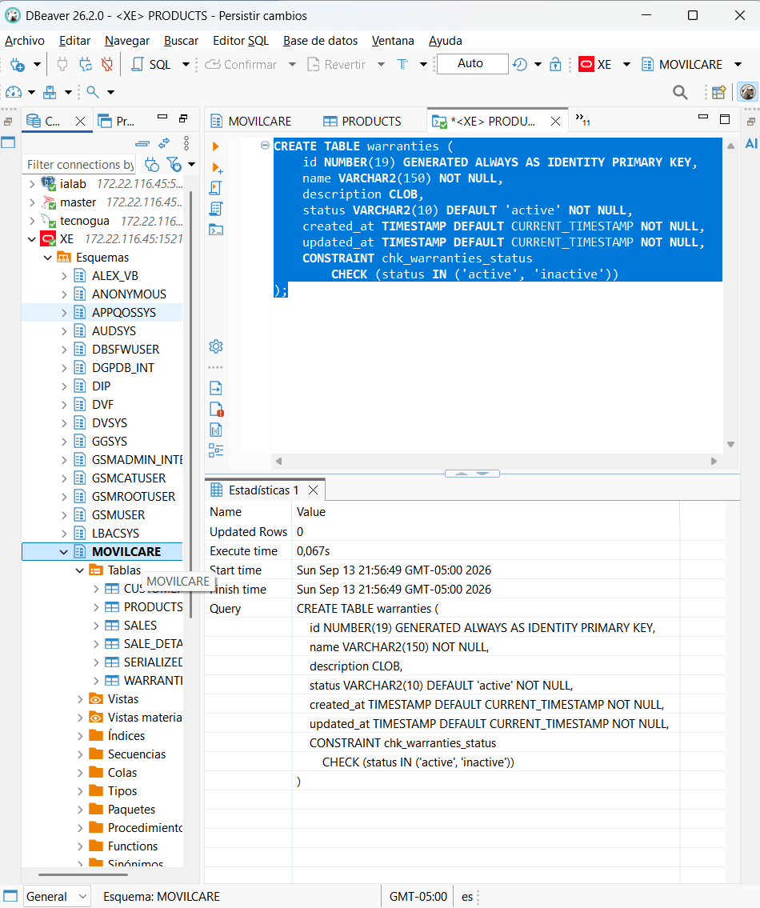


## 7. Creación de la tabla Service Orders

La tabla `service_orders` registra las órdenes de servicio y su relación con los clientes.

### Script SQL

```sql
CREATE TABLE service_orders (
    id NUMBER(19) GENERATED ALWAYS AS IDENTITY PRIMARY KEY,
    customer_id NUMBER(19) NOT NULL,
    resource_id NUMBER(19),
    service_order_number VARCHAR2(50) NOT NULL UNIQUE,
    opened_at TIMESTAMP DEFAULT CURRENT_TIMESTAMP NOT NULL,
    closed_at TIMESTAMP,
    total NUMBER(15,2) DEFAULT 0 NOT NULL,
    status VARCHAR2(10) DEFAULT 'active' NOT NULL,
    created_at TIMESTAMP DEFAULT CURRENT_TIMESTAMP NOT NULL,
    updated_at TIMESTAMP DEFAULT CURRENT_TIMESTAMP NOT NULL,

    CONSTRAINT fk_service_orders_customer
        FOREIGN KEY (customer_id)
        REFERENCES customers(id),

    CONSTRAINT chk_service_orders_status
        CHECK (status IN ('active', 'inactive'))
);
```

### Evidencia

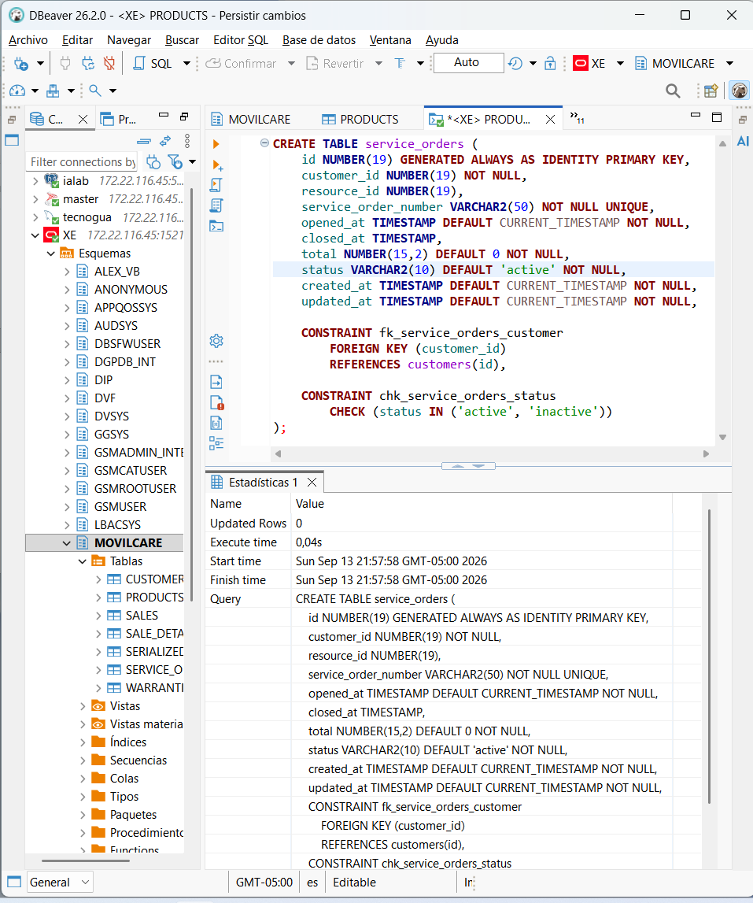

## 8. Creación de la tabla Diagnostics

La tabla `diagnostics` almacena los diagnósticos utilizados dentro de los procesos de servicio técnico.

### Script SQL

```sql
CREATE TABLE diagnostics (
    id NUMBER(19) GENERATED ALWAYS AS IDENTITY PRIMARY KEY,
    name VARCHAR2(150) NOT NULL,
    description CLOB,
    status VARCHAR2(10) DEFAULT 'active' NOT NULL,
    created_at TIMESTAMP DEFAULT CURRENT_TIMESTAMP NOT NULL,
    updated_at TIMESTAMP DEFAULT CURRENT_TIMESTAMP NOT NULL,
    CONSTRAINT chk_diagnostics_status
        CHECK (status IN ('active', 'inactive'))
);
```

### Evidencia

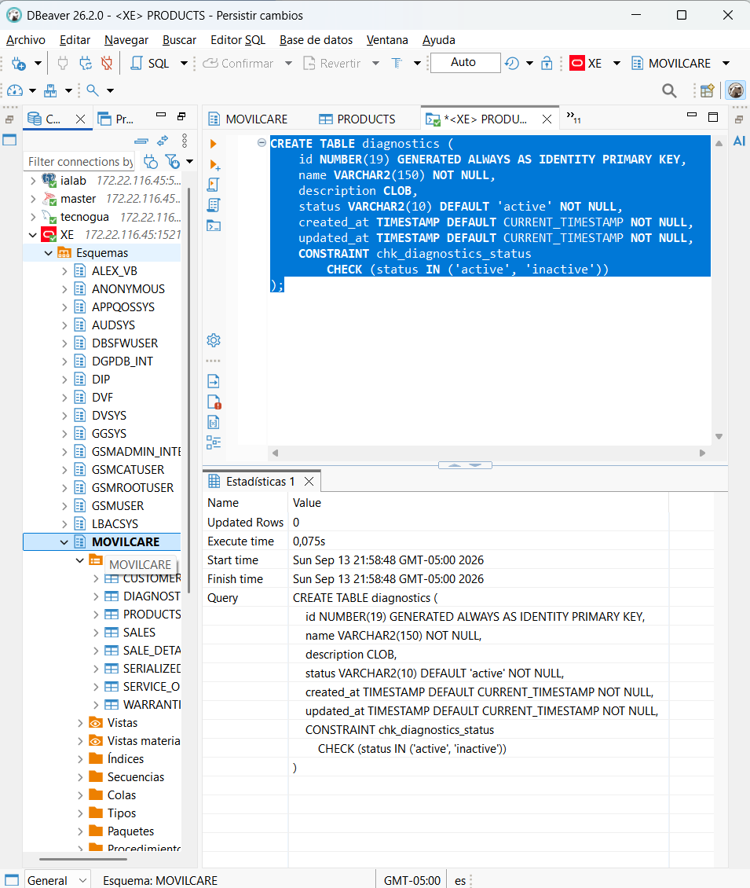


## 9. Creación de la tabla Spare Parts

La tabla `spare_parts` almacena la información de los repuestos utilizados en los procesos de mantenimiento y reparación.

### Script SQL

```sql
CREATE TABLE spare_parts (
    id NUMBER(19) GENERATED ALWAYS AS IDENTITY PRIMARY KEY,
    name VARCHAR2(150) NOT NULL,
    description CLOB,
    status VARCHAR2(10) DEFAULT 'active' NOT NULL,
    created_at TIMESTAMP DEFAULT CURRENT_TIMESTAMP NOT NULL,
    updated_at TIMESTAMP DEFAULT CURRENT_TIMESTAMP NOT NULL,
    CONSTRAINT chk_spare_parts_status
        CHECK (status IN ('active', 'inactive'))
);
```

### Evidencia

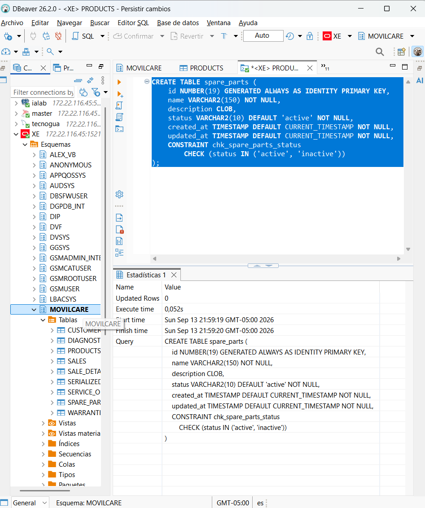

## 10. Creación de la tabla Spare Part Consumptions

La tabla `spare_part_consumptions` almacena información relacionada con el consumo de repuestos.

### Script SQL

```sql
CREATE TABLE spare_part_consumptions (
    id NUMBER(19) GENERATED ALWAYS AS IDENTITY PRIMARY KEY,
    name VARCHAR2(150) NOT NULL,
    description CLOB,
    status VARCHAR2(10) DEFAULT 'active' NOT NULL,
    created_at TIMESTAMP DEFAULT CURRENT_TIMESTAMP NOT NULL,
    updated_at TIMESTAMP DEFAULT CURRENT_TIMESTAMP NOT NULL,
    CONSTRAINT chk_spare_part_consumptions_status
        CHECK (status IN ('active', 'inactive'))
);
```

### Evidencia


## 11. Creación de la tabla Payments

La tabla `payments` registra los pagos realizados y permite identificar el tipo y registro al que pertenece cada pago.

### Script SQL

```sql
CREATE TABLE payments (
    id NUMBER(19) GENERATED ALWAYS AS IDENTITY PRIMARY KEY,
    reference_type VARCHAR2(50) NOT NULL,
    reference_id NUMBER(19) NOT NULL,
    method VARCHAR2(50) NOT NULL,
    amount NUMBER(15,2) NOT NULL,
    payment_date TIMESTAMP DEFAULT CURRENT_TIMESTAMP NOT NULL,
    status VARCHAR2(10) DEFAULT 'active' NOT NULL,
    created_at TIMESTAMP DEFAULT CURRENT_TIMESTAMP NOT NULL,
    updated_at TIMESTAMP DEFAULT CURRENT_TIMESTAMP NOT NULL,
    CONSTRAINT chk_payments_status
        CHECK (status IN ('active', 'inactive'))
);
```

### Evidencia

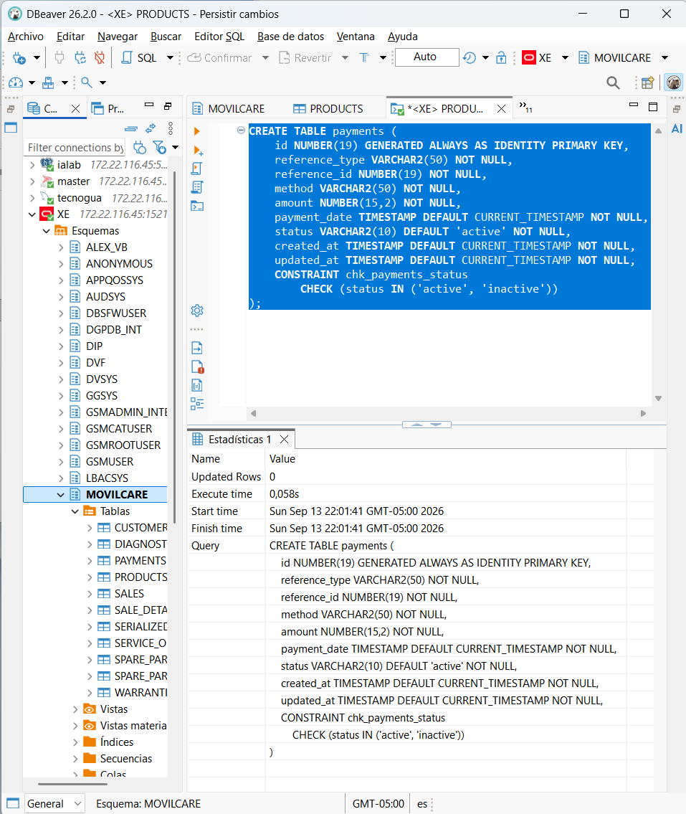

# Diagrama de la base de datos

Una vez creadas todas las tablas y establecidas las relaciones correspondientes, se procede a visualizar el diagrama de la base de datos en DBeaver.

### Evidencia


---

## Consideraciones de Oracle
durante la implementacion de MovilCare en Oracle se realizaron adaptaciones respecto a los demas motores:

| MySQL                         | PostgreSQL                            | MSSQL Server              | Oracle                                       |
| ----------------------------- | ------------------------------------- | ------------------------- | -------------------------------------------- |
| `BIGINT AUTO_INCREMENT`       | `BIGINT GENERATED ALWAYS AS IDENTITY` | `BIGINT IDENTITY(1,1)`    | `NUMBER(19) GENERATED ALWAYS AS IDENTITY`    |
| `DECIMAL(15,2)`               | `NUMERIC(15,2)`                       | `DECIMAL(15,2)`           | `NUMBER(15,2)`                               |
| `DECIMAL(15,3)`               | `NUMERIC(15,3)`                       | `DECIMAL(15,3)`           | `NUMBER(15,3)`                               |
| `DATETIME`                    | `TIMESTAMP`                           | `DATETIME`                | `TIMESTAMP`                                  |
| `BOOLEAN`                     | `BOOLEAN`                             | `BIT`                     | `NUMBER(1)` / `CHAR(1)` según implementación |
| `ENUM('active','inactive')`   | `ENUM` / `VARCHAR` + `CHECK`          | `VARCHAR(10)` + `CHECK`   | `VARCHAR2(10)` + `CHECK`                     |
| `TEXT`                        | `TEXT`                                | `VARCHAR(MAX)`            | `CLOB`                                       |
| `VARCHAR`                     | `VARCHAR`                             | `VARCHAR`                 | `VARCHAR2`                                   |
| `CURRENT_TIMESTAMP`           | `CURRENT_TIMESTAMP`                   | `CURRENT_TIMESTAMP`       | `CURRENT_TIMESTAMP`                          |
| `ON UPDATE CURRENT_TIMESTAMP` | No existe de forma nativa             | No existe de forma nativa | No existe de forma nativa                    |

> **Nota:** Oracle no dispone de un tipo de dato ENUM equivalente al utilizado en MySQL. Para mantener la misma restricción lógica, la columna status se implementó mediante VARCHAR2(10) acompañada de una restricción CHECK, permitiendo únicamente los valores 'active' e 'inactive'.

> **Nota:** Oracle permite utilizar columnas de identidad mediante GENERATED ALWAYS AS IDENTITY, eliminando la necesidad de crear manualmente una secuencia y un trigger para la generación de los identificadores.

> **Nota:** Oracle no dispone de una cláusula equivalente a ON UPDATE CURRENT_TIMESTAMP. Por esta razón, updated_at se inicializa automáticamente con CURRENT_TIMESTAMP, pero su actualización automática ante modificaciones requeriría la implementación posterior de un trigger.

## Resumen de la implementación

La estructura lógica de MovilCare se mantuvo equivalente a las implementaciones realizadas en MySQL, PostgreSQL y MSSQL Server, adaptando únicamente los elementos propios del motor Oracle.

Las relaciones implementadas fueron:

- `sales.customer_id` → `customers.id`
- `sale_details.sale_id` → `sales.id`
- `sale_details.product_id` → `products.id`
- `service_orders.customer_id` → `customers.id`

De esta manera, se conserva una estructura de datos consistente entre los cuatro motores de bases de datos utilizados para la implementación de MovilCare: MySQL, PostgreSQL, MSSQL Server y Oracle.

# Base de datos en Oracle - Terminal DBeaver

Para esta etapa se realizó la creación de la estructura de la base de datos MovilCare utilizando **Oracle SQL Developer** como herramienta de administración de Oracle Database.

La conexión se realizó sobre el servicio `XEPDB1`, previamente configurado en la instancia de Oracle XE.

A diferencia de la implementación mediante scripts SQL, en esta ocasión las tablas fueron construidas utilizando las herramientas gráficas proporcionadas por Oracle SQL Developer, configurando manualmente los campos, tipos de datos, claves primarias, valores predeterminados, restricciones y relaciones correspondientes.

La estructura lógica utilizada corresponde al modelo previamente definido para MovilCare.

---

# Conexión a la base de datos

Para iniciar el proceso se establece una conexión desde Oracle SQL Developer hacia el servicio `XEPDB1`.

Una vez realizada la conexión, se utiliza el esquema correspondiente para crear las tablas de la base de datos MovilCare.

En Oracle, a diferencia de otros motores utilizados en el proyecto, no se utiliza una instrucción `USE` para seleccionar la base de datos. La conexión determina el esquema y el servicio sobre el cual se ejecutarán las operaciones.

### Evidencia


---

# Creación de tablas

Una vez establecida la conexión con Oracle, se procede a crear cada una de las tablas mediante la interfaz gráfica de Oracle SQL Developer.

La creación se realiza individualmente para cada tabla, configurando los campos, restricciones y relaciones correspondientes.

## 1. Creación de la tabla `products`

Se crea la tabla `products`, destinada a almacenar la información general de los productos comercializados por el sistema.

La tabla contiene los siguientes campos:

| Campo | Tipo de dato | Restricciones |
|---|---|---|
| `id` | NUMBER | PK, NOT NULL, Identity |
| `sku` | CHAR(100) | NOT NULL, UNIQUE |
| `name` | CHAR(150) | NOT NULL |
| `description` | CHAR(500) | |
| `price` | NUMBER(15,2) | NOT NULL |
| `status` | CHAR(8) | NOT NULL, Default: active |
| `created_at` | TIMESTAMP | NOT NULL, Default: CURRENT_TIMESTAMP |
| `updated_at` | TIMESTAMP | NOT NULL, Default: CURRENT_TIMESTAMP |

El campo `id` se establece como clave primaria y se configura como columna Identity para generar automáticamente los identificadores.

El campo `sku` se configura como único para evitar la duplicación de identificadores de productos.

El campo `status` se configura mediante una restricción `CHECK`, permitiendo únicamente los valores `active` e `inactive`.

### Evidencia


---

## 2. Creación de la tabla `serialized_units`

Se crea la tabla `serialized_units`, destinada a almacenar la información de las unidades que requieren identificación individual.

La tabla contiene los siguientes campos:

| Campo | Tipo de dato | Restricciones |
|---|---|---|
| `id` | NUMBER | PK, NOT NULL, Identity |
| `name` | CHAR(150) | NOT NULL |
| `description` | CHAR(500) | |
| `status` | CHAR(8) | NOT NULL, Default: active |
| `created_at` | TIMESTAMP | NOT NULL, Default: CURRENT_TIMESTAMP |
| `updated_at` | TIMESTAMP | NOT NULL, Default: CURRENT_TIMESTAMP |

El campo `id` se establece como clave primaria y como columna Identity.

El campo `status` se restringe a los valores `active` e `inactive`.

### Evidencia


---

## 3. Creación de la tabla `customers`

Se crea la tabla `customers`, destinada a almacenar la información de los clientes registrados en el sistema.

La tabla contiene los siguientes campos:

| Campo | Tipo de dato | Restricciones |
|---|---|---|
| `id` | NUMBER | PK, NOT NULL, Identity |
| `document_type` | CHAR(30) | NOT NULL |
| `document_number` | CHAR(50) | NOT NULL, UNIQUE |
| `name` | CHAR(150) | NOT NULL |
| `phone` | CHAR(30) | |
| `email` | CHAR(150) | |
| `status` | CHAR(8) | NOT NULL, Default: active |
| `created_at` | TIMESTAMP | NOT NULL, Default: CURRENT_TIMESTAMP |
| `updated_at` | TIMESTAMP | NOT NULL, Default: CURRENT_TIMESTAMP |

El campo `id` se establece como clave primaria con generación automática mediante Identity.

El campo `document_number` se configura como único para evitar que un mismo documento de identificación sea registrado más de una vez.

### Evidencia


---

## 4. Creación de la tabla `sales`

Se crea la tabla `sales`, destinada a registrar las ventas realizadas y su relación con los clientes.

La tabla contiene los siguientes campos:

| Campo | Tipo de dato | Restricciones |
|---|---|---|
| `id` | NUMBER | PK, NOT NULL, Identity |
| `customer_id` | NUMBER | NOT NULL, FK |
| `date` | DATE | NOT NULL |
| `subtotal` | NUMBER(15,2) | NOT NULL |
| `taxes` | NUMBER(15,2) | NOT NULL, Default: 0 |
| `total` | NUMBER(15,2) | NOT NULL |
| `status` | CHAR(8) | NOT NULL, Default: active |
| `created_at` | TIMESTAMP | NOT NULL, Default: CURRENT_TIMESTAMP |
| `updated_at` | TIMESTAMP | NOT NULL, Default: CURRENT_TIMESTAMP |

El campo `customer_id` se establece como clave foránea relacionada con el campo `id` de la tabla `customers`.

### Relación

```text
sales.customer_id → customers.id
```

### Evidencia


---

## 5. Creación de la tabla `sale_details`

Se crea la tabla `sale_details`, destinada a almacenar el detalle de los productos incluidos en cada venta.

La tabla contiene los siguientes campos:

| Campo | Tipo de dato | Restricciones |
|---|---|---|
| `id` | NUMBER | PK, NOT NULL, Identity |
| `sale_id` | NUMBER | NOT NULL, FK |
| `product_id` | NUMBER | NOT NULL, FK |
| `quantity` | NUMBER(15,3) | NOT NULL |
| `unit_price` | NUMBER(15,2) | NOT NULL |
| `total` | NUMBER(15,2) | NOT NULL |
| `observations` | CHAR(500) | |
| `status` | CHAR(8) | NOT NULL, Default: active |
| `created_at` | TIMESTAMP | NOT NULL, Default: CURRENT_TIMESTAMP |
| `updated_at` | TIMESTAMP | NOT NULL, Default: CURRENT_TIMESTAMP |

Se establecen dos claves foráneas para relacionar cada detalle con la venta y con el producto correspondiente.

### Relaciones

```text
sale_details.sale_id → sales.id
sale_details.product_id → products.id
```

### Evidencia


---

## 6. Creación de la tabla `warranties`

Se crea la tabla `warranties`, destinada a almacenar la información relacionada con las garantías disponibles en el sistema.

La tabla contiene los siguientes campos:

| Campo | Tipo de dato | Restricciones |
|---|---|---|
| `id` | NUMBER | PK, NOT NULL, Identity |
| `name` | CHAR(150) | NOT NULL |
| `description` | CHAR(500) | |
| `status` | CHAR(8) | NOT NULL, Default: active |
| `created_at` | TIMESTAMP | NOT NULL, Default: CURRENT_TIMESTAMP |
| `updated_at` | TIMESTAMP | NOT NULL, Default: CURRENT_TIMESTAMP |

El campo `id` se establece como clave primaria y como columna Identity.

### Evidencia


---

## 7. Creación de la tabla `service_orders`

Se crea la tabla `service_orders`, destinada a registrar las órdenes de servicio y su relación con los clientes.

La tabla contiene los siguientes campos:

| Campo | Tipo de dato | Restricciones |
|---|---|---|
| `id` | NUMBER | PK, NOT NULL, Identity |
| `customer_id` | NUMBER | NOT NULL, FK |
| `resource_id` | NUMBER | |
| `number` | CHAR(50) | NOT NULL, UNIQUE |
| `opened_at` | DATE | NOT NULL |
| `closed_at` | DATE | |
| `total` | NUMBER(15,2) | NOT NULL, Default: 0 |
| `status` | CHAR(8) | NOT NULL, Default: active |
| `created_at` | TIMESTAMP | NOT NULL, Default: CURRENT_TIMESTAMP |
| `updated_at` | TIMESTAMP | NOT NULL, Default: CURRENT_TIMESTAMP |

El campo `customer_id` se establece como clave foránea relacionada con el campo `id` de la tabla `customers`.

El campo `resource_id` se mantiene sin clave foránea debido a que el modelo actual no contempla una tabla `resources`.

### Relación

```text
service_orders.customer_id → customers.id
```

### Evidencia


---

## 8. Creación de la tabla `diagnostics`

Se crea la tabla `diagnostics`, destinada a almacenar la información relacionada con los diagnósticos utilizados en los procesos de servicio técnico.

La tabla contiene los siguientes campos:

| Campo | Tipo de dato | Restricciones |
|---|---|---|
| `id` | NUMBER | PK, NOT NULL, Identity |
| `name` | CHAR(150) | NOT NULL |
| `description` | CHAR(500) | |
| `status` | CHAR(8) | NOT NULL, Default: active |
| `created_at` | TIMESTAMP | NOT NULL, Default: CURRENT_TIMESTAMP |
| `updated_at` | TIMESTAMP | NOT NULL, Default: CURRENT_TIMESTAMP |

El campo `id` se configura como clave primaria con generación automática.

### Evidencia


---

## 9. Creación de la tabla `spare_parts`

Se crea la tabla `spare_parts`, destinada a almacenar la información de los repuestos utilizados en los procesos de mantenimiento y reparación.

La tabla contiene los siguientes campos:

| Campo | Tipo de dato | Restricciones |
|---|---|---|
| `id` | NUMBER | PK, NOT NULL, Identity |
| `name` | CHAR(150) | NOT NULL |
| `description` | CHAR(500) | |
| `status` | CHAR(8) | NOT NULL, Default: active |
| `created_at` | TIMESTAMP | NOT NULL, Default: CURRENT_TIMESTAMP |
| `updated_at` | TIMESTAMP | NOT NULL, Default: CURRENT_TIMESTAMP |

El campo `id` se establece como clave primaria con generación automática.

### Evidencia


---

## 10. Creación de la tabla `spare_part_consumptions`

Se crea la tabla `spare_part_consumptions`, destinada a almacenar información relacionada con el consumo de repuestos.

La tabla contiene los siguientes campos:

| Campo | Tipo de dato | Restricciones |
|---|---|---|
| `id` | NUMBER | PK, NOT NULL, Identity |
| `name` | CHAR(150) | NOT NULL |
| `description` | CHAR(500) | |
| `status` | CHAR(8) | NOT NULL, Default: active |
| `created_at` | TIMESTAMP | NOT NULL, Default: CURRENT_TIMESTAMP |
| `updated_at` | TIMESTAMP | NOT NULL, Default: CURRENT_TIMESTAMP |

El campo `id` se establece como clave primaria con generación automática.

### Evidencia


---

## 11. Creación de la tabla `payments`

Finalmente, se crea la tabla `payments`, destinada a registrar los pagos realizados dentro del sistema.

La tabla contiene los siguientes campos:

| Campo | Tipo de dato | Restricciones |
|---|---|---|
| `id` | NUMBER | PK, NOT NULL, Identity |
| `reference_type` | CHAR(50) | NOT NULL |
| `reference_id` | NUMBER | NOT NULL |
| `method` | CHAR(50) | NOT NULL |
| `amount` | NUMBER(15,2) | NOT NULL |
| `date` | DATE | NOT NULL |
| `status` | CHAR(8) | NOT NULL, Default: active |
| `created_at` | TIMESTAMP | NOT NULL, Default: CURRENT_TIMESTAMP |
| `updated_at` | TIMESTAMP | NOT NULL, Default: CURRENT_TIMESTAMP |

El campo `id` se establece como clave primaria con generación automática.

El campo `reference_id` se mantiene sin clave foránea debido a que `reference_type` permite determinar el tipo de registro al que hace referencia.

### Evidencia


---

# Diagrama de la base de datos

Una vez finalizada la creación de todas las tablas mediante la interfaz gráfica de Oracle SQL Developer, se procede a verificar la estructura de la base de datos y las relaciones establecidas.

El diagrama permite visualizar gráficamente las tablas que conforman MovilCare y las relaciones establecidas mediante claves foráneas.

### Evidencia


---

# Consideraciones de la implementación en Oracle SQL Developer

Para esta implementación se utilizaron los tipos de datos correspondientes a Oracle Database:

| Elemento | Tipo utilizado |
|---|---|
| Identificadores | `NUMBER` |
| Textos | `CHAR(n)` |
| Fechas | `DATE` |
| Fecha de creación y actualización | `TIMESTAMP` |
| Números reales y valores monetarios | `NUMBER(15,2)` |
| Cantidades con tres decimales | `NUMBER(15,3)` |
| Estado | `CHAR(8)` + `CHECK` |
| Identificadores automáticos | `IDENTITY` |

El campo `status` se implementó mediante `CHAR(8)` acompañado de una restricción `CHECK`, debido a que Oracle no utiliza un tipo `ENUM` como MySQL.

Los valores permitidos para el campo son:

```text
active
inactive
```

Todas las tablas cuentan con los campos `created_at` y `updated_at`, destinados a registrar la fecha y hora de creación y actualización de los registros.

Las relaciones implementadas mediante claves foráneas son:

- `sales.customer_id` → `customers.id`
- `sale_details.sale_id` → `sales.id`
- `sale_details.product_id` → `products.id`
- `service_orders.customer_id` → `customers.id`